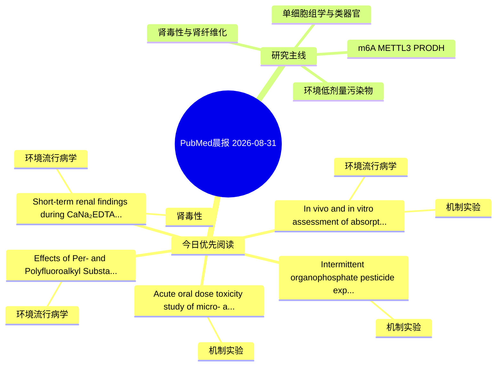

# PubMed 文献晨报｜2026-08-31

- 生成日期：2026-08-31 UTC
- 检索窗口：近 7 天
- 高质量阈值：规则评分 ≥ 7
- 近 24 小时原始命中数：0

## 今日总体判断

今日筛选出 5 篇优先阅读文献，主要集中在：机制实验、环境流行病学、肾毒性。
由于近 24 小时内没有检索到候选文献，本次已自动扩大检索范围。

## 今日最值得读的 5 篇文章

### 1. Intermittent organophosphate pesticide exposure induces hepatic injury in goats with subclinical fatty liver via immune activation and energy metabolism reprogramming.

- 题目：Intermittent organophosphate pesticide exposure induces hepatic injury in goats with subclinical fatty liver via immune activation and energy metabolism reprogramming.
- 期刊：Environmental pollution (Barking, Essex : 1987)
- 年份：2026
- PMID：[42648532](https://pubmed.ncbi.nlm.nih.gov/42648532/)
- DOI：[10.1016/j.envpol.2026.129033](https://doi.org/10.1016/j.envpol.2026.129033)
- 分类：机制实验
- 规则评分：10
- 研究对象：题名和摘要未明确，建议阅读全文确认
- 核心方法：基于题名/摘要的常规实验或文献分析，需阅读全文确认
- 主要发现：摘要提示研究重点涉及本方向相关问题；结论线索为：Proteomics revealed 326 altered proteins clustering in immune activation, specifically complement proteins C3 and C5 and TNF pathway molecules, and energy metabolism, specifically suppressed oxidative phosphorylation and enhanced glycolysis, with these two...
- 为什么值得读：与检索主题有交集，可作为背景或线索文献扫读

### 2. Acute oral dose toxicity study of micro- and nano-plastics of polystyrene in female Wistar albino rats.

- 题目：Acute oral dose toxicity study of micro- and nano-plastics of polystyrene in female Wistar albino rats.
- 期刊：Mutagenesis
- 年份：2026
- PMID：[42664242](https://pubmed.ncbi.nlm.nih.gov/42664242/)
- DOI：[10.1093/mutage/geag031](https://doi.org/10.1093/mutage/geag031)
- 分类：机制实验
- 规则评分：9
- 研究对象：人群/队列或环境暴露人群
- 核心方法：细胞与动物机制实验
- 主要发现：摘要提示研究重点涉及本方向相关问题；结论线索为：A dose dependent elevation in Thiobarbituric acid reactive substances (TBARS) levels levels and depletion of reduced glutathione in plasma samples of rats indicate disruption of redox homeostasis.
- 为什么值得读：与检索主题有交集，可作为背景或线索文献扫读

### 3. Short-term renal findings during CaNa₂EDTA chelation in workers with occupational lead exposure: Proteinuria, albuminuria, and renal function changes.

- 题目：Short-term renal findings during CaNa₂EDTA chelation in workers with occupational lead exposure: Proteinuria, albuminuria, and renal function changes.
- 期刊：Environmental toxicology and pharmacology
- 年份：2026
- PMID：[42648389](https://pubmed.ncbi.nlm.nih.gov/42648389/)
- DOI：[10.1016/j.etap.2026.105150](https://doi.org/10.1016/j.etap.2026.105150)
- 分类：环境流行病学、肾毒性
- 规则评分：9
- 研究对象：题名和摘要未明确，建议阅读全文确认
- 核心方法：基于题名/摘要的常规实验或文献分析，需阅读全文确认
- 主要发现：摘要提示研究重点涉及环境污染物暴露、肾毒性/肾损伤；结论线索为：CONCLUSION: CaNa₂EDTA effectively reduced blood lead levels, while small changes in renal function and urinary abnormalities were observed during treatment; however, these findings cannot be attributed specifically to chelation therapy.
- 为什么值得读：与肾毒性/肾损伤主线直接相关

### 4. In vivo and in vitro assessment of absorption and disposition kinetics of bis[2-(perfluorohexyl)ethyl] phosphate in rats: food effect, physiologically-based modeling, and human exposure estimation.

- 题目：In vivo and in vitro assessment of absorption and disposition kinetics of bis[2-(perfluorohexyl)ethyl] phosphate in rats: food effect, physiologically-based modeling, and human exposure estimation.
- 期刊：Environment international
- 年份：2026
- PMID：[42664870](https://pubmed.ncbi.nlm.nih.gov/42664870/)
- DOI：[10.1016/j.envint.2026.110475](https://doi.org/10.1016/j.envint.2026.110475)
- 分类：环境流行病学、机制实验
- 规则评分：9
- 研究对象：人群/队列或环境暴露人群
- 核心方法：环境流行病学/队列或人群数据；细胞与动物机制实验
- 主要发现：摘要提示研究重点涉及环境污染物暴露；结论线索为：Collectively, these findings provide a mechanistic understanding of the absorption and disposition kinetics of 6:2 diPAP and support quantitative evaluation of its exposure and potential health risks in human populations.
- 为什么值得读：同时连接环境暴露与机制线索

### 5. Effects of Per- and Polyfluoroalkyl Substances (PFAS) Exposure Reduction on Serum Lipids in the Copenhagen City Heart Study: A Protocol for an Observational Cohort Study Emulating a Target Trial.

- 题目：Effects of Per- and Polyfluoroalkyl Substances (PFAS) Exposure Reduction on Serum Lipids in the Copenhagen City Heart Study: A Protocol for an Observational Cohort Study Emulating a Target Trial.
- 期刊：Toxics
- 年份：2026
- PMID：[42647004](https://pubmed.ncbi.nlm.nih.gov/42647004/)
- DOI：[10.3390/toxics14080722](https://doi.org/10.3390/toxics14080722)
- 分类：环境流行病学
- 规则评分：9
- 研究对象：人群/队列或环境暴露人群
- 核心方法：环境流行病学/队列或人群数据
- 主要发现：摘要提示研究重点涉及环境污染物暴露；结论线索为：This protocol explores applying the target trial emulation framework to improve causal inference in environmental epidemiology.
- 为什么值得读：与检索主题有交集，可作为背景或线索文献扫读

## 分类归档

### 环境流行病学
- [Short-term renal findings during CaNa₂EDTA chelation in workers with occupational lead exposure: Proteinuria, albuminuria, and renal function changes.](https://pubmed.ncbi.nlm.nih.gov/42648389/)（PMID: 42648389）
- [In vivo and in vitro assessment of absorption and disposition kinetics of bis\[2-(perfluorohexyl)ethyl\] phosphate in rats: food effect, physiologically-based modeling, and human exposure estimation.](https://pubmed.ncbi.nlm.nih.gov/42664870/)（PMID: 42664870）
- [Effects of Per- and Polyfluoroalkyl Substances (PFAS) Exposure Reduction on Serum Lipids in the Copenhagen City Heart Study: A Protocol for an Observational Cohort Study Emulating a Target Trial.](https://pubmed.ncbi.nlm.nih.gov/42647004/)（PMID: 42647004）

### 机制实验
- [Intermittent organophosphate pesticide exposure induces hepatic injury in goats with subclinical fatty liver via immune activation and energy metabolism reprogramming.](https://pubmed.ncbi.nlm.nih.gov/42648532/)（PMID: 42648532）
- [Acute oral dose toxicity study of micro- and nano-plastics of polystyrene in female Wistar albino rats.](https://pubmed.ncbi.nlm.nih.gov/42664242/)（PMID: 42664242）
- [In vivo and in vitro assessment of absorption and disposition kinetics of bis\[2-(perfluorohexyl)ethyl\] phosphate in rats: food effect, physiologically-based modeling, and human exposure estimation.](https://pubmed.ncbi.nlm.nih.gov/42664870/)（PMID: 42664870）

### 单细胞组学
- 今日暂无高质量新文献。

### 类器官
- 今日暂无高质量新文献。

### 肾毒性
- [Short-term renal findings during CaNa₂EDTA chelation in workers with occupational lead exposure: Proteinuria, albuminuria, and renal function changes.](https://pubmed.ncbi.nlm.nih.gov/42648389/)（PMID: 42648389）

### m6A-METTL3-PRODH
- 今日暂无高质量新文献。

## 今日阅读优先级

1. Intermittent organophosphate pesticide exposure induces hepatic injury in goats with subclinical fatty liver via immune activation and energy metabolism reprogramming.（优先理由：与检索主题有交集，可作为背景或线索文献扫读）
2. Acute oral dose toxicity study of micro- and nano-plastics of polystyrene in female Wistar albino rats.（优先理由：与检索主题有交集，可作为背景或线索文献扫读）
3. Short-term renal findings during CaNa₂EDTA chelation in workers with occupational lead exposure: Proteinuria, albuminuria, and renal function changes.（优先理由：与肾毒性/肾损伤主线直接相关）
4. In vivo and in vitro assessment of absorption and disposition kinetics of bis[2-(perfluorohexyl)ethyl] phosphate in rats: food effect, physiologically-based modeling, and human exposure estimation.（优先理由：同时连接环境暴露与机制线索）
5. Effects of Per- and Polyfluoroalkyl Substances (PFAS) Exposure Reduction on Serum Lipids in the Copenhagen City Heart Study: A Protocol for an Observational Cohort Study Emulating a Target Trial.（优先理由：与检索主题有交集，可作为背景或线索文献扫读）

## Mermaid 思维导图

