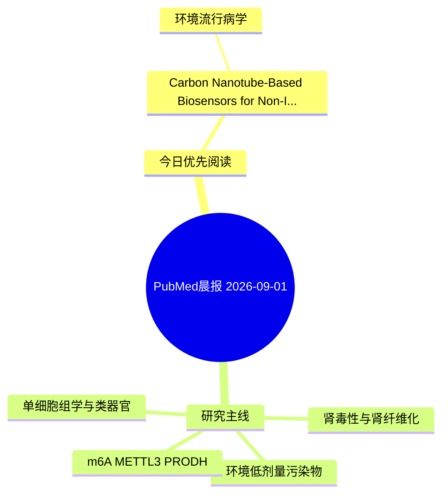

# PubMed 文献晨报｜2026-09-01

- 生成日期：2026-09-01 UTC
- 检索窗口：近 7 天
- 高质量阈值：规则评分 ≥ 7
- 近 24 小时原始命中数：0

## 今日总体判断

今日筛选出 1 篇优先阅读文献，主要集中在：环境流行病学。
由于近 24 小时内没有检索到候选文献，本次已自动扩大检索范围。

## 今日最值得读的 5 篇文章

### 1. Carbon Nanotube-Based Biosensors for Non-Invasive Biofluid Analysis.

- 题目：Carbon Nanotube-Based Biosensors for Non-Invasive Biofluid Analysis.
- 期刊：Biosensors
- 年份：2026
- PMID：[42645049](https://pubmed.ncbi.nlm.nih.gov/42645049/)
- DOI：[10.3390/bios16080431](https://doi.org/10.3390/bios16080431)
- 分类：环境流行病学
- 规则评分：9
- 研究对象：患者样本或临床数据
- 核心方法：基于题名/摘要的常规实验或文献分析，需阅读全文确认
- 主要发现：摘要提示研究重点涉及环境污染物暴露；结论线索为：Finally, we discuss key barriers limiting real-world translation of CNT biosensors, including material reproducibility issues, biofouling, physiological interpretation of biofluid biomarkers, scalable manufacturing, and long-term operational stability, and...
- 为什么值得读：与检索主题有交集，可作为背景或线索文献扫读

## 分类归档

### 环境流行病学
- [Carbon Nanotube-Based Biosensors for Non-Invasive Biofluid Analysis.](https://pubmed.ncbi.nlm.nih.gov/42645049/)（PMID: 42645049）

### 机制实验
- 今日暂无高质量新文献。

### 单细胞组学
- 今日暂无高质量新文献。

### 类器官
- 今日暂无高质量新文献。

### 肾毒性
- 今日暂无高质量新文献。

### m6A-METTL3-PRODH
- 今日暂无高质量新文献。

## 今日阅读优先级

1. Carbon Nanotube-Based Biosensors for Non-Invasive Biofluid Analysis.（优先理由：与检索主题有交集，可作为背景或线索文献扫读）

## Mermaid 思维导图

