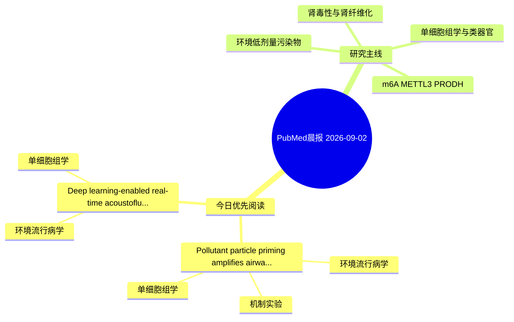

# PubMed 文献晨报｜2026-09-02

- 生成日期：2026-09-02 UTC
- 检索窗口：近 24 小时
- 高质量阈值：规则评分 ≥ 7
- 近 24 小时原始命中数：2

## 今日总体判断

今日筛选出 2 篇优先阅读文献，主要集中在：环境流行病学、单细胞组学、机制实验。

## 今日最值得读的 5 篇文章

### 1. Pollutant particle priming amplifies airway compartment specific neutrophil and macrophage inflammatory programs following house dust mite acute exposure.

- 题目：Pollutant particle priming amplifies airway compartment specific neutrophil and macrophage inflammatory programs following house dust mite acute exposure.
- 期刊：Frontiers in immunology
- 年份：2026
- PMID：[42676651](https://pubmed.ncbi.nlm.nih.gov/42676651/)
- DOI：[10.3389/fimmu.2026.1869644](https://doi.org/10.3389/fimmu.2026.1869644)
- 分类：环境流行病学、机制实验、单细胞组学
- 规则评分：14
- 研究对象：题名和摘要未明确，建议阅读全文确认
- 核心方法：单细胞或空间组学；细胞与动物机制实验
- 主要发现：摘要提示研究重点涉及环境污染物暴露、单细胞或空间组学；结论线索为：Collectively, these findings demonstrate that pollutant exposure reprograms airway immune landscapes to amplify subsequent allergen responses, suggested through neutrophil centric and interferon linked mechanisms.
- 为什么值得读：同时连接环境暴露与机制线索；可帮助寻找细胞类型特异性机制；关键词匹配度较高

### 2. Deep learning-enabled real-time acoustofluidic sorting for selective microalgae recovery under wastewater-relevant heterogeneous conditions.

- 题目：Deep learning-enabled real-time acoustofluidic sorting for selective microalgae recovery under wastewater-relevant heterogeneous conditions.
- 期刊：Bioresource technology
- 年份：2026
- PMID：[42679963](https://pubmed.ncbi.nlm.nih.gov/42679963/)
- DOI：[10.1016/j.biortech.2026.135751](https://doi.org/10.1016/j.biortech.2026.135751)
- 分类：环境流行病学、单细胞组学
- 规则评分：10
- 研究对象：题名和摘要未明确，建议阅读全文确认
- 核心方法：单细胞或空间组学
- 主要发现：摘要提示研究重点涉及环境污染物暴露、单细胞或空间组学；结论线索为：The proposed strategy provides a promising approach for high-purity microalgae recovery and intelligent bioresource recycling in heterogeneous environmental systems.
- 为什么值得读：可帮助寻找细胞类型特异性机制

## 分类归档

### 环境流行病学
- [Pollutant particle priming amplifies airway compartment specific neutrophil and macrophage inflammatory programs following house dust mite acute exposure.](https://pubmed.ncbi.nlm.nih.gov/42676651/)（PMID: 42676651）
- [Deep learning-enabled real-time acoustofluidic sorting for selective microalgae recovery under wastewater-relevant heterogeneous conditions.](https://pubmed.ncbi.nlm.nih.gov/42679963/)（PMID: 42679963）

### 机制实验
- [Pollutant particle priming amplifies airway compartment specific neutrophil and macrophage inflammatory programs following house dust mite acute exposure.](https://pubmed.ncbi.nlm.nih.gov/42676651/)（PMID: 42676651）

### 单细胞组学
- [Pollutant particle priming amplifies airway compartment specific neutrophil and macrophage inflammatory programs following house dust mite acute exposure.](https://pubmed.ncbi.nlm.nih.gov/42676651/)（PMID: 42676651）
- [Deep learning-enabled real-time acoustofluidic sorting for selective microalgae recovery under wastewater-relevant heterogeneous conditions.](https://pubmed.ncbi.nlm.nih.gov/42679963/)（PMID: 42679963）

### 类器官
- 今日暂无高质量新文献。

### 肾毒性
- 今日暂无高质量新文献。

### m6A-METTL3-PRODH
- 今日暂无高质量新文献。

## 今日阅读优先级

1. Pollutant particle priming amplifies airway compartment specific neutrophil and macrophage inflammatory programs following house dust mite acute exposure.（优先理由：同时连接环境暴露与机制线索；可帮助寻找细胞类型特异性机制；关键词匹配度较高）
2. Deep learning-enabled real-time acoustofluidic sorting for selective microalgae recovery under wastewater-relevant heterogeneous conditions.（优先理由：可帮助寻找细胞类型特异性机制）

## Mermaid 思维导图

