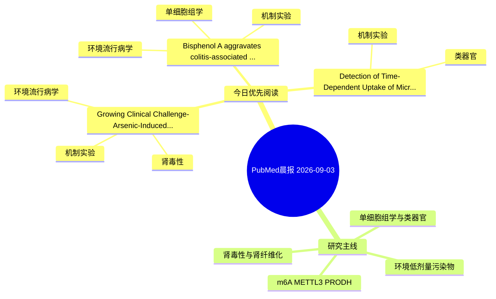

# PubMed 文献晨报｜2026-09-03

- 生成日期：2026-09-03 UTC
- 检索窗口：近 24 小时
- 高质量阈值：规则评分 ≥ 7
- 近 24 小时原始命中数：3

## 今日总体判断

今日筛选出 3 篇优先阅读文献，主要集中在：机制实验、环境流行病学、肾毒性。

## 今日最值得读的 5 篇文章

### 1. Growing Clinical Challenge-Arsenic-Induced Kidney Injury: Mechanisms and Management of Integrating Conventional and Traditional ChineseMedicine Approaches.

- 题目：Growing Clinical Challenge-Arsenic-Induced Kidney Injury: Mechanisms and Management of Integrating Conventional and Traditional ChineseMedicine Approaches.
- 期刊：Seminars in nephrology
- 年份：2026
- PMID：[42686433](https://pubmed.ncbi.nlm.nih.gov/42686433/)
- DOI：[10.1016/j.semnephrol.2026.151719](https://doi.org/10.1016/j.semnephrol.2026.151719)
- 分类：环境流行病学、机制实验、肾毒性
- 规则评分：16
- 研究对象：人群/队列或环境暴露人群
- 核心方法：基于题名/摘要的常规实验或文献分析，需阅读全文确认
- 主要发现：摘要提示研究重点涉及环境污染物暴露、肾毒性/肾损伤；结论线索为：In this review, we systematically review recent advancements in the understanding of arsenic-induced renal injury, with a particular focus on novel mechanisms, including epigenetic regulation, noncoding RNA-mediated gene expression regulation, and metabolic...
- 为什么值得读：同时连接环境暴露与机制线索；与肾毒性/肾损伤主线直接相关；关键词匹配度较高

### 2. Bisphenol A aggravates colitis-associated intestinal epithelial injury: Mitochondrial dysfunction and CASP1-associated inflammatory signaling.

- 题目：Bisphenol A aggravates colitis-associated intestinal epithelial injury: Mitochondrial dysfunction and CASP1-associated inflammatory signaling.
- 期刊：Ecotoxicology and environmental safety
- 年份：2026
- PMID：[42685547](https://pubmed.ncbi.nlm.nih.gov/42685547/)
- DOI：[10.1016/j.ecoenv.2026.120744](https://doi.org/10.1016/j.ecoenv.2026.120744)
- 分类：环境流行病学、机制实验、单细胞组学
- 规则评分：10
- 研究对象：人群/队列或环境暴露人群
- 核心方法：单细胞或空间组学
- 主要发现：摘要提示研究重点涉及单细胞或空间组学；结论线索为：CONCLUSION: BPA aggravates colitis-associated intestinal epithelial injury and induces mitochondrial oxidative and bioenergetic dysfunction.
- 为什么值得读：同时连接环境暴露与机制线索；可帮助寻找细胞类型特异性机制

### 3. Detection of Time-Dependent Uptake of Microplastics by Joint Utilization of Hepatic Organoids and a 3D-Printed Carrier.

- 题目：Detection of Time-Dependent Uptake of Microplastics by Joint Utilization of Hepatic Organoids and a 3D-Printed Carrier.
- 期刊：ACS applied materials & interfaces
- 年份：2026
- PMID：[42687243](https://pubmed.ncbi.nlm.nih.gov/42687243/)
- DOI：[10.1021/acsami.6c10955](https://doi.org/10.1021/acsami.6c10955)
- 分类：机制实验、类器官
- 规则评分：7
- 研究对象：人群/队列或环境暴露人群
- 核心方法：类器官/干细胞模型；细胞与动物机制实验
- 主要发现：摘要提示研究重点涉及类器官模型；结论线索为：Contrary to 2D models where >5 μm particles show negligible internalization, 3D HOs exhibited significant accumulation of intact micron-scale MPs via tissue-layer penetration and paracellular retention, with PP uptake peaking at ∼40% within 48 h and ∼18% re...
- 为什么值得读：对建立更接近人体的模型有参考价值

## 分类归档

### 环境流行病学
- [Growing Clinical Challenge-Arsenic-Induced Kidney Injury: Mechanisms and Management of Integrating Conventional and Traditional ChineseMedicine Approaches.](https://pubmed.ncbi.nlm.nih.gov/42686433/)（PMID: 42686433）
- [Bisphenol A aggravates colitis-associated intestinal epithelial injury: Mitochondrial dysfunction and CASP1-associated inflammatory signaling.](https://pubmed.ncbi.nlm.nih.gov/42685547/)（PMID: 42685547）

### 机制实验
- [Growing Clinical Challenge-Arsenic-Induced Kidney Injury: Mechanisms and Management of Integrating Conventional and Traditional ChineseMedicine Approaches.](https://pubmed.ncbi.nlm.nih.gov/42686433/)（PMID: 42686433）
- [Bisphenol A aggravates colitis-associated intestinal epithelial injury: Mitochondrial dysfunction and CASP1-associated inflammatory signaling.](https://pubmed.ncbi.nlm.nih.gov/42685547/)（PMID: 42685547）
- [Detection of Time-Dependent Uptake of Microplastics by Joint Utilization of Hepatic Organoids and a 3D-Printed Carrier.](https://pubmed.ncbi.nlm.nih.gov/42687243/)（PMID: 42687243）

### 单细胞组学
- [Bisphenol A aggravates colitis-associated intestinal epithelial injury: Mitochondrial dysfunction and CASP1-associated inflammatory signaling.](https://pubmed.ncbi.nlm.nih.gov/42685547/)（PMID: 42685547）

### 类器官
- [Detection of Time-Dependent Uptake of Microplastics by Joint Utilization of Hepatic Organoids and a 3D-Printed Carrier.](https://pubmed.ncbi.nlm.nih.gov/42687243/)（PMID: 42687243）

### 肾毒性
- [Growing Clinical Challenge-Arsenic-Induced Kidney Injury: Mechanisms and Management of Integrating Conventional and Traditional ChineseMedicine Approaches.](https://pubmed.ncbi.nlm.nih.gov/42686433/)（PMID: 42686433）

### m6A-METTL3-PRODH
- 今日暂无高质量新文献。

## 今日阅读优先级

1. Growing Clinical Challenge-Arsenic-Induced Kidney Injury: Mechanisms and Management of Integrating Conventional and Traditional ChineseMedicine Approaches.（优先理由：同时连接环境暴露与机制线索；与肾毒性/肾损伤主线直接相关；关键词匹配度较高）
2. Bisphenol A aggravates colitis-associated intestinal epithelial injury: Mitochondrial dysfunction and CASP1-associated inflammatory signaling.（优先理由：同时连接环境暴露与机制线索；可帮助寻找细胞类型特异性机制）
3. Detection of Time-Dependent Uptake of Microplastics by Joint Utilization of Hepatic Organoids and a 3D-Printed Carrier.（优先理由：对建立更接近人体的模型有参考价值）

## Mermaid 思维导图

