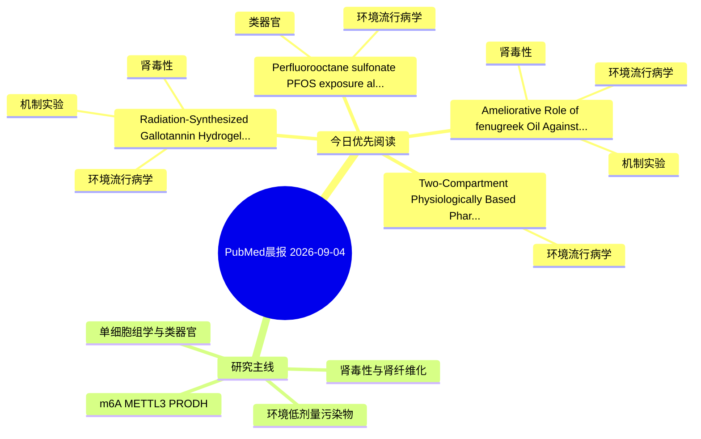

# PubMed 文献晨报｜2026-09-04

- 生成日期：2026-09-04 UTC
- 检索窗口：近 24 小时
- 高质量阈值：规则评分 ≥ 7
- 近 24 小时原始命中数：9

## 今日总体判断

今日筛选出 4 篇优先阅读文献，主要集中在：环境流行病学、机制实验、肾毒性。

## 今日最值得读的 5 篇文章

### 1. "Radiation-Synthesized Gallotannin Hydrogel Attenuates Trisenox-Induced Nephrotoxicity in Rats: miR-223/TXNIP Axis Modulation of Oxidative Stress and Inflammation".

- 题目："Radiation-Synthesized Gallotannin Hydrogel Attenuates Trisenox-Induced Nephrotoxicity in Rats: miR-223/TXNIP Axis Modulation of Oxidative Stress and Inflammation".
- 期刊：Biological trace element research
- 年份：2026
- PMID：[42693366](https://pubmed.ncbi.nlm.nih.gov/42693366/)
- DOI：[10.1007/s12011-026-05301-4](https://doi.org/10.1007/s12011-026-05301-4)
- 分类：环境流行病学、机制实验、肾毒性
- 规则评分：17
- 研究对象：小鼠或大鼠肾损伤模型
- 核心方法：基于题名/摘要的常规实验或文献分析，需阅读全文确认
- 主要发现：摘要提示研究重点涉及环境污染物暴露、肾毒性/肾损伤；结论线索为：These findings demonstrate that radiation-synthesized gallotannin hydrogel (GTH) exerts nephroprotective effects against ATO-induced nephrotoxicity.
- 为什么值得读：同时连接环境暴露与机制线索；与肾毒性/肾损伤主线直接相关；关键词匹配度较高

### 2. Perfluorooctane sulfonate (PFOS) exposure alters developmental and metabolic gene expression in human hippocampal organoids.

- 题目：Perfluorooctane sulfonate (PFOS) exposure alters developmental and metabolic gene expression in human hippocampal organoids.
- 期刊：Biochemical and biophysical research communications
- 年份：2026
- PMID：[42691624](https://pubmed.ncbi.nlm.nih.gov/42691624/)
- DOI：[10.1016/j.bbrc.2026.154534](https://doi.org/10.1016/j.bbrc.2026.154534)
- 分类：环境流行病学、类器官
- 规则评分：10
- 研究对象：人群/队列或环境暴露人群
- 核心方法：类器官/干细胞模型
- 主要发现：摘要提示研究重点涉及环境污染物暴露、类器官模型；结论线索为：Collectively, these findings suggest that PFOS induces neuronal toxicity in human hippocampal organoids and is accompanied by alterations in developmental transcriptional programs and mitochondrial metabolism-related gene expression.
- 为什么值得读：对建立更接近人体的模型有参考价值

### 3. Ameliorative Role of fenugreek Oil Against Lead Acetate Trihydrate-Induced Hepatic, Renal and Testicular Injury in Wistar Albino Rats: Insights into Bcl-2 Expression and sodium/potassium balance.

- 题目：Ameliorative Role of fenugreek Oil Against Lead Acetate Trihydrate-Induced Hepatic, Renal and Testicular Injury in Wistar Albino Rats: Insights into Bcl-2 Expression and sodium/potassium balance.
- 期刊：Biological trace element research
- 年份：2026
- PMID：[42690521](https://pubmed.ncbi.nlm.nih.gov/42690521/)
- DOI：[10.1007/s12011-026-05321-0](https://doi.org/10.1007/s12011-026-05321-0)
- 分类：环境流行病学、机制实验、肾毒性
- 规则评分：9
- 研究对象：小鼠或大鼠肾损伤模型
- 核心方法：基于题名/摘要的常规实验或文献分析，需阅读全文确认
- 主要发现：摘要提示研究重点涉及环境污染物暴露、肾毒性/肾损伤；结论线索为：In conclusion, concurrent administration of fenugreek seed oil may attenuate PbAc-induced hepatic, renal and testicular histopathological damage in rats.
- 为什么值得读：同时连接环境暴露与机制线索；与肾毒性/肾损伤主线直接相关

### 4. Two-Compartment Physiologically Based Pharmacokinetic Modeling with Postnatal Glomerular Filtration Rate Maturation to Estimate Individual-Level Infant Blood Polyfluoroalkyl Substances Concentrations from Breast Milk: Persistent Burden amid Shifting Compound Profiles in Korean Cohorts (2018-2023).

- 题目：Two-Compartment Physiologically Based Pharmacokinetic Modeling with Postnatal Glomerular Filtration Rate Maturation to Estimate Individual-Level Infant Blood Polyfluoroalkyl Substances Concentrations from Breast Milk: Persistent Burden amid Shifting Compound Profiles in Korean Cohorts (2018-2023).
- 期刊：Environmental science & technology
- 年份：2026
- PMID：[42689832](https://pubmed.ncbi.nlm.nih.gov/42689832/)
- DOI：[10.1021/acs.est.6c05230](https://doi.org/10.1021/acs.est.6c05230)
- 分类：环境流行病学
- 规则评分：9
- 研究对象：人群/队列或环境暴露人群
- 核心方法：环境流行病学/队列或人群数据
- 主要发现：摘要提示研究重点涉及环境污染物暴露；结论线索为：These findings demonstrate that compound-specific regulatory action has not reduced aggregate infant fluorinated burden and highlight the urgent need for infant-specific PFAS reference values accounting for GFR immaturity.
- 为什么值得读：与检索主题有交集，可作为背景或线索文献扫读

## 分类归档

### 环境流行病学
- ["Radiation-Synthesized Gallotannin Hydrogel Attenuates Trisenox-Induced Nephrotoxicity in Rats: miR-223/TXNIP Axis Modulation of Oxidative Stress and Inflammation".](https://pubmed.ncbi.nlm.nih.gov/42693366/)（PMID: 42693366）
- [Perfluorooctane sulfonate (PFOS) exposure alters developmental and metabolic gene expression in human hippocampal organoids.](https://pubmed.ncbi.nlm.nih.gov/42691624/)（PMID: 42691624）
- [Ameliorative Role of fenugreek Oil Against Lead Acetate Trihydrate-Induced Hepatic, Renal and Testicular Injury in Wistar Albino Rats: Insights into Bcl-2 Expression and sodium/potassium balance.](https://pubmed.ncbi.nlm.nih.gov/42690521/)（PMID: 42690521）
- [Two-Compartment Physiologically Based Pharmacokinetic Modeling with Postnatal Glomerular Filtration Rate Maturation to Estimate Individual-Level Infant Blood Polyfluoroalkyl Substances Concentrations from Breast Milk: Persistent Burden amid Shifting Compound Profiles in Korean Cohorts (2018-2023).](https://pubmed.ncbi.nlm.nih.gov/42689832/)（PMID: 42689832）

### 机制实验
- ["Radiation-Synthesized Gallotannin Hydrogel Attenuates Trisenox-Induced Nephrotoxicity in Rats: miR-223/TXNIP Axis Modulation of Oxidative Stress and Inflammation".](https://pubmed.ncbi.nlm.nih.gov/42693366/)（PMID: 42693366）
- [Ameliorative Role of fenugreek Oil Against Lead Acetate Trihydrate-Induced Hepatic, Renal and Testicular Injury in Wistar Albino Rats: Insights into Bcl-2 Expression and sodium/potassium balance.](https://pubmed.ncbi.nlm.nih.gov/42690521/)（PMID: 42690521）

### 单细胞组学
- 今日暂无高质量新文献。

### 类器官
- [Perfluorooctane sulfonate (PFOS) exposure alters developmental and metabolic gene expression in human hippocampal organoids.](https://pubmed.ncbi.nlm.nih.gov/42691624/)（PMID: 42691624）

### 肾毒性
- ["Radiation-Synthesized Gallotannin Hydrogel Attenuates Trisenox-Induced Nephrotoxicity in Rats: miR-223/TXNIP Axis Modulation of Oxidative Stress and Inflammation".](https://pubmed.ncbi.nlm.nih.gov/42693366/)（PMID: 42693366）
- [Ameliorative Role of fenugreek Oil Against Lead Acetate Trihydrate-Induced Hepatic, Renal and Testicular Injury in Wistar Albino Rats: Insights into Bcl-2 Expression and sodium/potassium balance.](https://pubmed.ncbi.nlm.nih.gov/42690521/)（PMID: 42690521）

### m6A-METTL3-PRODH
- 今日暂无高质量新文献。

## 今日阅读优先级

1. "Radiation-Synthesized Gallotannin Hydrogel Attenuates Trisenox-Induced Nephrotoxicity in Rats: miR-223/TXNIP Axis Modulation of Oxidative Stress and Inflammation".（优先理由：同时连接环境暴露与机制线索；与肾毒性/肾损伤主线直接相关；关键词匹配度较高）
2. Perfluorooctane sulfonate (PFOS) exposure alters developmental and metabolic gene expression in human hippocampal organoids.（优先理由：对建立更接近人体的模型有参考价值）
3. Ameliorative Role of fenugreek Oil Against Lead Acetate Trihydrate-Induced Hepatic, Renal and Testicular Injury in Wistar Albino Rats: Insights into Bcl-2 Expression and sodium/potassium balance.（优先理由：同时连接环境暴露与机制线索；与肾毒性/肾损伤主线直接相关）
4. Two-Compartment Physiologically Based Pharmacokinetic Modeling with Postnatal Glomerular Filtration Rate Maturation to Estimate Individual-Level Infant Blood Polyfluoroalkyl Substances Concentrations from Breast Milk: Persistent Burden amid Shifting Compound Profiles in Korean Cohorts (2018-2023).（优先理由：与检索主题有交集，可作为背景或线索文献扫读）

## Mermaid 思维导图

