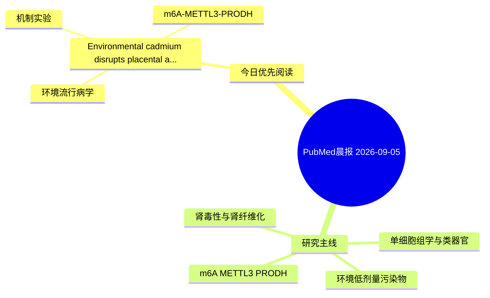

# PubMed 文献晨报｜2026-09-05

- 生成日期：2026-09-05 UTC
- 检索窗口：近 24 小时
- 高质量阈值：规则评分 ≥ 7
- 近 24 小时原始命中数：4

## 今日总体判断

今日筛选出 1 篇优先阅读文献，主要集中在：环境流行病学、机制实验、m6A-METTL3-PRODH。

## 今日最值得读的 5 篇文章

### 1. Environmental cadmium disrupts placental angiogenesis and fetal growth via enhancing m6A modification in Wwp2.

- 题目：Environmental cadmium disrupts placental angiogenesis and fetal growth via enhancing m6A modification in Wwp2.
- 期刊：Environmental pollution (Barking, Essex : 1987)
- 年份：2026
- PMID：[42697459](https://pubmed.ncbi.nlm.nih.gov/42697459/)
- DOI：[10.1016/j.envpol.2026.129085](https://doi.org/10.1016/j.envpol.2026.129085)
- 分类：环境流行病学、机制实验、m6A-METTL3-PRODH
- 规则评分：19
- 研究对象：人群/队列或环境暴露人群
- 核心方法：m6A RNA修饰检测；细胞与动物机制实验
- 主要发现：摘要提示研究重点涉及环境污染物暴露、m6A-METTL3/PRODH 调控；结论线索为：In conclusion, gestational Cd exposure enhanced m6A modification in Wwp2 mRNA to drive ESR1 degradation, thereby inhibiting placental angiogenesis and fetal growth.
- 为什么值得读：同时连接环境暴露与机制线索；贴近 m6A-METTL3-PRODH 调控假说；关键词匹配度较高

## 分类归档

### 环境流行病学
- [Environmental cadmium disrupts placental angiogenesis and fetal growth via enhancing m6A modification in Wwp2.](https://pubmed.ncbi.nlm.nih.gov/42697459/)（PMID: 42697459）

### 机制实验
- [Environmental cadmium disrupts placental angiogenesis and fetal growth via enhancing m6A modification in Wwp2.](https://pubmed.ncbi.nlm.nih.gov/42697459/)（PMID: 42697459）

### 单细胞组学
- 今日暂无高质量新文献。

### 类器官
- 今日暂无高质量新文献。

### 肾毒性
- 今日暂无高质量新文献。

### m6A-METTL3-PRODH
- [Environmental cadmium disrupts placental angiogenesis and fetal growth via enhancing m6A modification in Wwp2.](https://pubmed.ncbi.nlm.nih.gov/42697459/)（PMID: 42697459）

## 今日阅读优先级

1. Environmental cadmium disrupts placental angiogenesis and fetal growth via enhancing m6A modification in Wwp2.（优先理由：同时连接环境暴露与机制线索；贴近 m6A-METTL3-PRODH 调控假说；关键词匹配度较高）

## Mermaid 思维导图

