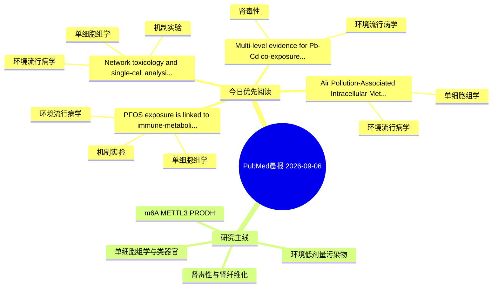

# PubMed 文献晨报｜2026-09-06

- 生成日期：2026-09-06 UTC
- 检索窗口：近 24 小时
- 高质量阈值：规则评分 ≥ 7
- 近 24 小时原始命中数：4

## 今日总体判断

今日筛选出 4 篇优先阅读文献，主要集中在：环境流行病学、单细胞组学、机制实验。

## 今日最值得读的 5 篇文章

### 1. Multi-level evidence for Pb-Cd co-exposure nephrotoxicity: An integrated analysis of NHANES, outcome-oriented network toxicology, and cell-based validation.

- 题目：Multi-level evidence for Pb-Cd co-exposure nephrotoxicity: An integrated analysis of NHANES, outcome-oriented network toxicology, and cell-based validation.
- 期刊：Ecotoxicology and environmental safety
- 年份：2026
- PMID：[42700663](https://pubmed.ncbi.nlm.nih.gov/42700663/)
- DOI：[10.1016/j.ecoenv.2026.120747](https://doi.org/10.1016/j.ecoenv.2026.120747)
- 分类：环境流行病学、肾毒性
- 规则评分：17
- 研究对象：人群/队列或环境暴露人群
- 核心方法：环境流行病学/队列或人群数据
- 主要发现：摘要提示研究重点涉及环境污染物暴露、肾毒性/肾损伤；结论线索为：CONCLUSION: Blood- and urine-based Pb and Cd biomarkers exhibited distinct association profiles across renal outcomes, indicating that a single biomarker matrix or endpoint may incompletely characterize Pb-Cd-associated renal abnormalities.
- 为什么值得读：与肾毒性/肾损伤主线直接相关；关键词匹配度较高

### 2. Network toxicology and single-cell analysis reveal molecular mechanisms of DEHP-induced colorectal cancer.

- 题目：Network toxicology and single-cell analysis reveal molecular mechanisms of DEHP-induced colorectal cancer.
- 期刊：Bioinformation
- 年份：2026
- PMID：[42701762](https://pubmed.ncbi.nlm.nih.gov/42701762/)
- DOI：[10.6026/973206300223430](https://doi.org/10.6026/973206300223430)
- 分类：环境流行病学、机制实验、单细胞组学
- 规则评分：13
- 研究对象：题名和摘要未明确，建议阅读全文确认
- 核心方法：单细胞或空间组学
- 主要发现：摘要提示研究重点涉及环境污染物暴露、单细胞或空间组学；结论线索为：Thus, we report the molecular basis of DEHP-induced CRC progression providing a novel strategy for identifying environmental carcinogenic biomarkers and therapeutic targets.
- 为什么值得读：同时连接环境暴露与机制线索；可帮助寻找细胞类型特异性机制；关键词匹配度较高

### 3. PFOS exposure is linked to immune-metabolic disruption in MASLD: integrated population, computational, and experimental evidence.

- 题目：PFOS exposure is linked to immune-metabolic disruption in MASLD: integrated population, computational, and experimental evidence.
- 期刊：Molecular diversity
- 年份：2026
- PMID：[42701175](https://pubmed.ncbi.nlm.nih.gov/42701175/)
- DOI：[10.1007/s11030-026-11727-8](https://doi.org/10.1007/s11030-026-11727-8)
- 分类：环境流行病学、机制实验、单细胞组学
- 规则评分：10
- 研究对象：人群/队列或环境暴露人群
- 核心方法：环境流行病学/队列或人群数据；单细胞或空间组学；细胞与动物机制实验
- 主要发现：摘要提示研究重点涉及环境污染物暴露、单细胞或空间组学；结论线索为：Single-cell analysis revealed cell-type specificity, with CYP7A1/PHLDA1 enriched in hepatocytes, SOCS2/WNT5A in hepatic stellate cells, and GRIA3 in T cells.
- 为什么值得读：同时连接环境暴露与机制线索；可帮助寻找细胞类型特异性机制

### 4. Air Pollution-Associated Intracellular Metals, Immune Gene Expression, and Erythrocyte Indices in COPD with Anemia.

- 题目：Air Pollution-Associated Intracellular Metals, Immune Gene Expression, and Erythrocyte Indices in COPD with Anemia.
- 期刊：International journal of chronic obstructive pulmonary disease
- 年份：2026
- PMID：[42699267](https://pubmed.ncbi.nlm.nih.gov/42699267/)
- DOI：[10.2147/COPD.S626348](https://doi.org/10.2147/COPD.S626348)
- 分类：环境流行病学、单细胞组学
- 规则评分：10
- 研究对象：题名和摘要未明确，建议阅读全文确认
- 核心方法：单细胞或空间组学
- 主要发现：摘要提示研究重点涉及环境污染物暴露、单细胞或空间组学；结论线索为：These findings suggest potential biological associations among air pollution exposure, intracellular metal burden, immune dysregulation, and hematologic alterations in COPD.
- 为什么值得读：可帮助寻找细胞类型特异性机制

## 分类归档

### 环境流行病学
- [Multi-level evidence for Pb-Cd co-exposure nephrotoxicity: An integrated analysis of NHANES, outcome-oriented network toxicology, and cell-based validation.](https://pubmed.ncbi.nlm.nih.gov/42700663/)（PMID: 42700663）
- [Network toxicology and single-cell analysis reveal molecular mechanisms of DEHP-induced colorectal cancer.](https://pubmed.ncbi.nlm.nih.gov/42701762/)（PMID: 42701762）
- [PFOS exposure is linked to immune-metabolic disruption in MASLD: integrated population, computational, and experimental evidence.](https://pubmed.ncbi.nlm.nih.gov/42701175/)（PMID: 42701175）
- [Air Pollution-Associated Intracellular Metals, Immune Gene Expression, and Erythrocyte Indices in COPD with Anemia.](https://pubmed.ncbi.nlm.nih.gov/42699267/)（PMID: 42699267）

### 机制实验
- [Network toxicology and single-cell analysis reveal molecular mechanisms of DEHP-induced colorectal cancer.](https://pubmed.ncbi.nlm.nih.gov/42701762/)（PMID: 42701762）
- [PFOS exposure is linked to immune-metabolic disruption in MASLD: integrated population, computational, and experimental evidence.](https://pubmed.ncbi.nlm.nih.gov/42701175/)（PMID: 42701175）

### 单细胞组学
- [Network toxicology and single-cell analysis reveal molecular mechanisms of DEHP-induced colorectal cancer.](https://pubmed.ncbi.nlm.nih.gov/42701762/)（PMID: 42701762）
- [PFOS exposure is linked to immune-metabolic disruption in MASLD: integrated population, computational, and experimental evidence.](https://pubmed.ncbi.nlm.nih.gov/42701175/)（PMID: 42701175）
- [Air Pollution-Associated Intracellular Metals, Immune Gene Expression, and Erythrocyte Indices in COPD with Anemia.](https://pubmed.ncbi.nlm.nih.gov/42699267/)（PMID: 42699267）

### 类器官
- 今日暂无高质量新文献。

### 肾毒性
- [Multi-level evidence for Pb-Cd co-exposure nephrotoxicity: An integrated analysis of NHANES, outcome-oriented network toxicology, and cell-based validation.](https://pubmed.ncbi.nlm.nih.gov/42700663/)（PMID: 42700663）

### m6A-METTL3-PRODH
- 今日暂无高质量新文献。

## 今日阅读优先级

1. Multi-level evidence for Pb-Cd co-exposure nephrotoxicity: An integrated analysis of NHANES, outcome-oriented network toxicology, and cell-based validation.（优先理由：与肾毒性/肾损伤主线直接相关；关键词匹配度较高）
2. Network toxicology and single-cell analysis reveal molecular mechanisms of DEHP-induced colorectal cancer.（优先理由：同时连接环境暴露与机制线索；可帮助寻找细胞类型特异性机制；关键词匹配度较高）
3. PFOS exposure is linked to immune-metabolic disruption in MASLD: integrated population, computational, and experimental evidence.（优先理由：同时连接环境暴露与机制线索；可帮助寻找细胞类型特异性机制）
4. Air Pollution-Associated Intracellular Metals, Immune Gene Expression, and Erythrocyte Indices in COPD with Anemia.（优先理由：可帮助寻找细胞类型特异性机制）

## Mermaid 思维导图

