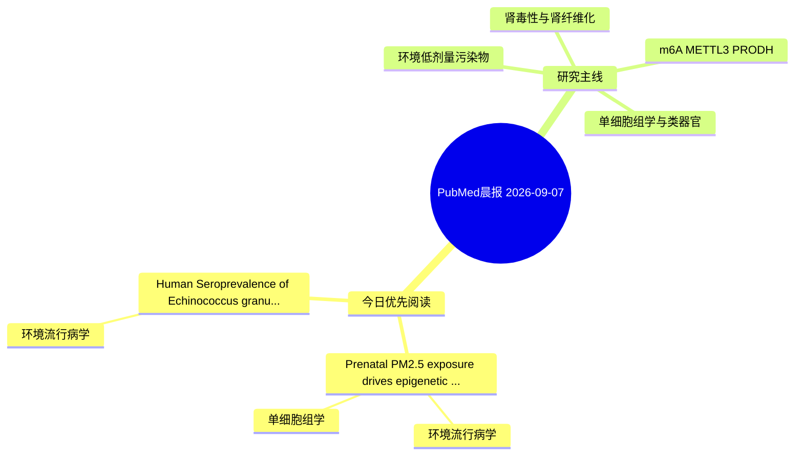

# PubMed 文献晨报｜2026-09-07

- 生成日期：2026-09-07 UTC
- 检索窗口：近 24 小时
- 高质量阈值：规则评分 ≥ 7
- 近 24 小时原始命中数：6

## 今日总体判断

今日筛选出 2 篇优先阅读文献，主要集中在：环境流行病学、单细胞组学。

## 今日最值得读的 5 篇文章

### 1. Prenatal PM2.5 exposure drives epigenetic reprogramming of fetal macrophages linked to atopic dermatitis.

- 题目：Prenatal PM2.5 exposure drives epigenetic reprogramming of fetal macrophages linked to atopic dermatitis.
- 期刊：Nature communications
- 年份：2026
- PMID：[42702610](https://pubmed.ncbi.nlm.nih.gov/42702610/)
- DOI：[10.1038/s41467-026-76298-6](https://doi.org/10.1038/s41467-026-76298-6)
- 分类：环境流行病学、单细胞组学
- 规则评分：11
- 研究对象：题名和摘要未明确，建议阅读全文确认
- 核心方法：单细胞或空间组学
- 主要发现：摘要提示研究重点涉及环境污染物暴露、单细胞或空间组学；结论线索为：These findings suggest that prenatal PM2.5 exposure induces durable epigenetic changes in immune cells, predisposing individuals to inflammatory responses that contribute to AD pathogenesis, and highlight early-life environmental exposure as a potential tar...
- 为什么值得读：可帮助寻找细胞类型特异性机制

### 2. Human Seroprevalence of Echinococcus granulosus in Sulaimani City.

- 题目：Human Seroprevalence of Echinococcus granulosus in Sulaimani City.
- 期刊：Acta tropica
- 年份：2026
- PMID：[42702276](https://pubmed.ncbi.nlm.nih.gov/42702276/)
- DOI：[10.1016/j.actatropica.2026.108318](https://doi.org/10.1016/j.actatropica.2026.108318)
- 分类：环境流行病学
- 规则评分：10
- 研究对象：人群/队列或环境暴露人群
- 核心方法：环境流行病学/队列或人群数据
- 主要发现：摘要提示研究重点涉及环境污染物暴露；结论线索为：The results of this study indicate that CE is a public health problem in Sulaimani City.
- 为什么值得读：与检索主题有交集，可作为背景或线索文献扫读

## 分类归档

### 环境流行病学
- [Prenatal PM2.5 exposure drives epigenetic reprogramming of fetal macrophages linked to atopic dermatitis.](https://pubmed.ncbi.nlm.nih.gov/42702610/)（PMID: 42702610）
- [Human Seroprevalence of Echinococcus granulosus in Sulaimani City.](https://pubmed.ncbi.nlm.nih.gov/42702276/)（PMID: 42702276）

### 机制实验
- 今日暂无高质量新文献。

### 单细胞组学
- [Prenatal PM2.5 exposure drives epigenetic reprogramming of fetal macrophages linked to atopic dermatitis.](https://pubmed.ncbi.nlm.nih.gov/42702610/)（PMID: 42702610）

### 类器官
- 今日暂无高质量新文献。

### 肾毒性
- 今日暂无高质量新文献。

### m6A-METTL3-PRODH
- 今日暂无高质量新文献。

## 今日阅读优先级

1. Prenatal PM2.5 exposure drives epigenetic reprogramming of fetal macrophages linked to atopic dermatitis.（优先理由：可帮助寻找细胞类型特异性机制）
2. Human Seroprevalence of Echinococcus granulosus in Sulaimani City.（优先理由：与检索主题有交集，可作为背景或线索文献扫读）

## Mermaid 思维导图

