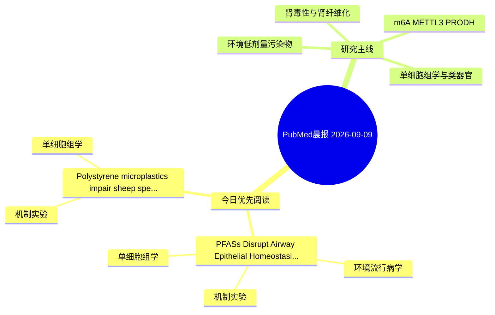

# PubMed 文献晨报｜2026-09-09

- 生成日期：2026-09-09 UTC
- 检索窗口：近 24 小时
- 高质量阈值：规则评分 ≥ 7
- 近 24 小时原始命中数：4

## 今日总体判断

今日筛选出 2 篇优先阅读文献，主要集中在：机制实验、单细胞组学、环境流行病学。

## 今日最值得读的 5 篇文章

### 1. PFASs Disrupt Airway Epithelial Homeostasis in Human Organoids: Evidence Relevant to Obstructive Airway Disease.

- 题目：PFASs Disrupt Airway Epithelial Homeostasis in Human Organoids: Evidence Relevant to Obstructive Airway Disease.
- 期刊：Environmental science & technology
- 年份：2026
- PMID：[42708935](https://pubmed.ncbi.nlm.nih.gov/42708935/)
- DOI：[10.1021/acs.est.6c04546](https://doi.org/10.1021/acs.est.6c04546)
- 分类：环境流行病学、机制实验、单细胞组学、类器官
- 规则评分：14
- 研究对象：人群/队列或环境暴露人群
- 核心方法：单细胞或空间组学；类器官/干细胞模型；细胞与动物机制实验
- 主要发现：摘要提示研究重点涉及环境污染物暴露、单细胞或空间组学、类器官模型；结论线索为：Multiend point Toxicological Priority Index ranking revealed that emerging substitutes, particularly sodium p-perfluorinated noneoxybenzenesulfonate (OBS) and fluorotelomer alcohols (FTOHs), exhibited higher toxicity potency than legacy compounds.
- 为什么值得读：同时连接环境暴露与机制线索；可帮助寻找细胞类型特异性机制；对建立更接近人体的模型有参考价值

### 2. Polystyrene microplastics impair sheep spermatogenesis by disrupting rumen microbiota-derived butyrate signaling.

- 题目：Polystyrene microplastics impair sheep spermatogenesis by disrupting rumen microbiota-derived butyrate signaling.
- 期刊：Journal of animal science and biotechnology
- 年份：2026
- PMID：[42711729](https://pubmed.ncbi.nlm.nih.gov/42711729/)
- DOI：[10.1186/s40104-026-01490-z](https://doi.org/10.1186/s40104-026-01490-z)
- 分类：机制实验、单细胞组学
- 规则评分：10
- 研究对象：题名和摘要未明确，建议阅读全文确认
- 核心方法：单细胞或空间组学
- 主要发现：摘要提示研究重点涉及单细胞或空间组学；结论线索为：CONCLUSIONS: These findings suggest that PS-MPs exposure disrupts spermatogenesis in sheep through rumen-derived butyrate alterations rather than detectable direct tissue accumulation.
- 为什么值得读：可帮助寻找细胞类型特异性机制

## 分类归档

### 环境流行病学
- [PFASs Disrupt Airway Epithelial Homeostasis in Human Organoids: Evidence Relevant to Obstructive Airway Disease.](https://pubmed.ncbi.nlm.nih.gov/42708935/)（PMID: 42708935）

### 机制实验
- [PFASs Disrupt Airway Epithelial Homeostasis in Human Organoids: Evidence Relevant to Obstructive Airway Disease.](https://pubmed.ncbi.nlm.nih.gov/42708935/)（PMID: 42708935）
- [Polystyrene microplastics impair sheep spermatogenesis by disrupting rumen microbiota-derived butyrate signaling.](https://pubmed.ncbi.nlm.nih.gov/42711729/)（PMID: 42711729）

### 单细胞组学
- [PFASs Disrupt Airway Epithelial Homeostasis in Human Organoids: Evidence Relevant to Obstructive Airway Disease.](https://pubmed.ncbi.nlm.nih.gov/42708935/)（PMID: 42708935）
- [Polystyrene microplastics impair sheep spermatogenesis by disrupting rumen microbiota-derived butyrate signaling.](https://pubmed.ncbi.nlm.nih.gov/42711729/)（PMID: 42711729）

### 类器官
- [PFASs Disrupt Airway Epithelial Homeostasis in Human Organoids: Evidence Relevant to Obstructive Airway Disease.](https://pubmed.ncbi.nlm.nih.gov/42708935/)（PMID: 42708935）

### 肾毒性
- 今日暂无高质量新文献。

### m6A-METTL3-PRODH
- 今日暂无高质量新文献。

## 今日阅读优先级

1. PFASs Disrupt Airway Epithelial Homeostasis in Human Organoids: Evidence Relevant to Obstructive Airway Disease.（优先理由：同时连接环境暴露与机制线索；可帮助寻找细胞类型特异性机制；对建立更接近人体的模型有参考价值）
2. Polystyrene microplastics impair sheep spermatogenesis by disrupting rumen microbiota-derived butyrate signaling.（优先理由：可帮助寻找细胞类型特异性机制）

## Mermaid 思维导图

