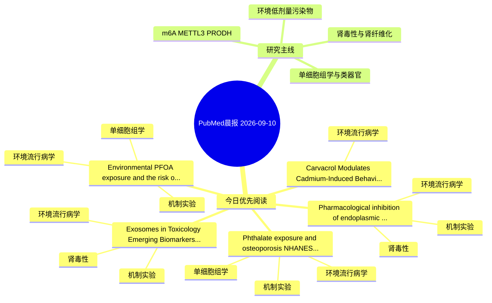

# PubMed 文献晨报｜2026-09-10

- 生成日期：2026-09-10 UTC
- 检索窗口：近 24 小时
- 高质量阈值：规则评分 ≥ 7
- 近 24 小时原始命中数：7

## 今日总体判断

今日筛选出 5 篇优先阅读文献，主要集中在：环境流行病学、机制实验、肾毒性。

## 今日最值得读的 5 篇文章

### 1. Pharmacological inhibition of endoplasmic reticulum stress ameliorates polystyrene nanoplastic-induced renal injury in female Wistar rats.

- 题目：Pharmacological inhibition of endoplasmic reticulum stress ameliorates polystyrene nanoplastic-induced renal injury in female Wistar rats.
- 期刊：Journal of molecular histology
- 年份：2026
- PMID：[42717112](https://pubmed.ncbi.nlm.nih.gov/42717112/)
- DOI：[10.1007/s10735-026-10955-4](https://doi.org/10.1007/s10735-026-10955-4)
- 分类：环境流行病学、机制实验、肾毒性
- 规则评分：17
- 研究对象：小鼠或大鼠肾损伤模型
- 核心方法：基于题名/摘要的常规实验或文献分析，需阅读全文确认
- 主要发现：摘要提示研究重点涉及环境污染物暴露、肾毒性/肾损伤；结论线索为：The results of this study indicate that 4-PBA may serve as a potent intervention to treat PSNP-induced nephrotoxicity.
- 为什么值得读：同时连接环境暴露与机制线索；与肾毒性/肾损伤主线直接相关；关键词匹配度较高

### 2. Environmental PFOA exposure and the risk of metabolic dysfunction-associated steatotic liver disease: An integrated computational toxicology and multi-omics study.

- 题目：Environmental PFOA exposure and the risk of metabolic dysfunction-associated steatotic liver disease: An integrated computational toxicology and multi-omics study.
- 期刊：PloS one
- 年份：2026
- PMID：[42715255](https://pubmed.ncbi.nlm.nih.gov/42715255/)
- DOI：[10.1371/journal.pone.0357970](https://doi.org/10.1371/journal.pone.0357970)
- 分类：环境流行病学、机制实验、单细胞组学
- 规则评分：14
- 研究对象：题名和摘要未明确，建议阅读全文确认
- 核心方法：单细胞或空间组学；细胞与动物机制实验
- 主要发现：摘要提示研究重点涉及环境污染物暴露、单细胞或空间组学；结论线索为：CONCLUSION: Our findings suggest a potential mechanistic association between PFOA exposure and MASLD pathogenesis, characterized by disruption of lipid metabolism, inflammatory responses, and immune homeostasis.
- 为什么值得读：同时连接环境暴露与机制线索；可帮助寻找细胞类型特异性机制；关键词匹配度较高

### 3. Phthalate exposure and osteoporosis: NHANES associations and integrative in silico prioritization of candidate molecular targets.

- 题目：Phthalate exposure and osteoporosis: NHANES associations and integrative in silico prioritization of candidate molecular targets.
- 期刊：Chemosphere
- 年份：2026
- PMID：[42715894](https://pubmed.ncbi.nlm.nih.gov/42715894/)
- DOI：[10.1016/j.chemosphere.2026.145085](https://doi.org/10.1016/j.chemosphere.2026.145085)
- 分类：环境流行病学、机制实验、单细胞组学
- 规则评分：14
- 研究对象：人群/队列或环境暴露人群
- 核心方法：环境流行病学/队列或人群数据；单细胞或空间组学
- 主要发现：摘要提示研究重点涉及环境污染物暴露、单细胞或空间组学；结论线索为：CONCLUSION: Higher urinary phthalate burden was associated with osteoporosis-related outcomes, while integrative in silico analyses prioritized candidate molecular and cellular contexts for future experimental testing.
- 为什么值得读：同时连接环境暴露与机制线索；可帮助寻找细胞类型特异性机制；关键词匹配度较高

### 4. Exosomes in Toxicology: Emerging Biomarkers and Mechanistic Mediators of Toxicant-Induced Injury.

- 题目：Exosomes in Toxicology: Emerging Biomarkers and Mechanistic Mediators of Toxicant-Induced Injury.
- 期刊：Journal of applied toxicology : JAT
- 年份：2026
- PMID：[42712133](https://pubmed.ncbi.nlm.nih.gov/42712133/)
- DOI：[10.1002/jat.70431](https://doi.org/10.1002/jat.70431)
- 分类：环境流行病学、机制实验、肾毒性
- 规则评分：14
- 研究对象：题名和摘要未明确，建议阅读全文确认
- 核心方法：细胞与动物机制实验
- 主要发现：摘要提示研究重点涉及环境污染物暴露、肾毒性/肾损伤；结论线索为：However, broader regulatory implementation will require standardized vesicle definitions, reproducible analytical workflows, dose-response validation, and direct comparison with established toxicological endpoints.
- 为什么值得读：同时连接环境暴露与机制线索；与肾毒性/肾损伤主线直接相关；关键词匹配度较高

### 5. Carvacrol Modulates Cadmium-Induced Behavioral, Biochemical, Histopathological, and Metabolomic Alterations in rats.

- 题目：Carvacrol Modulates Cadmium-Induced Behavioral, Biochemical, Histopathological, and Metabolomic Alterations in rats.
- 期刊：Biological trace element research
- 年份：2026
- PMID：[42717167](https://pubmed.ncbi.nlm.nih.gov/42717167/)
- DOI：[10.1007/s12011-026-05280-6](https://doi.org/10.1007/s12011-026-05280-6)
- 分类：环境流行病学
- 规则评分：12
- 研究对象：小鼠或大鼠肾损伤模型
- 核心方法：基于题名/摘要的常规实验或文献分析，需阅读全文确认
- 主要发现：摘要提示研究重点涉及环境污染物暴露；结论线索为：In conclusion, co-administration of CAR with Cd provided only limited and heterogeneous protection that was insufficient to counteract Cd-induced multisystem toxicity.
- 为什么值得读：关键词匹配度较高

## 分类归档

### 环境流行病学
- [Pharmacological inhibition of endoplasmic reticulum stress ameliorates polystyrene nanoplastic-induced renal injury in female Wistar rats.](https://pubmed.ncbi.nlm.nih.gov/42717112/)（PMID: 42717112）
- [Environmental PFOA exposure and the risk of metabolic dysfunction-associated steatotic liver disease: An integrated computational toxicology and multi-omics study.](https://pubmed.ncbi.nlm.nih.gov/42715255/)（PMID: 42715255）
- [Phthalate exposure and osteoporosis: NHANES associations and integrative in silico prioritization of candidate molecular targets.](https://pubmed.ncbi.nlm.nih.gov/42715894/)（PMID: 42715894）
- [Exosomes in Toxicology: Emerging Biomarkers and Mechanistic Mediators of Toxicant-Induced Injury.](https://pubmed.ncbi.nlm.nih.gov/42712133/)（PMID: 42712133）
- [Carvacrol Modulates Cadmium-Induced Behavioral, Biochemical, Histopathological, and Metabolomic Alterations in rats.](https://pubmed.ncbi.nlm.nih.gov/42717167/)（PMID: 42717167）

### 机制实验
- [Pharmacological inhibition of endoplasmic reticulum stress ameliorates polystyrene nanoplastic-induced renal injury in female Wistar rats.](https://pubmed.ncbi.nlm.nih.gov/42717112/)（PMID: 42717112）
- [Environmental PFOA exposure and the risk of metabolic dysfunction-associated steatotic liver disease: An integrated computational toxicology and multi-omics study.](https://pubmed.ncbi.nlm.nih.gov/42715255/)（PMID: 42715255）
- [Phthalate exposure and osteoporosis: NHANES associations and integrative in silico prioritization of candidate molecular targets.](https://pubmed.ncbi.nlm.nih.gov/42715894/)（PMID: 42715894）
- [Exosomes in Toxicology: Emerging Biomarkers and Mechanistic Mediators of Toxicant-Induced Injury.](https://pubmed.ncbi.nlm.nih.gov/42712133/)（PMID: 42712133）

### 单细胞组学
- [Environmental PFOA exposure and the risk of metabolic dysfunction-associated steatotic liver disease: An integrated computational toxicology and multi-omics study.](https://pubmed.ncbi.nlm.nih.gov/42715255/)（PMID: 42715255）
- [Phthalate exposure and osteoporosis: NHANES associations and integrative in silico prioritization of candidate molecular targets.](https://pubmed.ncbi.nlm.nih.gov/42715894/)（PMID: 42715894）

### 类器官
- 今日暂无高质量新文献。

### 肾毒性
- [Pharmacological inhibition of endoplasmic reticulum stress ameliorates polystyrene nanoplastic-induced renal injury in female Wistar rats.](https://pubmed.ncbi.nlm.nih.gov/42717112/)（PMID: 42717112）
- [Exosomes in Toxicology: Emerging Biomarkers and Mechanistic Mediators of Toxicant-Induced Injury.](https://pubmed.ncbi.nlm.nih.gov/42712133/)（PMID: 42712133）

### m6A-METTL3-PRODH
- 今日暂无高质量新文献。

## 今日阅读优先级

1. Pharmacological inhibition of endoplasmic reticulum stress ameliorates polystyrene nanoplastic-induced renal injury in female Wistar rats.（优先理由：同时连接环境暴露与机制线索；与肾毒性/肾损伤主线直接相关；关键词匹配度较高）
2. Environmental PFOA exposure and the risk of metabolic dysfunction-associated steatotic liver disease: An integrated computational toxicology and multi-omics study.（优先理由：同时连接环境暴露与机制线索；可帮助寻找细胞类型特异性机制；关键词匹配度较高）
3. Phthalate exposure and osteoporosis: NHANES associations and integrative in silico prioritization of candidate molecular targets.（优先理由：同时连接环境暴露与机制线索；可帮助寻找细胞类型特异性机制；关键词匹配度较高）
4. Exosomes in Toxicology: Emerging Biomarkers and Mechanistic Mediators of Toxicant-Induced Injury.（优先理由：同时连接环境暴露与机制线索；与肾毒性/肾损伤主线直接相关；关键词匹配度较高）
5. Carvacrol Modulates Cadmium-Induced Behavioral, Biochemical, Histopathological, and Metabolomic Alterations in rats.（优先理由：关键词匹配度较高）

## Mermaid 思维导图

