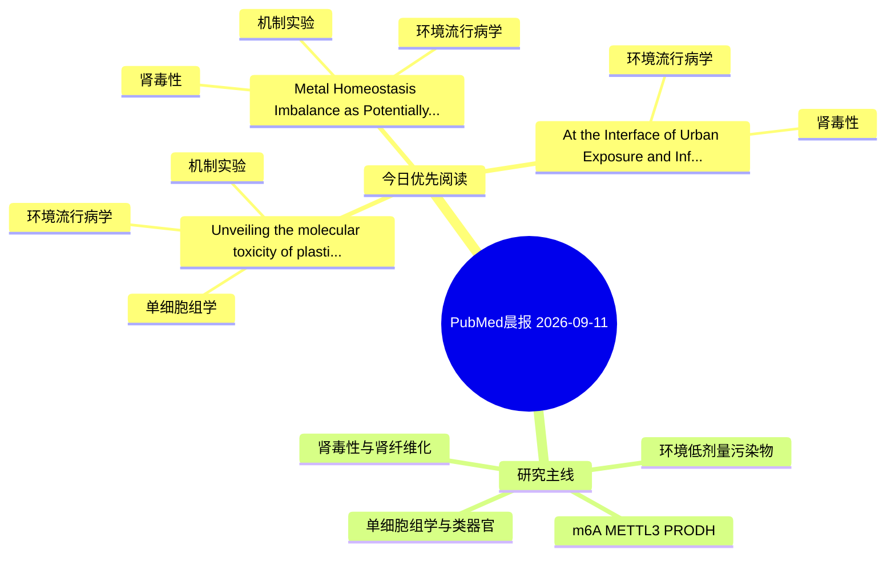

# PubMed 文献晨报｜2026-09-11

- 生成日期：2026-09-11 UTC
- 检索窗口：近 24 小时
- 高质量阈值：规则评分 ≥ 7
- 近 24 小时原始命中数：5

## 今日总体判断

今日筛选出 3 篇优先阅读文献，主要集中在：环境流行病学、肾毒性、机制实验。

## 今日最值得读的 5 篇文章

### 1. Unveiling the molecular toxicity of plasticizers derived from microplastics (DMP and DEP) in diabetic kidney disease: integrative insights from network toxicology and multi-omics analysis.

- 题目：Unveiling the molecular toxicity of plasticizers derived from microplastics (DMP and DEP) in diabetic kidney disease: integrative insights from network toxicology and multi-omics analysis.
- 期刊：Frontiers in immunology
- 年份：2026
- PMID：[42719741](https://pubmed.ncbi.nlm.nih.gov/42719741/)
- DOI：[10.3389/fimmu.2026.1918728](https://doi.org/10.3389/fimmu.2026.1918728)
- 分类：环境流行病学、机制实验、单细胞组学、肾毒性
- 规则评分：21
- 研究对象：HK-2 近端肾小管上皮细胞
- 核心方法：单细胞或空间组学；细胞与动物机制实验
- 主要发现：摘要提示研究重点涉及单细胞或空间组学；结论线索为：These findings suggest potential molecular links between plasticizer exposure and DKD-related cellular injury; however, their exposure-dependent relevance and mechanistic roles in human DKD require further validation.
- 为什么值得读：同时连接环境暴露与机制线索；与肾毒性/肾损伤主线直接相关；可帮助寻找细胞类型特异性机制

### 2. Metal Homeostasis Imbalance as Potentially Contributing Mechanism in Onset of Cardiac Disorders in Individuals with Chronic Obstructive Pulmonary Disease and Chronic Kidney Disease.

- 题目：Metal Homeostasis Imbalance as Potentially Contributing Mechanism in Onset of Cardiac Disorders in Individuals with Chronic Obstructive Pulmonary Disease and Chronic Kidney Disease.
- 期刊：Biological trace element research
- 年份：2026
- PMID：[42722804](https://pubmed.ncbi.nlm.nih.gov/42722804/)
- DOI：[10.1007/s12011-026-05330-z](https://doi.org/10.1007/s12011-026-05330-z)
- 分类：环境流行病学、机制实验、肾毒性
- 规则评分：12
- 研究对象：患者样本或临床数据
- 核心方法：基于题名/摘要的常规实验或文献分析，需阅读全文确认
- 主要发现：摘要提示研究重点涉及环境污染物暴露、肾毒性/肾损伤；结论线索为：Higher myocardial cadmium and lower magnesium concentrations in individuals with COPD suggest altered myocardial metal homeostasis that may be relevant to COPD-associated cardiac alterations.
- 为什么值得读：同时连接环境暴露与机制线索；与肾毒性/肾损伤主线直接相关；关键词匹配度较高

### 3. At the Interface of Urban Exposure and Infection: A Classical Case of Leptospirosis in New York City.

- 题目：At the Interface of Urban Exposure and Infection: A Classical Case of Leptospirosis in New York City.
- 期刊：Cureus
- 年份：2026
- PMID：[42719684](https://pubmed.ncbi.nlm.nih.gov/42719684/)
- DOI：[10.7759/cureus.114250](https://doi.org/10.7759/cureus.114250)
- 分类：环境流行病学、肾毒性
- 规则评分：10
- 研究对象：患者样本或临床数据
- 核心方法：基于题名/摘要的常规实验或文献分析，需阅读全文确认
- 主要发现：摘要提示研究重点涉及环境污染物暴露、肾毒性/肾损伤；结论线索为：The patient improved clinically despite developing severe acute kidney injury and hyperbilirubinemia and was discharged to complete a course of doxycycline, with a favorable outcome.
- 为什么值得读：与肾毒性/肾损伤主线直接相关

## 分类归档

### 环境流行病学
- [Unveiling the molecular toxicity of plasticizers derived from microplastics (DMP and DEP) in diabetic kidney disease: integrative insights from network toxicology and multi-omics analysis.](https://pubmed.ncbi.nlm.nih.gov/42719741/)（PMID: 42719741）
- [Metal Homeostasis Imbalance as Potentially Contributing Mechanism in Onset of Cardiac Disorders in Individuals with Chronic Obstructive Pulmonary Disease and Chronic Kidney Disease.](https://pubmed.ncbi.nlm.nih.gov/42722804/)（PMID: 42722804）
- [At the Interface of Urban Exposure and Infection: A Classical Case of Leptospirosis in New York City.](https://pubmed.ncbi.nlm.nih.gov/42719684/)（PMID: 42719684）

### 机制实验
- [Unveiling the molecular toxicity of plasticizers derived from microplastics (DMP and DEP) in diabetic kidney disease: integrative insights from network toxicology and multi-omics analysis.](https://pubmed.ncbi.nlm.nih.gov/42719741/)（PMID: 42719741）
- [Metal Homeostasis Imbalance as Potentially Contributing Mechanism in Onset of Cardiac Disorders in Individuals with Chronic Obstructive Pulmonary Disease and Chronic Kidney Disease.](https://pubmed.ncbi.nlm.nih.gov/42722804/)（PMID: 42722804）

### 单细胞组学
- [Unveiling the molecular toxicity of plasticizers derived from microplastics (DMP and DEP) in diabetic kidney disease: integrative insights from network toxicology and multi-omics analysis.](https://pubmed.ncbi.nlm.nih.gov/42719741/)（PMID: 42719741）

### 类器官
- 今日暂无高质量新文献。

### 肾毒性
- [Unveiling the molecular toxicity of plasticizers derived from microplastics (DMP and DEP) in diabetic kidney disease: integrative insights from network toxicology and multi-omics analysis.](https://pubmed.ncbi.nlm.nih.gov/42719741/)（PMID: 42719741）
- [Metal Homeostasis Imbalance as Potentially Contributing Mechanism in Onset of Cardiac Disorders in Individuals with Chronic Obstructive Pulmonary Disease and Chronic Kidney Disease.](https://pubmed.ncbi.nlm.nih.gov/42722804/)（PMID: 42722804）
- [At the Interface of Urban Exposure and Infection: A Classical Case of Leptospirosis in New York City.](https://pubmed.ncbi.nlm.nih.gov/42719684/)（PMID: 42719684）

### m6A-METTL3-PRODH
- 今日暂无高质量新文献。

## 今日阅读优先级

1. Unveiling the molecular toxicity of plasticizers derived from microplastics (DMP and DEP) in diabetic kidney disease: integrative insights from network toxicology and multi-omics analysis.（优先理由：同时连接环境暴露与机制线索；与肾毒性/肾损伤主线直接相关；可帮助寻找细胞类型特异性机制）
2. Metal Homeostasis Imbalance as Potentially Contributing Mechanism in Onset of Cardiac Disorders in Individuals with Chronic Obstructive Pulmonary Disease and Chronic Kidney Disease.（优先理由：同时连接环境暴露与机制线索；与肾毒性/肾损伤主线直接相关；关键词匹配度较高）
3. At the Interface of Urban Exposure and Infection: A Classical Case of Leptospirosis in New York City.（优先理由：与肾毒性/肾损伤主线直接相关）

## Mermaid 思维导图

