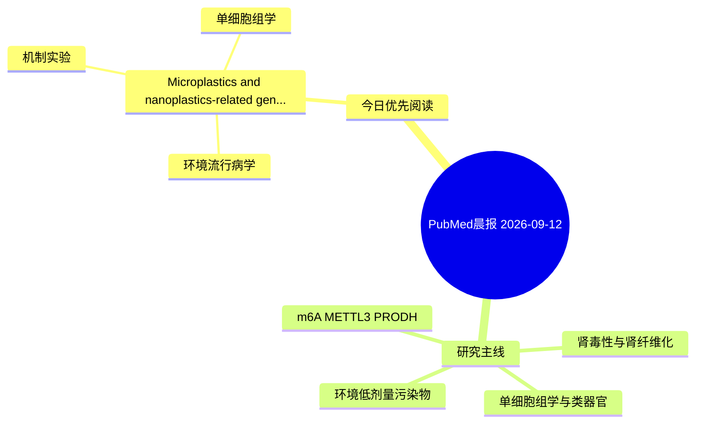

# PubMed 文献晨报｜2026-09-12

- 生成日期：2026-09-12 UTC
- 检索窗口：近 24 小时
- 高质量阈值：规则评分 ≥ 7
- 近 24 小时原始命中数：2

## 今日总体判断

今日筛选出 1 篇优先阅读文献，主要集中在：环境流行病学、机制实验、单细胞组学。

## 今日最值得读的 5 篇文章

### 1. Microplastics and nanoplastics-related genes signature predicts prognosis in pancreatic ductal adenocarcinoma and functional validation of interleukin 1 alpha.

- 题目：Microplastics and nanoplastics-related genes signature predicts prognosis in pancreatic ductal adenocarcinoma and functional validation of interleukin 1 alpha.
- 期刊：Translational cancer research
- 年份：2026
- PMID：[42724844](https://pubmed.ncbi.nlm.nih.gov/42724844/)
- DOI：[10.21037/tcr-2026-1405](https://doi.org/10.21037/tcr-2026-1405)
- 分类：环境流行病学、机制实验、单细胞组学
- 规则评分：7
- 研究对象：人群/队列或环境暴露人群
- 核心方法：环境流行病学/队列或人群数据；单细胞或空间组学；细胞与动物机制实验
- 主要发现：摘要提示研究重点涉及单细胞或空间组学；结论线索为：CONCLUSIONS: Using MNPs-related genes, we built a prognostic model for PAAD, revealing that patients with high-risk scores are likely to have a worse prognosis.
- 为什么值得读：同时连接环境暴露与机制线索；可帮助寻找细胞类型特异性机制

## 分类归档

### 环境流行病学
- [Microplastics and nanoplastics-related genes signature predicts prognosis in pancreatic ductal adenocarcinoma and functional validation of interleukin 1 alpha.](https://pubmed.ncbi.nlm.nih.gov/42724844/)（PMID: 42724844）

### 机制实验
- [Microplastics and nanoplastics-related genes signature predicts prognosis in pancreatic ductal adenocarcinoma and functional validation of interleukin 1 alpha.](https://pubmed.ncbi.nlm.nih.gov/42724844/)（PMID: 42724844）

### 单细胞组学
- [Microplastics and nanoplastics-related genes signature predicts prognosis in pancreatic ductal adenocarcinoma and functional validation of interleukin 1 alpha.](https://pubmed.ncbi.nlm.nih.gov/42724844/)（PMID: 42724844）

### 类器官
- 今日暂无高质量新文献。

### 肾毒性
- 今日暂无高质量新文献。

### m6A-METTL3-PRODH
- 今日暂无高质量新文献。

## 今日阅读优先级

1. Microplastics and nanoplastics-related genes signature predicts prognosis in pancreatic ductal adenocarcinoma and functional validation of interleukin 1 alpha.（优先理由：同时连接环境暴露与机制线索；可帮助寻找细胞类型特异性机制）

## Mermaid 思维导图

