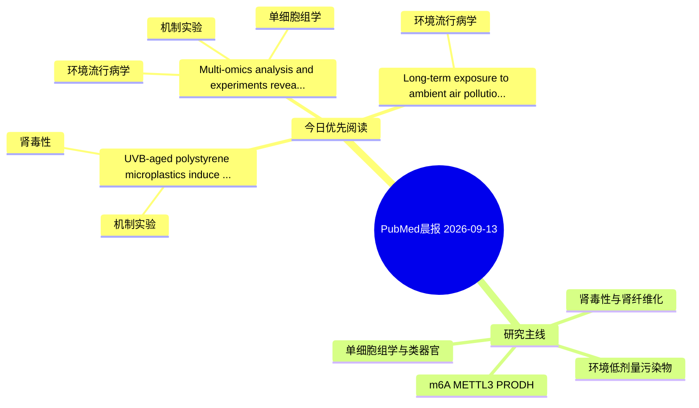

# PubMed 文献晨报｜2026-09-13

- 生成日期：2026-09-13 UTC
- 检索窗口：近 24 小时
- 高质量阈值：规则评分 ≥ 7
- 近 24 小时原始命中数：3

## 今日总体判断

今日筛选出 3 篇优先阅读文献，主要集中在：机制实验、环境流行病学、肾毒性。

## 今日最值得读的 5 篇文章

### 1. UVB-aged polystyrene microplastics induce enhanced stress responses in human proximal tubular cells.

- 题目：UVB-aged polystyrene microplastics induce enhanced stress responses in human proximal tubular cells.
- 期刊：Toxicology
- 年份：2026
- PMID：[42731774](https://pubmed.ncbi.nlm.nih.gov/42731774/)
- DOI：[10.1016/j.tox.2026.154585](https://doi.org/10.1016/j.tox.2026.154585)
- 分类：机制实验、肾毒性
- 规则评分：14
- 研究对象：HK-2 近端肾小管上皮细胞
- 核心方法：细胞与动物机制实验
- 主要发现：摘要提示研究重点涉及本方向相关问题；结论线索为：Collectively, these findings indicate that environmentally aged polystyrene MPs elicit more evident cellular stress responses than their virgin counterparts in HK-2 cells.
- 为什么值得读：与肾毒性/肾损伤主线直接相关；关键词匹配度较高

### 2. Multi-omics analysis and experiments reveal an association between polystyrene microplastics exposure and colorectal cancer progression.

- 题目：Multi-omics analysis and experiments reveal an association between polystyrene microplastics exposure and colorectal cancer progression.
- 期刊：Ecotoxicology and environmental safety
- 年份：2026
- PMID：[42731388](https://pubmed.ncbi.nlm.nih.gov/42731388/)
- DOI：[10.1016/j.ecoenv.2026.120792](https://doi.org/10.1016/j.ecoenv.2026.120792)
- 分类：环境流行病学、机制实验、单细胞组学
- 规则评分：11
- 研究对象：小鼠或大鼠肾损伤模型
- 核心方法：单细胞或空间组学；细胞与动物机制实验
- 主要发现：摘要提示研究重点涉及环境污染物暴露、单细胞或空间组学；结论线索为：CONCLUSION: Our findings suggest that PS-MPs promote CRC progression and are associated with transcriptomic alterations and tumor-related biological processes.
- 为什么值得读：同时连接环境暴露与机制线索；可帮助寻找细胞类型特异性机制

### 3. Long-term exposure to ambient air pollution and an increased risk of hyperuricemia.

- 题目：Long-term exposure to ambient air pollution and an increased risk of hyperuricemia.
- 期刊：Clinical rheumatology
- 年份：2026
- PMID：[42730965](https://pubmed.ncbi.nlm.nih.gov/42730965/)
- DOI：[10.1007/s10067-026-08398-z](https://doi.org/10.1007/s10067-026-08398-z)
- 分类：环境流行病学
- 规则评分：9
- 研究对象：人群/队列或环境暴露人群
- 核心方法：环境流行病学/队列或人群数据
- 主要发现：摘要提示研究重点涉及环境污染物暴露；结论线索为：These findings suggest that air pollution is an important environmental risk factor for metabolic disease, emphasizing the need for stricter regulations to protect vulnerable populations.
- 为什么值得读：与检索主题有交集，可作为背景或线索文献扫读

## 分类归档

### 环境流行病学
- [Multi-omics analysis and experiments reveal an association between polystyrene microplastics exposure and colorectal cancer progression.](https://pubmed.ncbi.nlm.nih.gov/42731388/)（PMID: 42731388）
- [Long-term exposure to ambient air pollution and an increased risk of hyperuricemia.](https://pubmed.ncbi.nlm.nih.gov/42730965/)（PMID: 42730965）

### 机制实验
- [UVB-aged polystyrene microplastics induce enhanced stress responses in human proximal tubular cells.](https://pubmed.ncbi.nlm.nih.gov/42731774/)（PMID: 42731774）
- [Multi-omics analysis and experiments reveal an association between polystyrene microplastics exposure and colorectal cancer progression.](https://pubmed.ncbi.nlm.nih.gov/42731388/)（PMID: 42731388）

### 单细胞组学
- [Multi-omics analysis and experiments reveal an association between polystyrene microplastics exposure and colorectal cancer progression.](https://pubmed.ncbi.nlm.nih.gov/42731388/)（PMID: 42731388）

### 类器官
- 今日暂无高质量新文献。

### 肾毒性
- [UVB-aged polystyrene microplastics induce enhanced stress responses in human proximal tubular cells.](https://pubmed.ncbi.nlm.nih.gov/42731774/)（PMID: 42731774）

### m6A-METTL3-PRODH
- 今日暂无高质量新文献。

## 今日阅读优先级

1. UVB-aged polystyrene microplastics induce enhanced stress responses in human proximal tubular cells.（优先理由：与肾毒性/肾损伤主线直接相关；关键词匹配度较高）
2. Multi-omics analysis and experiments reveal an association between polystyrene microplastics exposure and colorectal cancer progression.（优先理由：同时连接环境暴露与机制线索；可帮助寻找细胞类型特异性机制）
3. Long-term exposure to ambient air pollution and an increased risk of hyperuricemia.（优先理由：与检索主题有交集，可作为背景或线索文献扫读）

## Mermaid 思维导图

