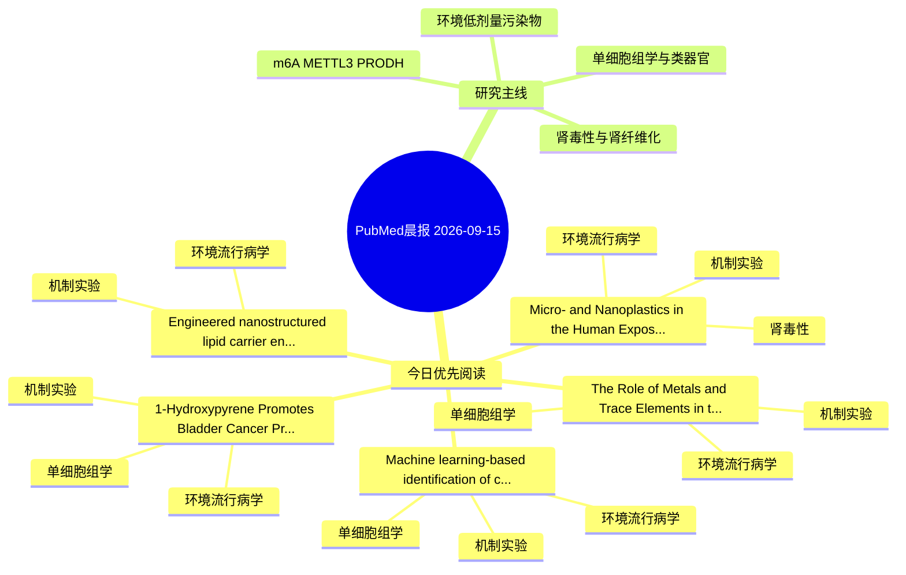

# PubMed 文献晨报｜2026-09-15

- 生成日期：2026-09-15 UTC
- 检索窗口：近 24 小时
- 高质量阈值：规则评分 ≥ 7
- 近 24 小时原始命中数：6

## 今日总体判断

今日筛选出 5 篇优先阅读文献，主要集中在：环境流行病学、机制实验、单细胞组学。

## 今日最值得读的 5 篇文章

### 1. Micro- and Nanoplastics in the Human Exposome: Environmental Pathways, Kidney Toxicity, and Implications for Public Health Risk Assessment.

- 题目：Micro- and Nanoplastics in the Human Exposome: Environmental Pathways, Kidney Toxicity, and Implications for Public Health Risk Assessment.
- 期刊：International journal of molecular sciences
- 年份：2026
- PMID：[42737799](https://pubmed.ncbi.nlm.nih.gov/42737799/)
- DOI：[10.3390/ijms27177903](https://doi.org/10.3390/ijms27177903)
- 分类：环境流行病学、机制实验、肾毒性
- 规则评分：17
- 研究对象：人群/队列或环境暴露人群
- 核心方法：基于题名/摘要的常规实验或文献分析，需阅读全文确认
- 主要发现：摘要提示研究重点涉及环境污染物暴露、肾毒性/肾损伤；结论线索为：Experimental studies, often conducted at concentrations exceeding estimated environmentally relevant exposure levels, have associated renal MNP exposure with oxidative injury, apoptosis, and fibrotic remodeling, while emerging mechanistic findings suggest p...
- 为什么值得读：同时连接环境暴露与机制线索；与肾毒性/肾损伤主线直接相关；关键词匹配度较高

### 2. Machine learning-based identification of core regulatory targets in 1-nitropyrene-induced placental trophoblast dysfunction and FGR.

- 题目：Machine learning-based identification of core regulatory targets in 1-nitropyrene-induced placental trophoblast dysfunction and FGR.
- 期刊：Ecotoxicology and environmental safety
- 年份：2026
- PMID：[42735479](https://pubmed.ncbi.nlm.nih.gov/42735479/)
- DOI：[10.1016/j.ecoenv.2026.120794](https://doi.org/10.1016/j.ecoenv.2026.120794)
- 分类：环境流行病学、机制实验、单细胞组学
- 规则评分：14
- 研究对象：人群/队列或环境暴露人群
- 核心方法：环境流行病学/队列或人群数据；单细胞或空间组学；细胞与动物机制实验
- 主要发现：摘要提示研究重点涉及环境污染物暴露、单细胞或空间组学；结论线索为：Together, these findings suggest that 1-NP exposure contributes to placental dysfunction through EVT-associated molecular alterations and highlight a potential link between environmental pollutants and FGR pathogenesis.
- 为什么值得读：同时连接环境暴露与机制线索；可帮助寻找细胞类型特异性机制；关键词匹配度较高

### 3. The Role of Metals and Trace Elements in the Pathogenesis of Osteoarthritis and Other Rheumatic Diseases.

- 题目：The Role of Metals and Trace Elements in the Pathogenesis of Osteoarthritis and Other Rheumatic Diseases.
- 期刊：International journal of molecular sciences
- 年份：2026
- PMID：[42737786](https://pubmed.ncbi.nlm.nih.gov/42737786/)
- DOI：[10.3390/ijms27177889](https://doi.org/10.3390/ijms27177889)
- 分类：环境流行病学、机制实验、单细胞组学
- 规则评分：12
- 研究对象：题名和摘要未明确，建议阅读全文确认
- 核心方法：单细胞或空间组学
- 主要发现：摘要提示研究重点涉及环境污染物暴露、单细胞或空间组学；结论线索为：A better understanding of metal homeostasis may improve the identification of novel biomarkers and therapeutic targets, ultimately contributing to more precise diagnosis and individualized treatment strategies for osteoarthritis and other rheumatic diseases.
- 为什么值得读：同时连接环境暴露与机制线索；可帮助寻找细胞类型特异性机制；关键词匹配度较高

### 4. 1-Hydroxypyrene Promotes Bladder Cancer Progression and Tumor-Associated Immunosuppression via MIF.

- 题目：1-Hydroxypyrene Promotes Bladder Cancer Progression and Tumor-Associated Immunosuppression via MIF.
- 期刊：International journal of molecular sciences
- 年份：2026
- PMID：[42737676](https://pubmed.ncbi.nlm.nih.gov/42737676/)
- DOI：[10.3390/ijms27177778](https://doi.org/10.3390/ijms27177778)
- 分类：环境流行病学、机制实验、单细胞组学
- 规则评分：11
- 研究对象：题名和摘要未明确，建议阅读全文确认
- 核心方法：单细胞或空间组学；细胞与动物机制实验
- 主要发现：摘要提示研究重点涉及环境污染物暴露、单细胞或空间组学；结论线索为：Collectively, our findings show that 1-OHP promotes bladder cancer progression and tumor-associated immunosuppression, at least in part, through a MIF-dependent mechanism.
- 为什么值得读：同时连接环境暴露与机制线索；可帮助寻找细胞类型特异性机制

### 5. Engineered nanostructured lipid carrier encapsulating thymoquinone and resveratrol to prevent Bisphenol S induced cytotoxicity.

- 题目：Engineered nanostructured lipid carrier encapsulating thymoquinone and resveratrol to prevent Bisphenol S induced cytotoxicity.
- 期刊：Pharmaceutical development and technology
- 年份：2026
- PMID：[42734623](https://pubmed.ncbi.nlm.nih.gov/42734623/)
- DOI：[10.1080/10837450.2026.2734054](https://doi.org/10.1080/10837450.2026.2734054)
- 分类：环境流行病学、机制实验
- 规则评分：9
- 研究对象：题名和摘要未明确，建议阅读全文确认
- 核心方法：细胞与动物机制实验
- 主要发现：摘要提示研究重点涉及本方向相关问题；结论线索为：In summary, this study provides proof of concept that TQRV-NLCs markedly enhance efficacy, confer superior cytoprotection, and offer preventive effects, presenting a promising strategy for renal protection against BPS.
- 为什么值得读：同时连接环境暴露与机制线索

## 分类归档

### 环境流行病学
- [Micro- and Nanoplastics in the Human Exposome: Environmental Pathways, Kidney Toxicity, and Implications for Public Health Risk Assessment.](https://pubmed.ncbi.nlm.nih.gov/42737799/)（PMID: 42737799）
- [Machine learning-based identification of core regulatory targets in 1-nitropyrene-induced placental trophoblast dysfunction and FGR.](https://pubmed.ncbi.nlm.nih.gov/42735479/)（PMID: 42735479）
- [The Role of Metals and Trace Elements in the Pathogenesis of Osteoarthritis and Other Rheumatic Diseases.](https://pubmed.ncbi.nlm.nih.gov/42737786/)（PMID: 42737786）
- [1-Hydroxypyrene Promotes Bladder Cancer Progression and Tumor-Associated Immunosuppression via MIF.](https://pubmed.ncbi.nlm.nih.gov/42737676/)（PMID: 42737676）
- [Engineered nanostructured lipid carrier encapsulating thymoquinone and resveratrol to prevent Bisphenol S induced cytotoxicity.](https://pubmed.ncbi.nlm.nih.gov/42734623/)（PMID: 42734623）

### 机制实验
- [Micro- and Nanoplastics in the Human Exposome: Environmental Pathways, Kidney Toxicity, and Implications for Public Health Risk Assessment.](https://pubmed.ncbi.nlm.nih.gov/42737799/)（PMID: 42737799）
- [Machine learning-based identification of core regulatory targets in 1-nitropyrene-induced placental trophoblast dysfunction and FGR.](https://pubmed.ncbi.nlm.nih.gov/42735479/)（PMID: 42735479）
- [The Role of Metals and Trace Elements in the Pathogenesis of Osteoarthritis and Other Rheumatic Diseases.](https://pubmed.ncbi.nlm.nih.gov/42737786/)（PMID: 42737786）
- [1-Hydroxypyrene Promotes Bladder Cancer Progression and Tumor-Associated Immunosuppression via MIF.](https://pubmed.ncbi.nlm.nih.gov/42737676/)（PMID: 42737676）
- [Engineered nanostructured lipid carrier encapsulating thymoquinone and resveratrol to prevent Bisphenol S induced cytotoxicity.](https://pubmed.ncbi.nlm.nih.gov/42734623/)（PMID: 42734623）

### 单细胞组学
- [Machine learning-based identification of core regulatory targets in 1-nitropyrene-induced placental trophoblast dysfunction and FGR.](https://pubmed.ncbi.nlm.nih.gov/42735479/)（PMID: 42735479）
- [The Role of Metals and Trace Elements in the Pathogenesis of Osteoarthritis and Other Rheumatic Diseases.](https://pubmed.ncbi.nlm.nih.gov/42737786/)（PMID: 42737786）
- [1-Hydroxypyrene Promotes Bladder Cancer Progression and Tumor-Associated Immunosuppression via MIF.](https://pubmed.ncbi.nlm.nih.gov/42737676/)（PMID: 42737676）

### 类器官
- 今日暂无高质量新文献。

### 肾毒性
- [Micro- and Nanoplastics in the Human Exposome: Environmental Pathways, Kidney Toxicity, and Implications for Public Health Risk Assessment.](https://pubmed.ncbi.nlm.nih.gov/42737799/)（PMID: 42737799）

### m6A-METTL3-PRODH
- 今日暂无高质量新文献。

## 今日阅读优先级

1. Micro- and Nanoplastics in the Human Exposome: Environmental Pathways, Kidney Toxicity, and Implications for Public Health Risk Assessment.（优先理由：同时连接环境暴露与机制线索；与肾毒性/肾损伤主线直接相关；关键词匹配度较高）
2. Machine learning-based identification of core regulatory targets in 1-nitropyrene-induced placental trophoblast dysfunction and FGR.（优先理由：同时连接环境暴露与机制线索；可帮助寻找细胞类型特异性机制；关键词匹配度较高）
3. The Role of Metals and Trace Elements in the Pathogenesis of Osteoarthritis and Other Rheumatic Diseases.（优先理由：同时连接环境暴露与机制线索；可帮助寻找细胞类型特异性机制；关键词匹配度较高）
4. 1-Hydroxypyrene Promotes Bladder Cancer Progression and Tumor-Associated Immunosuppression via MIF.（优先理由：同时连接环境暴露与机制线索；可帮助寻找细胞类型特异性机制）
5. Engineered nanostructured lipid carrier encapsulating thymoquinone and resveratrol to prevent Bisphenol S induced cytotoxicity.（优先理由：同时连接环境暴露与机制线索）

## Mermaid 思维导图

