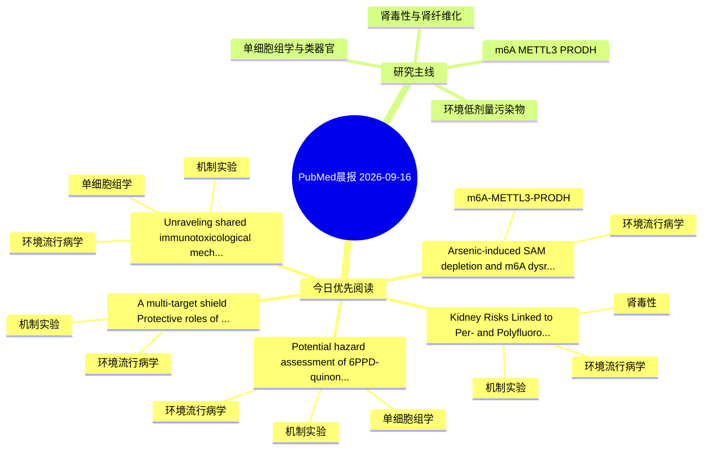

# PubMed 文献晨报｜2026-09-16

- 生成日期：2026-09-16 UTC
- 检索窗口：近 24 小时
- 高质量阈值：规则评分 ≥ 7
- 近 24 小时原始命中数：10

## 今日总体判断

今日筛选出 5 篇优先阅读文献，主要集中在：环境流行病学、机制实验、单细胞组学。

## 今日最值得读的 5 篇文章

### 1. Kidney Risks Linked to Per- and Polyfluoroalkyl Substance Exposure.

- 题目：Kidney Risks Linked to Per- and Polyfluoroalkyl Substance Exposure.
- 期刊：Environmental toxicology
- 年份：2026
- PMID：[42744603](https://pubmed.ncbi.nlm.nih.gov/42744603/)
- DOI：[10.1002/tox.70197](https://doi.org/10.1002/tox.70197)
- 分类：环境流行病学、机制实验、肾毒性
- 规则评分：16
- 研究对象：人群/队列或环境暴露人群
- 核心方法：基于题名/摘要的常规实验或文献分析，需阅读全文确认
- 主要发现：摘要提示研究重点涉及环境污染物暴露、肾毒性/肾损伤；结论线索为：Emerging data further suggest an association between PFAS exposure and increased risk of renal malignancies, particularly renal cell carcinoma.
- 为什么值得读：同时连接环境暴露与机制线索；与肾毒性/肾损伤主线直接相关；关键词匹配度较高

### 2. Arsenic-induced SAM depletion and m6A dysregulation contribute to impaired insulin secretion in MIN6 cells.

- 题目：Arsenic-induced SAM depletion and m6A dysregulation contribute to impaired insulin secretion in MIN6 cells.
- 期刊：Toxicology
- 年份：2026
- PMID：[42744184](https://pubmed.ncbi.nlm.nih.gov/42744184/)
- DOI：[10.1016/j.tox.2026.154587](https://doi.org/10.1016/j.tox.2026.154587)
- 分类：环境流行病学、m6A-METTL3-PRODH
- 规则评分：14
- 研究对象：题名和摘要未明确，建议阅读全文确认
- 核心方法：m6A RNA修饰检测
- 主要发现：摘要提示研究重点涉及环境污染物暴露、m6A-METTL3/PRODH 调控；结论线索为：Collectively, these findings suggest that arsenic exposure impairs insulin secretion in MIN6 cells, potentially through SAM depletion, disruption of m6A homeostasis, and altered m6A regulation of the MAFA-PDX1 regulatory network.
- 为什么值得读：贴近 m6A-METTL3-PRODH 调控假说；关键词匹配度较高

### 3. A multi-target shield: Protective roles of Scutellaria baicalensis flavonoids in heavy metal-induced organ damage.

- 题目：A multi-target shield: Protective roles of Scutellaria baicalensis flavonoids in heavy metal-induced organ damage.
- 期刊：Journal of integrative medicine
- 年份：2026
- PMID：[42744665](https://pubmed.ncbi.nlm.nih.gov/42744665/)
- DOI：[10.1016/j.joim.2026.09.001](https://doi.org/10.1016/j.joim.2026.09.001)
- 分类：环境流行病学、机制实验
- 规则评分：12
- 研究对象：患者样本或临床数据
- 核心方法：细胞与动物机制实验
- 主要发现：摘要提示研究重点涉及环境污染物暴露；结论线索为：2026; Epub ahead of print.
- 为什么值得读：同时连接环境暴露与机制线索；关键词匹配度较高

### 4. Unraveling shared immunotoxicological mechanisms linking exposure to PPCPs with Alzheimer's disease and atherosclerosis: integrative multi-omics, network toxicology, and experimental validation.

- 题目：Unraveling shared immunotoxicological mechanisms linking exposure to PPCPs with Alzheimer's disease and atherosclerosis: integrative multi-omics, network toxicology, and experimental validation.
- 期刊：Environment international
- 年份：2026
- PMID：[42743802](https://pubmed.ncbi.nlm.nih.gov/42743802/)
- DOI：[10.1016/j.envint.2026.110518](https://doi.org/10.1016/j.envint.2026.110518)
- 分类：环境流行病学、机制实验、单细胞组学
- 规则评分：10
- 研究对象：小鼠或大鼠肾损伤模型
- 核心方法：单细胞或空间组学；细胞与动物机制实验
- 主要发现：摘要提示研究重点涉及单细胞或空间组学；结论线索为：CONCLUSIONS: TREM2, SPP1, TGFBI, and MRGPRF constitute a recurrent but directionally heterogeneous molecular signature across AD and AS, with MRGPRF showing disease-context-dependent regulation.
- 为什么值得读：同时连接环境暴露与机制线索；可帮助寻找细胞类型特异性机制

### 5. Potential hazard assessment of 6PPD-quinone in the context of ulcerative colitis: network toxicology, machine learning, transcriptomic analysis, and preliminary In vivo validation.

- 题目：Potential hazard assessment of 6PPD-quinone in the context of ulcerative colitis: network toxicology, machine learning, transcriptomic analysis, and preliminary In vivo validation.
- 期刊：Frontiers in immunology
- 年份：2026
- PMID：[42741553](https://pubmed.ncbi.nlm.nih.gov/42741553/)
- DOI：[10.3389/fimmu.2026.1848350](https://doi.org/10.3389/fimmu.2026.1848350)
- 分类：环境流行病学、机制实验、单细胞组学
- 规则评分：10
- 研究对象：小鼠或大鼠肾损伤模型
- 核心方法：单细胞或空间组学；细胞与动物机制实验
- 主要发现：摘要提示研究重点涉及环境污染物暴露、单细胞或空间组学；结论线索为：CONCLUSIONS: This study provides an integrative mechanistic framework for investigating the potential intestinal effects of 6PPD-Q under inflammatory conditions.
- 为什么值得读：同时连接环境暴露与机制线索；可帮助寻找细胞类型特异性机制

## 分类归档

### 环境流行病学
- [Kidney Risks Linked to Per- and Polyfluoroalkyl Substance Exposure.](https://pubmed.ncbi.nlm.nih.gov/42744603/)（PMID: 42744603）
- [Arsenic-induced SAM depletion and m6A dysregulation contribute to impaired insulin secretion in MIN6 cells.](https://pubmed.ncbi.nlm.nih.gov/42744184/)（PMID: 42744184）
- [A multi-target shield: Protective roles of Scutellaria baicalensis flavonoids in heavy metal-induced organ damage.](https://pubmed.ncbi.nlm.nih.gov/42744665/)（PMID: 42744665）
- [Unraveling shared immunotoxicological mechanisms linking exposure to PPCPs with Alzheimer's disease and atherosclerosis: integrative multi-omics, network toxicology, and experimental validation.](https://pubmed.ncbi.nlm.nih.gov/42743802/)（PMID: 42743802）
- [Potential hazard assessment of 6PPD-quinone in the context of ulcerative colitis: network toxicology, machine learning, transcriptomic analysis, and preliminary In vivo validation.](https://pubmed.ncbi.nlm.nih.gov/42741553/)（PMID: 42741553）

### 机制实验
- [Kidney Risks Linked to Per- and Polyfluoroalkyl Substance Exposure.](https://pubmed.ncbi.nlm.nih.gov/42744603/)（PMID: 42744603）
- [A multi-target shield: Protective roles of Scutellaria baicalensis flavonoids in heavy metal-induced organ damage.](https://pubmed.ncbi.nlm.nih.gov/42744665/)（PMID: 42744665）
- [Unraveling shared immunotoxicological mechanisms linking exposure to PPCPs with Alzheimer's disease and atherosclerosis: integrative multi-omics, network toxicology, and experimental validation.](https://pubmed.ncbi.nlm.nih.gov/42743802/)（PMID: 42743802）
- [Potential hazard assessment of 6PPD-quinone in the context of ulcerative colitis: network toxicology, machine learning, transcriptomic analysis, and preliminary In vivo validation.](https://pubmed.ncbi.nlm.nih.gov/42741553/)（PMID: 42741553）

### 单细胞组学
- [Unraveling shared immunotoxicological mechanisms linking exposure to PPCPs with Alzheimer's disease and atherosclerosis: integrative multi-omics, network toxicology, and experimental validation.](https://pubmed.ncbi.nlm.nih.gov/42743802/)（PMID: 42743802）
- [Potential hazard assessment of 6PPD-quinone in the context of ulcerative colitis: network toxicology, machine learning, transcriptomic analysis, and preliminary In vivo validation.](https://pubmed.ncbi.nlm.nih.gov/42741553/)（PMID: 42741553）

### 类器官
- 今日暂无高质量新文献。

### 肾毒性
- [Kidney Risks Linked to Per- and Polyfluoroalkyl Substance Exposure.](https://pubmed.ncbi.nlm.nih.gov/42744603/)（PMID: 42744603）

### m6A-METTL3-PRODH
- [Arsenic-induced SAM depletion and m6A dysregulation contribute to impaired insulin secretion in MIN6 cells.](https://pubmed.ncbi.nlm.nih.gov/42744184/)（PMID: 42744184）

## 今日阅读优先级

1. Kidney Risks Linked to Per- and Polyfluoroalkyl Substance Exposure.（优先理由：同时连接环境暴露与机制线索；与肾毒性/肾损伤主线直接相关；关键词匹配度较高）
2. Arsenic-induced SAM depletion and m6A dysregulation contribute to impaired insulin secretion in MIN6 cells.（优先理由：贴近 m6A-METTL3-PRODH 调控假说；关键词匹配度较高）
3. A multi-target shield: Protective roles of Scutellaria baicalensis flavonoids in heavy metal-induced organ damage.（优先理由：同时连接环境暴露与机制线索；关键词匹配度较高）
4. Unraveling shared immunotoxicological mechanisms linking exposure to PPCPs with Alzheimer's disease and atherosclerosis: integrative multi-omics, network toxicology, and experimental validation.（优先理由：同时连接环境暴露与机制线索；可帮助寻找细胞类型特异性机制）
5. Potential hazard assessment of 6PPD-quinone in the context of ulcerative colitis: network toxicology, machine learning, transcriptomic analysis, and preliminary In vivo validation.（优先理由：同时连接环境暴露与机制线索；可帮助寻找细胞类型特异性机制）

## Mermaid 思维导图

