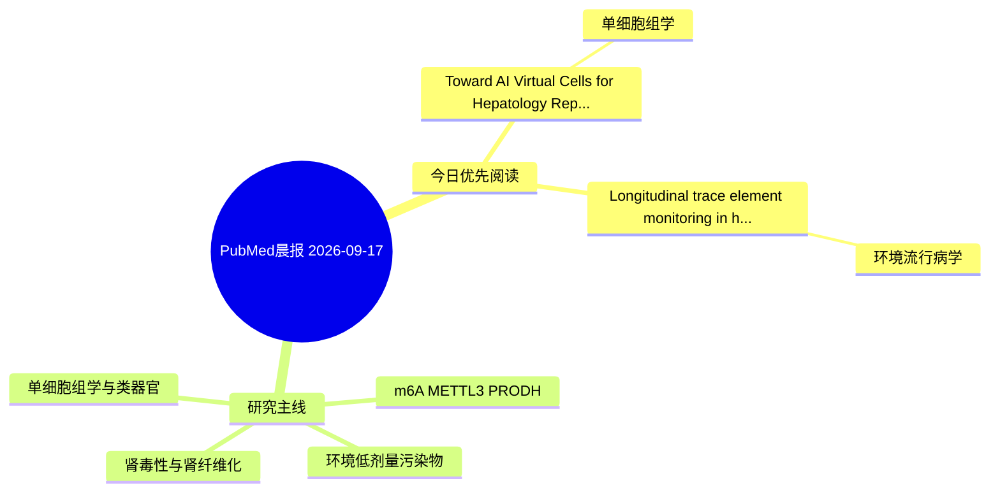

# PubMed 文献晨报｜2026-09-17

- 生成日期：2026-09-17 UTC
- 检索窗口：近 24 小时
- 高质量阈值：规则评分 ≥ 7
- 近 24 小时原始命中数：3

## 今日总体判断

今日筛选出 2 篇优先阅读文献，主要集中在：单细胞组学、环境流行病学。

## 今日最值得读的 5 篇文章

### 1. Toward AI Virtual Cells for Hepatology: Representation, Generation, Dynamics, and Intervention in Single-Cell Models.

- 题目：Toward AI Virtual Cells for Hepatology: Representation, Generation, Dynamics, and Intervention in Single-Cell Models.
- 期刊：Clinical and molecular hepatology
- 年份：2026
- PMID：[42749352](https://pubmed.ncbi.nlm.nih.gov/42749352/)
- DOI：[10.3350/cmh.2026.0820](https://doi.org/10.3350/cmh.2026.0820)
- 分类：单细胞组学
- 规则评分：10
- 研究对象：患者样本或临床数据
- 核心方法：单细胞或空间组学
- 主要发现：摘要提示研究重点涉及环境污染物暴露、单细胞或空间组学；结论线索为：Published models demonstrate individual components, including atlas integration, inferred trajectories, transferable representations, and retrospective response programs.
- 为什么值得读：可帮助寻找细胞类型特异性机制

### 2. Longitudinal trace element monitoring in haemodialysis patients: Impact of dialysis vintage and technical treatment factors.

- 题目：Longitudinal trace element monitoring in haemodialysis patients: Impact of dialysis vintage and technical treatment factors.
- 期刊：Clinical biochemistry
- 年份：2026
- PMID：[42749109](https://pubmed.ncbi.nlm.nih.gov/42749109/)
- DOI：[10.1016/j.clinbiochem.2026.111206](https://doi.org/10.1016/j.clinbiochem.2026.111206)
- 分类：环境流行病学
- 规则评分：9
- 研究对象：人群/队列或环境暴露人群
- 核心方法：环境流行病学/队列或人群数据
- 主要发现：摘要提示研究重点涉及环境污染物暴露；结论线索为：CONCLUSION: HD patients suffer profound, progressive dyshomeostasis of trace elements, marked by deficiencies in essential elements and accumulation of toxic metals.
- 为什么值得读：与检索主题有交集，可作为背景或线索文献扫读

## 分类归档

### 环境流行病学
- [Longitudinal trace element monitoring in haemodialysis patients: Impact of dialysis vintage and technical treatment factors.](https://pubmed.ncbi.nlm.nih.gov/42749109/)（PMID: 42749109）

### 机制实验
- 今日暂无高质量新文献。

### 单细胞组学
- [Toward AI Virtual Cells for Hepatology: Representation, Generation, Dynamics, and Intervention in Single-Cell Models.](https://pubmed.ncbi.nlm.nih.gov/42749352/)（PMID: 42749352）

### 类器官
- 今日暂无高质量新文献。

### 肾毒性
- 今日暂无高质量新文献。

### m6A-METTL3-PRODH
- 今日暂无高质量新文献。

## 今日阅读优先级

1. Toward AI Virtual Cells for Hepatology: Representation, Generation, Dynamics, and Intervention in Single-Cell Models.（优先理由：可帮助寻找细胞类型特异性机制）
2. Longitudinal trace element monitoring in haemodialysis patients: Impact of dialysis vintage and technical treatment factors.（优先理由：与检索主题有交集，可作为背景或线索文献扫读）

## Mermaid 思维导图

