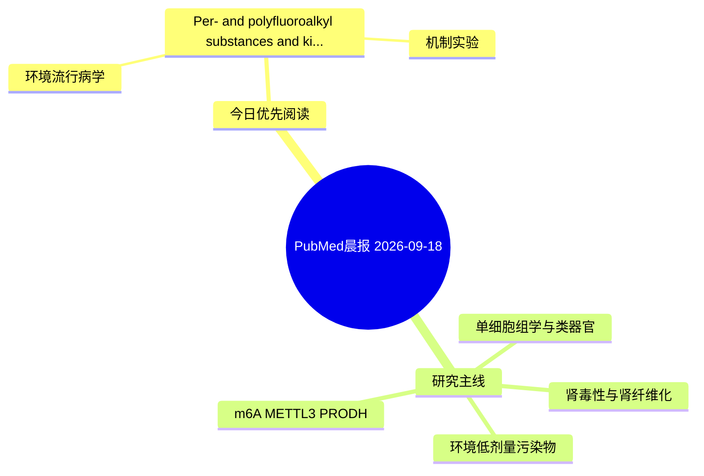

# PubMed 文献晨报｜2026-09-18

- 生成日期：2026-09-18 UTC
- 检索窗口：近 24 小时
- 高质量阈值：规则评分 ≥ 7
- 近 24 小时原始命中数：1

## 今日总体判断

今日筛选出 1 篇优先阅读文献，主要集中在：环境流行病学、机制实验。

## 今日最值得读的 5 篇文章

### 1. Per- and polyfluoroalkyl substances and kidney disease: Genetic associations and computational prioritization of candidate toxicogenomic pathways.

- 题目：Per- and polyfluoroalkyl substances and kidney disease: Genetic associations and computational prioritization of candidate toxicogenomic pathways.
- 期刊：PLoS computational biology
- 年份：2026
- PMID：[42752549](https://pubmed.ncbi.nlm.nih.gov/42752549/)
- DOI：[10.1371/journal.pcbi.1014665](https://doi.org/10.1371/journal.pcbi.1014665)
- 分类：环境流行病学、机制实验
- 规则评分：9
- 研究对象：题名和摘要未明确，建议阅读全文确认
- 核心方法：基于题名/摘要的常规实验或文献分析，需阅读全文确认
- 主要发现：摘要提示研究重点涉及环境污染物暴露；结论线索为：Overall, this study provides a hypothesis-generating framework for exploring associations among genetically predicted PFAS-related traits, kidney disease outcomes, and candidate toxicogenomic pathway themes that require experimental validation.
- 为什么值得读：同时连接环境暴露与机制线索

## 分类归档

### 环境流行病学
- [Per- and polyfluoroalkyl substances and kidney disease: Genetic associations and computational prioritization of candidate toxicogenomic pathways.](https://pubmed.ncbi.nlm.nih.gov/42752549/)（PMID: 42752549）

### 机制实验
- [Per- and polyfluoroalkyl substances and kidney disease: Genetic associations and computational prioritization of candidate toxicogenomic pathways.](https://pubmed.ncbi.nlm.nih.gov/42752549/)（PMID: 42752549）

### 单细胞组学
- 今日暂无高质量新文献。

### 类器官
- 今日暂无高质量新文献。

### 肾毒性
- 今日暂无高质量新文献。

### m6A-METTL3-PRODH
- 今日暂无高质量新文献。

## 今日阅读优先级

1. Per- and polyfluoroalkyl substances and kidney disease: Genetic associations and computational prioritization of candidate toxicogenomic pathways.（优先理由：同时连接环境暴露与机制线索）

## Mermaid 思维导图

