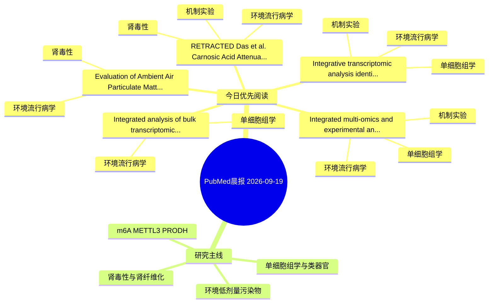

# PubMed 文献晨报｜2026-09-19

- 生成日期：2026-09-19 UTC
- 检索窗口：近 24 小时
- 高质量阈值：规则评分 ≥ 7
- 近 24 小时原始命中数：9

## 今日总体判断

今日筛选出 5 篇优先阅读文献，主要集中在：环境流行病学、单细胞组学、机制实验。

## 今日最值得读的 5 篇文章

### 1. Integrated analysis of bulk transcriptomics and single-cell transcriptomics revealed the association characteristics between heart failure and β-hydroxybutyrylation-related genes.

- 题目：Integrated analysis of bulk transcriptomics and single-cell transcriptomics revealed the association characteristics between heart failure and β-hydroxybutyrylation-related genes.
- 期刊：PloS one
- 年份：2026
- PMID：[42758764](https://pubmed.ncbi.nlm.nih.gov/42758764/)
- DOI：[10.1371/journal.pone.0357103](https://doi.org/10.1371/journal.pone.0357103)
- 分类：环境流行病学、单细胞组学
- 规则评分：14
- 研究对象：题名和摘要未明确，建议阅读全文确认
- 核心方法：单细胞或空间组学
- 主要发现：摘要提示研究重点涉及单细胞或空间组学；结论线索为：CONCLUSION: HMOX2 and KPNA2 were identified as Kbhb-related biomarkers in HF, while T cells served as a key cell type in the disease.
- 为什么值得读：可帮助寻找细胞类型特异性机制；关键词匹配度较高

### 2. Evaluation of Ambient Air Particulate Matter, Urine Arsenic Levels and the Effect on Residents Health in an Artisanal Mining Community and an Incorporated Mining Community in Ghana From April 2024 to July 2024: A Cross-Sectional Study.

- 题目：Evaluation of Ambient Air Particulate Matter, Urine Arsenic Levels and the Effect on Residents Health in an Artisanal Mining Community and an Incorporated Mining Community in Ghana From April 2024 to July 2024: A Cross-Sectional Study.
- 期刊：Health science reports
- 年份：2026
- PMID：[42756606](https://pubmed.ncbi.nlm.nih.gov/42756606/)
- DOI：[10.1002/hsr2.73246](https://doi.org/10.1002/hsr2.73246)
- 分类：环境流行病学、肾毒性
- 规则评分：12
- 研究对象：题名和摘要未明确，建议阅读全文确认
- 核心方法：基于题名/摘要的常规实验或文献分析，需阅读全文确认
- 主要发现：摘要提示研究重点涉及环境污染物暴露、肾毒性/肾损伤；结论线索为：CONCLUSION: The inhabitants of the artisanal mining community are at a higher risk of air pollution related disorders and kidney diseases whereas those in the incorporated mining community exhibit poorer general health status.
- 为什么值得读：与肾毒性/肾损伤主线直接相关；关键词匹配度较高

### 3. RETRACTED: Das et al. Carnosic Acid Attenuates Cadmium Induced Nephrotoxicity by Inhibiting Oxidative Stress, Promoting Nrf2/HO-1 Signalling and Impairing TGF-β1/Smad/Collagen IV Signalling. Molecules 2019, 24, 4176.

- 题目：RETRACTED: Das et al. Carnosic Acid Attenuates Cadmium Induced Nephrotoxicity by Inhibiting Oxidative Stress, Promoting Nrf2/HO-1 Signalling and Impairing TGF-β1/Smad/Collagen IV Signalling. Molecules 2019, 24, 4176.
- 期刊：Molecules (Basel, Switzerland)
- 年份：2026
- PMID：[42757645](https://pubmed.ncbi.nlm.nih.gov/42757645/)
- DOI：[10.3390/molecules31183312](https://doi.org/10.3390/molecules31183312)
- 分类：环境流行病学、机制实验、肾毒性
- 规则评分：11
- 研究对象：题名和摘要未明确，建议阅读全文确认
- 核心方法：基于题名/摘要的常规实验或文献分析，需阅读全文确认
- 主要发现：摘要提示研究重点涉及环境污染物暴露、肾毒性/肾损伤、肾纤维化；结论线索为：The journal retracts the article titled "Carnosic Acid Attenuates Cadmium Induced Nephrotoxicity by Inhibiting Oxidative Stress, Promoting Nrf2/HO-1 Signalling and Impairing TGF-β1/Smad/Collagen IV Signalling" [...].
- 为什么值得读：同时连接环境暴露与机制线索；与肾毒性/肾损伤主线直接相关

### 4. Integrated multi-omics and experimental analyses reveal VIPR1 as a potential mediator linking environmental bisphenol A exposure to MASH-HCC progression.

- 题目：Integrated multi-omics and experimental analyses reveal VIPR1 as a potential mediator linking environmental bisphenol A exposure to MASH-HCC progression.
- 期刊：Ecotoxicology and environmental safety
- 年份：2026
- PMID：[42759461](https://pubmed.ncbi.nlm.nih.gov/42759461/)
- DOI：[10.1016/j.ecoenv.2026.120809](https://doi.org/10.1016/j.ecoenv.2026.120809)
- 分类：环境流行病学、机制实验、单细胞组学
- 规则评分：10
- 研究对象：题名和摘要未明确，建议阅读全文确认
- 核心方法：单细胞或空间组学；细胞与动物机制实验
- 主要发现：摘要提示研究重点涉及单细胞或空间组学；结论线索为：Single-cell and virtual perturbation analyses revealed hepatocyte-enriched expression patterns and prioritized YY1 as a potential upstream regulator of VIPR1.
- 为什么值得读：同时连接环境暴露与机制线索；可帮助寻找细胞类型特异性机制

### 5. Integrative transcriptomic analysis identifies CCL22-associated immune signatures in air pollution-related atopic dermatitis.

- 题目：Integrative transcriptomic analysis identifies CCL22-associated immune signatures in air pollution-related atopic dermatitis.
- 期刊：Frontiers in public health
- 年份：2026
- PMID：[42756293](https://pubmed.ncbi.nlm.nih.gov/42756293/)
- DOI：[10.3389/fpubh.2026.1906298](https://doi.org/10.3389/fpubh.2026.1906298)
- 分类：环境流行病学、机制实验、单细胞组学
- 规则评分：10
- 研究对象：人群/队列或环境暴露人群
- 核心方法：环境流行病学/队列或人群数据；单细胞或空间组学；细胞与动物机制实验
- 主要发现：摘要提示研究重点涉及环境污染物暴露、单细胞或空间组学；结论线索为：CONCLUSION: These findings identify CCL22-associated immune and stromal remodeling signatures as candidate molecular features of air pollution-related AD and generate testable hypotheses for future controlled exposure studies.
- 为什么值得读：同时连接环境暴露与机制线索；可帮助寻找细胞类型特异性机制

## 分类归档

### 环境流行病学
- [Integrated analysis of bulk transcriptomics and single-cell transcriptomics revealed the association characteristics between heart failure and β-hydroxybutyrylation-related genes.](https://pubmed.ncbi.nlm.nih.gov/42758764/)（PMID: 42758764）
- [Evaluation of Ambient Air Particulate Matter, Urine Arsenic Levels and the Effect on Residents Health in an Artisanal Mining Community and an Incorporated Mining Community in Ghana From April 2024 to July 2024: A Cross-Sectional Study.](https://pubmed.ncbi.nlm.nih.gov/42756606/)（PMID: 42756606）
- [RETRACTED: Das et al. Carnosic Acid Attenuates Cadmium Induced Nephrotoxicity by Inhibiting Oxidative Stress, Promoting Nrf2/HO-1 Signalling and Impairing TGF-β1/Smad/Collagen IV Signalling. Molecules 2019, 24, 4176.](https://pubmed.ncbi.nlm.nih.gov/42757645/)（PMID: 42757645）
- [Integrated multi-omics and experimental analyses reveal VIPR1 as a potential mediator linking environmental bisphenol A exposure to MASH-HCC progression.](https://pubmed.ncbi.nlm.nih.gov/42759461/)（PMID: 42759461）
- [Integrative transcriptomic analysis identifies CCL22-associated immune signatures in air pollution-related atopic dermatitis.](https://pubmed.ncbi.nlm.nih.gov/42756293/)（PMID: 42756293）

### 机制实验
- [RETRACTED: Das et al. Carnosic Acid Attenuates Cadmium Induced Nephrotoxicity by Inhibiting Oxidative Stress, Promoting Nrf2/HO-1 Signalling and Impairing TGF-β1/Smad/Collagen IV Signalling. Molecules 2019, 24, 4176.](https://pubmed.ncbi.nlm.nih.gov/42757645/)（PMID: 42757645）
- [Integrated multi-omics and experimental analyses reveal VIPR1 as a potential mediator linking environmental bisphenol A exposure to MASH-HCC progression.](https://pubmed.ncbi.nlm.nih.gov/42759461/)（PMID: 42759461）
- [Integrative transcriptomic analysis identifies CCL22-associated immune signatures in air pollution-related atopic dermatitis.](https://pubmed.ncbi.nlm.nih.gov/42756293/)（PMID: 42756293）

### 单细胞组学
- [Integrated analysis of bulk transcriptomics and single-cell transcriptomics revealed the association characteristics between heart failure and β-hydroxybutyrylation-related genes.](https://pubmed.ncbi.nlm.nih.gov/42758764/)（PMID: 42758764）
- [Integrated multi-omics and experimental analyses reveal VIPR1 as a potential mediator linking environmental bisphenol A exposure to MASH-HCC progression.](https://pubmed.ncbi.nlm.nih.gov/42759461/)（PMID: 42759461）
- [Integrative transcriptomic analysis identifies CCL22-associated immune signatures in air pollution-related atopic dermatitis.](https://pubmed.ncbi.nlm.nih.gov/42756293/)（PMID: 42756293）

### 类器官
- 今日暂无高质量新文献。

### 肾毒性
- [Evaluation of Ambient Air Particulate Matter, Urine Arsenic Levels and the Effect on Residents Health in an Artisanal Mining Community and an Incorporated Mining Community in Ghana From April 2024 to July 2024: A Cross-Sectional Study.](https://pubmed.ncbi.nlm.nih.gov/42756606/)（PMID: 42756606）
- [RETRACTED: Das et al. Carnosic Acid Attenuates Cadmium Induced Nephrotoxicity by Inhibiting Oxidative Stress, Promoting Nrf2/HO-1 Signalling and Impairing TGF-β1/Smad/Collagen IV Signalling. Molecules 2019, 24, 4176.](https://pubmed.ncbi.nlm.nih.gov/42757645/)（PMID: 42757645）

### m6A-METTL3-PRODH
- 今日暂无高质量新文献。

## 今日阅读优先级

1. Integrated analysis of bulk transcriptomics and single-cell transcriptomics revealed the association characteristics between heart failure and β-hydroxybutyrylation-related genes.（优先理由：可帮助寻找细胞类型特异性机制；关键词匹配度较高）
2. Evaluation of Ambient Air Particulate Matter, Urine Arsenic Levels and the Effect on Residents Health in an Artisanal Mining Community and an Incorporated Mining Community in Ghana From April 2024 to July 2024: A Cross-Sectional Study.（优先理由：与肾毒性/肾损伤主线直接相关；关键词匹配度较高）
3. RETRACTED: Das et al. Carnosic Acid Attenuates Cadmium Induced Nephrotoxicity by Inhibiting Oxidative Stress, Promoting Nrf2/HO-1 Signalling and Impairing TGF-β1/Smad/Collagen IV Signalling. Molecules 2019, 24, 4176.（优先理由：同时连接环境暴露与机制线索；与肾毒性/肾损伤主线直接相关）
4. Integrated multi-omics and experimental analyses reveal VIPR1 as a potential mediator linking environmental bisphenol A exposure to MASH-HCC progression.（优先理由：同时连接环境暴露与机制线索；可帮助寻找细胞类型特异性机制）
5. Integrative transcriptomic analysis identifies CCL22-associated immune signatures in air pollution-related atopic dermatitis.（优先理由：同时连接环境暴露与机制线索；可帮助寻找细胞类型特异性机制）

## Mermaid 思维导图

