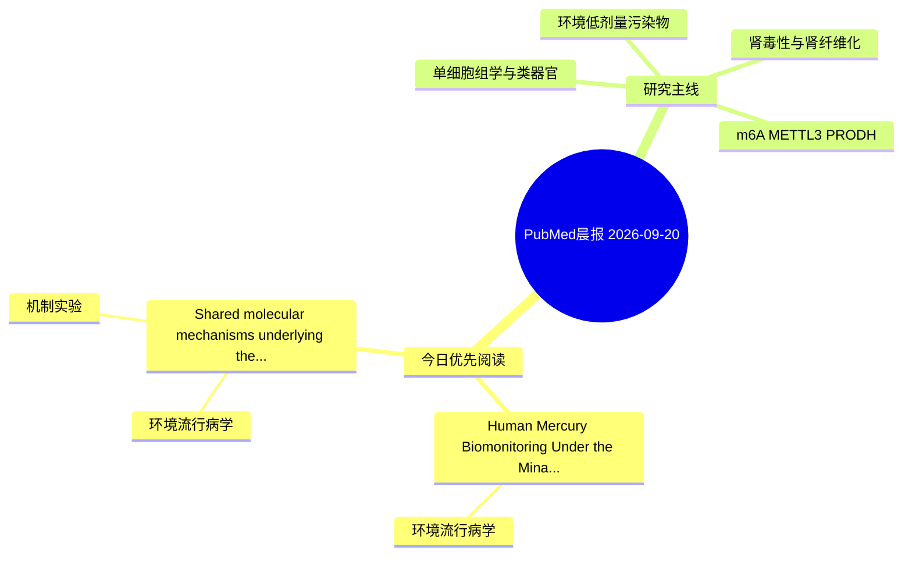

# PubMed 文献晨报｜2026-09-20

- 生成日期：2026-09-20 UTC
- 检索窗口：近 24 小时
- 高质量阈值：规则评分 ≥ 7
- 近 24 小时原始命中数：3

## 今日总体判断

今日筛选出 2 篇优先阅读文献，主要集中在：环境流行病学、机制实验。

## 今日最值得读的 5 篇文章

### 1. Human Mercury Biomonitoring Under the Minamata Convention: Blood, Urine, Hair, and Tissue Biomarkers (2000-2026).

- 题目：Human Mercury Biomonitoring Under the Minamata Convention: Blood, Urine, Hair, and Tissue Biomarkers (2000-2026).
- 期刊：Biological trace element research
- 年份：2026
- PMID：[42762425](https://pubmed.ncbi.nlm.nih.gov/42762425/)
- DOI：[10.1007/s12011-026-05347-4](https://doi.org/10.1007/s12011-026-05347-4)
- 分类：环境流行病学
- 规则评分：15
- 研究对象：人群/队列或环境暴露人群
- 核心方法：环境流行病学/队列或人群数据
- 主要发现：摘要提示研究重点涉及环境污染物暴露；结论线索为：NHANES data show a progressive decline in blood Hg among women of reproductive age.
- 为什么值得读：关键词匹配度较高

### 2. Shared molecular mechanisms underlying the systemic toxicity of air pollution.

- 题目：Shared molecular mechanisms underlying the systemic toxicity of air pollution.
- 期刊：MedScience
- 年份：2026
- PMID：[42760421](https://pubmed.ncbi.nlm.nih.gov/42760421/)
- DOI：[10.1007/s11684-026-1255-6](https://doi.org/10.1007/s11684-026-1255-6)
- 分类：环境流行病学、机制实验
- 规则评分：8
- 研究对象：人群/队列或环境暴露人群
- 核心方法：环境流行病学/队列或人群数据
- 主要发现：摘要提示研究重点涉及环境污染物暴露；结论线索为：We further identify critical knowledge gaps related to real-world multipollutant exposure, biological resilience, and precision prevention, providing a conceptual foundation for targeted interventions and risk stratification in pollution-exposed populations.
- 为什么值得读：同时连接环境暴露与机制线索

## 分类归档

### 环境流行病学
- [Human Mercury Biomonitoring Under the Minamata Convention: Blood, Urine, Hair, and Tissue Biomarkers (2000-2026).](https://pubmed.ncbi.nlm.nih.gov/42762425/)（PMID: 42762425）
- [Shared molecular mechanisms underlying the systemic toxicity of air pollution.](https://pubmed.ncbi.nlm.nih.gov/42760421/)（PMID: 42760421）

### 机制实验
- [Shared molecular mechanisms underlying the systemic toxicity of air pollution.](https://pubmed.ncbi.nlm.nih.gov/42760421/)（PMID: 42760421）

### 单细胞组学
- 今日暂无高质量新文献。

### 类器官
- 今日暂无高质量新文献。

### 肾毒性
- 今日暂无高质量新文献。

### m6A-METTL3-PRODH
- 今日暂无高质量新文献。

## 今日阅读优先级

1. Human Mercury Biomonitoring Under the Minamata Convention: Blood, Urine, Hair, and Tissue Biomarkers (2000-2026).（优先理由：关键词匹配度较高）
2. Shared molecular mechanisms underlying the systemic toxicity of air pollution.（优先理由：同时连接环境暴露与机制线索）

## Mermaid 思维导图

