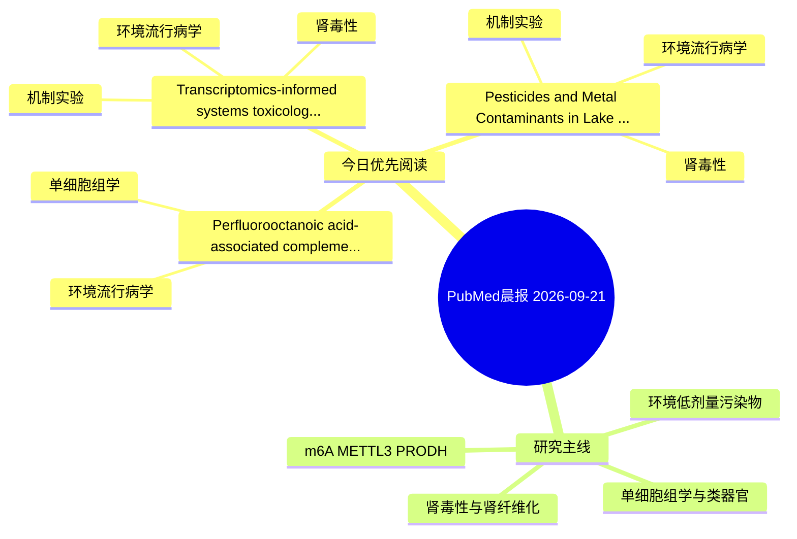

# PubMed 文献晨报｜2026-09-21

- 生成日期：2026-09-21 UTC
- 检索窗口：近 7 天
- 高质量阈值：规则评分 ≥ 7
- 近 24 小时原始命中数：0

## 今日总体判断

今日筛选出 3 篇优先阅读文献，主要集中在：环境流行病学、机制实验、肾毒性。
由于近 24 小时内没有检索到候选文献，本次已自动扩大检索范围。

## 今日最值得读的 5 篇文章

### 1. Perfluorooctanoic acid-associated complement factor B upregulation and atrial fibrillation-related molecular alterations: integrated network toxicology, Mendelian randomization, molecular dynamics, and HL-1 cell analyses.

- 题目：Perfluorooctanoic acid-associated complement factor B upregulation and atrial fibrillation-related molecular alterations: integrated network toxicology, Mendelian randomization, molecular dynamics, and HL-1 cell analyses.
- 期刊：Frontiers in cardiovascular medicine
- 年份：2026
- PMID：[42755451](https://pubmed.ncbi.nlm.nih.gov/42755451/)
- DOI：[10.3389/fcvm.2026.1759840](https://doi.org/10.3389/fcvm.2026.1759840)
- 分类：环境流行病学、单细胞组学
- 规则评分：10
- 研究对象：题名和摘要未明确，建议阅读全文确认
- 核心方法：单细胞或空间组学；细胞与动物机制实验
- 主要发现：摘要提示研究重点涉及环境污染物暴露、单细胞或空间组学；结论线索为：CONCLUSION: These findings prioritize CFB as a candidate molecule potentially associated with PFOA exposure and AF-related molecular alterations.
- 为什么值得读：可帮助寻找细胞类型特异性机制

### 2. Transcriptomics-informed systems toxicology prioritizes candidate links between endocrine-disrupting chemicals and chronic kidney disease.

- 题目：Transcriptomics-informed systems toxicology prioritizes candidate links between endocrine-disrupting chemicals and chronic kidney disease.
- 期刊：Environmental pollution (Barking, Essex : 1987)
- 年份：2026
- PMID：[42759910](https://pubmed.ncbi.nlm.nih.gov/42759910/)
- DOI：[10.1016/j.envpol.2026.129160](https://doi.org/10.1016/j.envpol.2026.129160)
- 分类：环境流行病学、机制实验、肾毒性
- 规则评分：9
- 研究对象：人群/队列或环境暴露人群
- 核心方法：环境流行病学/队列或人群数据
- 主要发现：摘要提示研究重点涉及肾毒性/肾损伤；结论线索为：Overall, this workflow prioritizes an externally evaluated FOS/MDK diagnostic-candidate panel and testable hypotheses for future exposure-aware experimental and epidemiological validation.
- 为什么值得读：同时连接环境暴露与机制线索；与肾毒性/肾损伤主线直接相关

### 3. Pesticides and Metal Contaminants in Lake Chapala, Mexico: Differences in Bioaccumulation and Associated Health Risks.

- 题目：Pesticides and Metal Contaminants in Lake Chapala, Mexico: Differences in Bioaccumulation and Associated Health Risks.
- 期刊：Environmental research
- 年份：2026
- PMID：[42759590](https://pubmed.ncbi.nlm.nih.gov/42759590/)
- DOI：[10.1016/j.envres.2026.125693](https://doi.org/10.1016/j.envres.2026.125693)
- 分类：环境流行病学、机制实验、肾毒性
- 规则评分：9
- 研究对象：题名和摘要未明确，建议阅读全文确认
- 核心方法：基于题名/摘要的常规实验或文献分析，需阅读全文确认
- 主要发现：摘要提示研究重点涉及环境污染物暴露、肾毒性/肾损伤；结论线索为：These first multi-matrix seasonal patterns show that rainfall timing drives chemical mobilization and risk.
- 为什么值得读：同时连接环境暴露与机制线索；与肾毒性/肾损伤主线直接相关

## 分类归档

### 环境流行病学
- [Perfluorooctanoic acid-associated complement factor B upregulation and atrial fibrillation-related molecular alterations: integrated network toxicology, Mendelian randomization, molecular dynamics, and HL-1 cell analyses.](https://pubmed.ncbi.nlm.nih.gov/42755451/)（PMID: 42755451）
- [Transcriptomics-informed systems toxicology prioritizes candidate links between endocrine-disrupting chemicals and chronic kidney disease.](https://pubmed.ncbi.nlm.nih.gov/42759910/)（PMID: 42759910）
- [Pesticides and Metal Contaminants in Lake Chapala, Mexico: Differences in Bioaccumulation and Associated Health Risks.](https://pubmed.ncbi.nlm.nih.gov/42759590/)（PMID: 42759590）

### 机制实验
- [Transcriptomics-informed systems toxicology prioritizes candidate links between endocrine-disrupting chemicals and chronic kidney disease.](https://pubmed.ncbi.nlm.nih.gov/42759910/)（PMID: 42759910）
- [Pesticides and Metal Contaminants in Lake Chapala, Mexico: Differences in Bioaccumulation and Associated Health Risks.](https://pubmed.ncbi.nlm.nih.gov/42759590/)（PMID: 42759590）

### 单细胞组学
- [Perfluorooctanoic acid-associated complement factor B upregulation and atrial fibrillation-related molecular alterations: integrated network toxicology, Mendelian randomization, molecular dynamics, and HL-1 cell analyses.](https://pubmed.ncbi.nlm.nih.gov/42755451/)（PMID: 42755451）

### 类器官
- 今日暂无高质量新文献。

### 肾毒性
- [Transcriptomics-informed systems toxicology prioritizes candidate links between endocrine-disrupting chemicals and chronic kidney disease.](https://pubmed.ncbi.nlm.nih.gov/42759910/)（PMID: 42759910）
- [Pesticides and Metal Contaminants in Lake Chapala, Mexico: Differences in Bioaccumulation and Associated Health Risks.](https://pubmed.ncbi.nlm.nih.gov/42759590/)（PMID: 42759590）

### m6A-METTL3-PRODH
- 今日暂无高质量新文献。

## 今日阅读优先级

1. Perfluorooctanoic acid-associated complement factor B upregulation and atrial fibrillation-related molecular alterations: integrated network toxicology, Mendelian randomization, molecular dynamics, and HL-1 cell analyses.（优先理由：可帮助寻找细胞类型特异性机制）
2. Transcriptomics-informed systems toxicology prioritizes candidate links between endocrine-disrupting chemicals and chronic kidney disease.（优先理由：同时连接环境暴露与机制线索；与肾毒性/肾损伤主线直接相关）
3. Pesticides and Metal Contaminants in Lake Chapala, Mexico: Differences in Bioaccumulation and Associated Health Risks.（优先理由：同时连接环境暴露与机制线索；与肾毒性/肾损伤主线直接相关）

## Mermaid 思维导图

