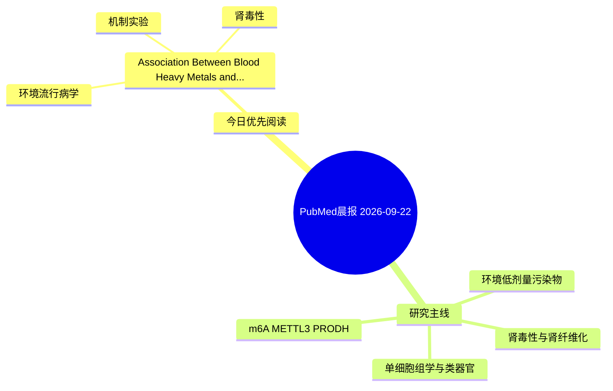

# PubMed 文献晨报｜2026-09-22

- 生成日期：2026-09-22 UTC
- 检索窗口：近 24 小时
- 高质量阈值：规则评分 ≥ 7
- 近 24 小时原始命中数：2

## 今日总体判断

今日筛选出 1 篇优先阅读文献，主要集中在：环境流行病学、机制实验、肾毒性。

## 今日最值得读的 5 篇文章

### 1. Association Between Blood Heavy Metals and Selenium with All-Cause Mortality in Cardiovascular-Kidney-Metabolic Syndrome Populations: Exploring the Mediating Effects of Inflammatory Biomarkers.

- 题目：Association Between Blood Heavy Metals and Selenium with All-Cause Mortality in Cardiovascular-Kidney-Metabolic Syndrome Populations: Exploring the Mediating Effects of Inflammatory Biomarkers.
- 期刊：Cardiovascular toxicology
- 年份：2026
- PMID：[42766214](https://pubmed.ncbi.nlm.nih.gov/42766214/)
- DOI：[10.1007/s12012-026-10179-8](https://doi.org/10.1007/s12012-026-10179-8)
- 分类：环境流行病学、机制实验、肾毒性
- 规则评分：9
- 研究对象：人群/队列或环境暴露人群
- 核心方法：环境流行病学/队列或人群数据
- 主要发现：摘要提示研究重点涉及环境污染物暴露、肾毒性/肾损伤；结论线索为：Mediation analysis revealed that NLR, MLR, NMLR, and SIRI partially mediated the association between blood selenium and all-cause mortality, and the mediated proportions were relatively modest (ranging from 3.57 to 5.29%).
- 为什么值得读：同时连接环境暴露与机制线索；与肾毒性/肾损伤主线直接相关

## 分类归档

### 环境流行病学
- [Association Between Blood Heavy Metals and Selenium with All-Cause Mortality in Cardiovascular-Kidney-Metabolic Syndrome Populations: Exploring the Mediating Effects of Inflammatory Biomarkers.](https://pubmed.ncbi.nlm.nih.gov/42766214/)（PMID: 42766214）

### 机制实验
- [Association Between Blood Heavy Metals and Selenium with All-Cause Mortality in Cardiovascular-Kidney-Metabolic Syndrome Populations: Exploring the Mediating Effects of Inflammatory Biomarkers.](https://pubmed.ncbi.nlm.nih.gov/42766214/)（PMID: 42766214）

### 单细胞组学
- 今日暂无高质量新文献。

### 类器官
- 今日暂无高质量新文献。

### 肾毒性
- [Association Between Blood Heavy Metals and Selenium with All-Cause Mortality in Cardiovascular-Kidney-Metabolic Syndrome Populations: Exploring the Mediating Effects of Inflammatory Biomarkers.](https://pubmed.ncbi.nlm.nih.gov/42766214/)（PMID: 42766214）

### m6A-METTL3-PRODH
- 今日暂无高质量新文献。

## 今日阅读优先级

1. Association Between Blood Heavy Metals and Selenium with All-Cause Mortality in Cardiovascular-Kidney-Metabolic Syndrome Populations: Exploring the Mediating Effects of Inflammatory Biomarkers.（优先理由：同时连接环境暴露与机制线索；与肾毒性/肾损伤主线直接相关）

## Mermaid 思维导图

