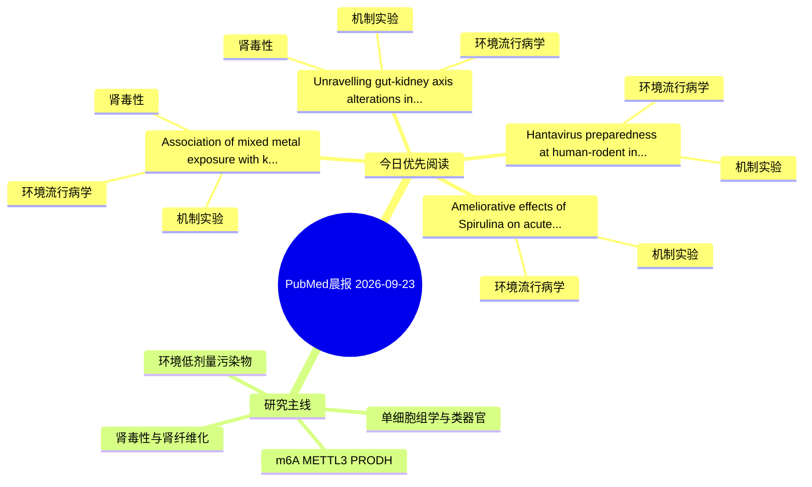

# PubMed 文献晨报｜2026-09-23

- 生成日期：2026-09-23 UTC
- 检索窗口：近 24 小时
- 高质量阈值：规则评分 ≥ 7
- 近 24 小时原始命中数：4

## 今日总体判断

今日筛选出 4 篇优先阅读文献，主要集中在：环境流行病学、机制实验、肾毒性。

## 今日最值得读的 5 篇文章

### 1. Association of mixed metal exposure with kidney injury and benchmark dose estimation in Chinese adults aged 40 years and older.

- 题目：Association of mixed metal exposure with kidney injury and benchmark dose estimation in Chinese adults aged 40 years and older.
- 期刊：Ecotoxicology and environmental safety
- 年份：2026
- PMID：[42771981](https://pubmed.ncbi.nlm.nih.gov/42771981/)
- DOI：[10.1016/j.ecoenv.2026.120829](https://doi.org/10.1016/j.ecoenv.2026.120829)
- 分类：环境流行病学、机制实验、肾毒性
- 规则评分：12
- 研究对象：人群/队列或环境暴露人群
- 核心方法：环境流行病学/队列或人群数据
- 主要发现：摘要提示研究重点涉及环境污染物暴露、肾毒性/肾损伤；结论线索为：Mediation analysis revealed that mALB and β2-MG were potential mediating factors in the association between cadmium/lead exposure and chronic kidney disease.
- 为什么值得读：同时连接环境暴露与机制线索；与肾毒性/肾损伤主线直接相关；关键词匹配度较高

### 2. Unravelling gut-kidney axis alterations in BPA-related CKD: Integrating network toxicology and machine learning with experimental validation.

- 题目：Unravelling gut-kidney axis alterations in BPA-related CKD: Integrating network toxicology and machine learning with experimental validation.
- 期刊：Ecotoxicology and environmental safety
- 年份：2026
- PMID：[42771980](https://pubmed.ncbi.nlm.nih.gov/42771980/)
- DOI：[10.1016/j.ecoenv.2026.120793](https://doi.org/10.1016/j.ecoenv.2026.120793)
- 分类：环境流行病学、机制实验、肾毒性
- 规则评分：12
- 研究对象：题名和摘要未明确，建议阅读全文确认
- 核心方法：细胞与动物机制实验
- 主要发现：摘要提示研究重点涉及肾毒性/肾损伤；结论线索为：CONCLUSION: Our study suggests that BPA may be linked to the onset and progression of CKD, and the gut-kidney axis may play a role in this process.
- 为什么值得读：同时连接环境暴露与机制线索；与肾毒性/肾损伤主线直接相关；关键词匹配度较高

### 3. Hantavirus preparedness at human-rodent interfaces: lessons from China's HFRS control and Andes virus transmission in mobile populations.

- 题目：Hantavirus preparedness at human-rodent interfaces: lessons from China's HFRS control and Andes virus transmission in mobile populations.
- 期刊：Emerging microbes & infections
- 年份：2026
- PMID：[42773773](https://pubmed.ncbi.nlm.nih.gov/42773773/)
- DOI：[10.1080/22221751.2026.2721722](https://doi.org/10.1080/22221751.2026.2721722)
- 分类：环境流行病学、机制实验
- 规则评分：9
- 研究对象：人群/队列或环境暴露人群
- 核心方法：细胞与动物机制实验
- 主要发现：摘要提示研究重点涉及环境污染物暴露；结论线索为：Preparedness should therefore combine long-term management of rodent-derived interfaces, rapid discrimination between common-source clusters and ANDV secondary transmission, and response systems that remain effective when exposed persons, infected animals o...
- 为什么值得读：同时连接环境暴露与机制线索

### 4. Ameliorative effects of Spirulina on acute lead acetate toxicity complications in male rats.

- 题目：Ameliorative effects of Spirulina on acute lead acetate toxicity complications in male rats.
- 期刊：Avicenna journal of phytomedicine
- 年份：2026
- PMID：[42770103](https://pubmed.ncbi.nlm.nih.gov/42770103/)
- DOI：[10.22038/ajp.2025.27148](https://doi.org/10.22038/ajp.2025.27148)
- 分类：环境流行病学、机制实验
- 规则评分：9
- 研究对象：小鼠或大鼠肾损伤模型
- 核心方法：基于题名/摘要的常规实验或文献分析，需阅读全文确认
- 主要发现：摘要提示研究重点涉及环境污染物暴露；结论线索为：These promising results suggest its potential as a protective agent, though further studies are warranted to elucidate the precise mechanisms and clinical applicability.
- 为什么值得读：同时连接环境暴露与机制线索

## 分类归档

### 环境流行病学
- [Association of mixed metal exposure with kidney injury and benchmark dose estimation in Chinese adults aged 40 years and older.](https://pubmed.ncbi.nlm.nih.gov/42771981/)（PMID: 42771981）
- [Unravelling gut-kidney axis alterations in BPA-related CKD: Integrating network toxicology and machine learning with experimental validation.](https://pubmed.ncbi.nlm.nih.gov/42771980/)（PMID: 42771980）
- [Hantavirus preparedness at human-rodent interfaces: lessons from China's HFRS control and Andes virus transmission in mobile populations.](https://pubmed.ncbi.nlm.nih.gov/42773773/)（PMID: 42773773）
- [Ameliorative effects of Spirulina on acute lead acetate toxicity complications in male rats.](https://pubmed.ncbi.nlm.nih.gov/42770103/)（PMID: 42770103）

### 机制实验
- [Association of mixed metal exposure with kidney injury and benchmark dose estimation in Chinese adults aged 40 years and older.](https://pubmed.ncbi.nlm.nih.gov/42771981/)（PMID: 42771981）
- [Unravelling gut-kidney axis alterations in BPA-related CKD: Integrating network toxicology and machine learning with experimental validation.](https://pubmed.ncbi.nlm.nih.gov/42771980/)（PMID: 42771980）
- [Hantavirus preparedness at human-rodent interfaces: lessons from China's HFRS control and Andes virus transmission in mobile populations.](https://pubmed.ncbi.nlm.nih.gov/42773773/)（PMID: 42773773）
- [Ameliorative effects of Spirulina on acute lead acetate toxicity complications in male rats.](https://pubmed.ncbi.nlm.nih.gov/42770103/)（PMID: 42770103）

### 单细胞组学
- 今日暂无高质量新文献。

### 类器官
- 今日暂无高质量新文献。

### 肾毒性
- [Association of mixed metal exposure with kidney injury and benchmark dose estimation in Chinese adults aged 40 years and older.](https://pubmed.ncbi.nlm.nih.gov/42771981/)（PMID: 42771981）
- [Unravelling gut-kidney axis alterations in BPA-related CKD: Integrating network toxicology and machine learning with experimental validation.](https://pubmed.ncbi.nlm.nih.gov/42771980/)（PMID: 42771980）

### m6A-METTL3-PRODH
- 今日暂无高质量新文献。

## 今日阅读优先级

1. Association of mixed metal exposure with kidney injury and benchmark dose estimation in Chinese adults aged 40 years and older.（优先理由：同时连接环境暴露与机制线索；与肾毒性/肾损伤主线直接相关；关键词匹配度较高）
2. Unravelling gut-kidney axis alterations in BPA-related CKD: Integrating network toxicology and machine learning with experimental validation.（优先理由：同时连接环境暴露与机制线索；与肾毒性/肾损伤主线直接相关；关键词匹配度较高）
3. Hantavirus preparedness at human-rodent interfaces: lessons from China's HFRS control and Andes virus transmission in mobile populations.（优先理由：同时连接环境暴露与机制线索）
4. Ameliorative effects of Spirulina on acute lead acetate toxicity complications in male rats.（优先理由：同时连接环境暴露与机制线索）

## Mermaid 思维导图

