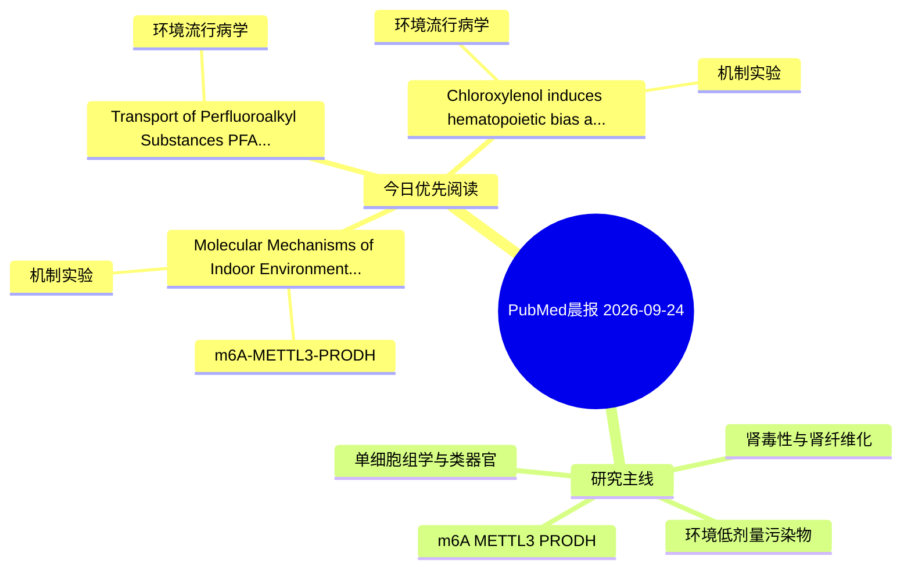

# PubMed 文献晨报｜2026-09-24

- 生成日期：2026-09-24 UTC
- 检索窗口：近 24 小时
- 高质量阈值：规则评分 ≥ 7
- 近 24 小时原始命中数：4

## 今日总体判断

今日筛选出 3 篇优先阅读文献，主要集中在：机制实验、环境流行病学、m6A-METTL3-PRODH。

## 今日最值得读的 5 篇文章

### 1. Molecular Mechanisms of Indoor Environmental Pollution tt-DDE-Induced Blood Pressure Elevation and the Protective Role of Human-Specific Gene CHRFAM7A.

- 题目：Molecular Mechanisms of Indoor Environmental Pollution tt-DDE-Induced Blood Pressure Elevation and the Protective Role of Human-Specific Gene CHRFAM7A.
- 期刊：Environment & health (Washington, D.C.)
- 年份：2026
- PMID：[42775181](https://pubmed.ncbi.nlm.nih.gov/42775181/)
- DOI：[10.1021/envhealth.5c00703](https://doi.org/10.1021/envhealth.5c00703)
- 分类：机制实验、m6A-METTL3-PRODH
- 规则评分：13
- 研究对象：人群/队列或环境暴露人群
- 核心方法：m6A RNA修饰检测；细胞与动物机制实验
- 主要发现：摘要提示研究重点涉及m6A-METTL3/PRODH 调控；结论线索为：Moreover, in vitro revealed that tt-DDE promotes KLF5-driven inflammatory responses through METTL3-dependent m6A modification, effects that were mitigated by CHRFAM7A overexpression.
- 为什么值得读：贴近 m6A-METTL3-PRODH 调控假说；关键词匹配度较高

### 2. Transport of Perfluoroalkyl Substances (PFAS) by Three Renal Transporters: Implications for PFAS Bioaccumulation Mechanisms.

- 题目：Transport of Perfluoroalkyl Substances (PFAS) by Three Renal Transporters: Implications for PFAS Bioaccumulation Mechanisms.
- 期刊：Environment & health (Washington, D.C.)
- 年份：2026
- PMID：[42775203](https://pubmed.ncbi.nlm.nih.gov/42775203/)
- DOI：[10.1021/envhealth.6c00088](https://doi.org/10.1021/envhealth.6c00088)
- 分类：环境流行病学
- 规则评分：12
- 研究对象：题名和摘要未明确，建议阅读全文确认
- 核心方法：基于题名/摘要的常规实验或文献分析，需阅读全文确认
- 主要发现：摘要提示研究重点涉及环境污染物暴露；结论线索为：These findings enhance our understanding of PFAS bioaccumulation at the cellular and molecular levels, offering key parameters for PFAS toxicokinetic modeling.
- 为什么值得读：关键词匹配度较高

### 3. Chloroxylenol induces hematopoietic bias and immune dysregulation in zebrafish associated with MAPK signaling disruption.

- 题目：Chloroxylenol induces hematopoietic bias and immune dysregulation in zebrafish associated with MAPK signaling disruption.
- 期刊：Chemico-biological interactions
- 年份：2026
- PMID：[42777797](https://pubmed.ncbi.nlm.nih.gov/42777797/)
- DOI：[10.1016/j.cbi.2026.112349](https://doi.org/10.1016/j.cbi.2026.112349)
- 分类：环境流行病学、机制实验
- 规则评分：9
- 研究对象：题名和摘要未明确，建议阅读全文确认
- 核心方法：细胞与动物机制实验
- 主要发现：摘要提示研究重点涉及环境污染物暴露；结论线索为：Despite the concentration gap, these findings show that PCMX, even at sublethal doses, can disrupt conserved immune and hematopoietic pathways, raising concern for aquatic organisms.
- 为什么值得读：同时连接环境暴露与机制线索

## 分类归档

### 环境流行病学
- [Transport of Perfluoroalkyl Substances (PFAS) by Three Renal Transporters: Implications for PFAS Bioaccumulation Mechanisms.](https://pubmed.ncbi.nlm.nih.gov/42775203/)（PMID: 42775203）
- [Chloroxylenol induces hematopoietic bias and immune dysregulation in zebrafish associated with MAPK signaling disruption.](https://pubmed.ncbi.nlm.nih.gov/42777797/)（PMID: 42777797）

### 机制实验
- [Molecular Mechanisms of Indoor Environmental Pollution tt-DDE-Induced Blood Pressure Elevation and the Protective Role of Human-Specific Gene CHRFAM7A.](https://pubmed.ncbi.nlm.nih.gov/42775181/)（PMID: 42775181）
- [Chloroxylenol induces hematopoietic bias and immune dysregulation in zebrafish associated with MAPK signaling disruption.](https://pubmed.ncbi.nlm.nih.gov/42777797/)（PMID: 42777797）

### 单细胞组学
- 今日暂无高质量新文献。

### 类器官
- 今日暂无高质量新文献。

### 肾毒性
- 今日暂无高质量新文献。

### m6A-METTL3-PRODH
- [Molecular Mechanisms of Indoor Environmental Pollution tt-DDE-Induced Blood Pressure Elevation and the Protective Role of Human-Specific Gene CHRFAM7A.](https://pubmed.ncbi.nlm.nih.gov/42775181/)（PMID: 42775181）

## 今日阅读优先级

1. Molecular Mechanisms of Indoor Environmental Pollution tt-DDE-Induced Blood Pressure Elevation and the Protective Role of Human-Specific Gene CHRFAM7A.（优先理由：贴近 m6A-METTL3-PRODH 调控假说；关键词匹配度较高）
2. Transport of Perfluoroalkyl Substances (PFAS) by Three Renal Transporters: Implications for PFAS Bioaccumulation Mechanisms.（优先理由：关键词匹配度较高）
3. Chloroxylenol induces hematopoietic bias and immune dysregulation in zebrafish associated with MAPK signaling disruption.（优先理由：同时连接环境暴露与机制线索）

## Mermaid 思维导图

