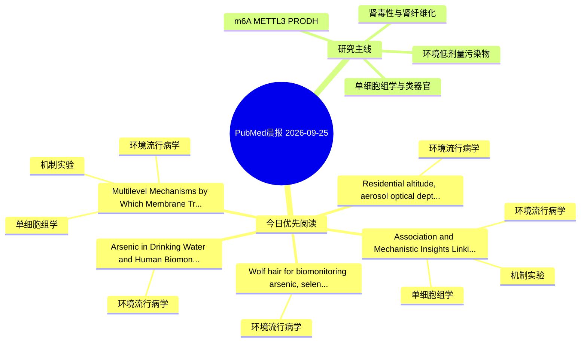

# PubMed 文献晨报｜2026-09-25

- 生成日期：2026-09-25 UTC
- 检索窗口：近 24 小时
- 高质量阈值：规则评分 ≥ 7
- 近 24 小时原始命中数：8

## 今日总体判断

今日筛选出 5 篇优先阅读文献，主要集中在：环境流行病学、机制实验、单细胞组学。

## 今日最值得读的 5 篇文章

### 1. Wolf hair for biomonitoring arsenic, selenium, cadmium and lead exposure: a comparative study with internal organs.

- 题目：Wolf hair for biomonitoring arsenic, selenium, cadmium and lead exposure: a comparative study with internal organs.
- 期刊：Environmental pollution (Barking, Essex : 1987)
- 年份：2026
- PMID：[42785617](https://pubmed.ncbi.nlm.nih.gov/42785617/)
- DOI：[10.1016/j.envpol.2026.129237](https://doi.org/10.1016/j.envpol.2026.129237)
- 分类：环境流行病学
- 规则评分：15
- 研究对象：题名和摘要未明确，建议阅读全文确认
- 核心方法：环境流行病学/队列或人群数据
- 主要发现：摘要提示研究重点涉及环境污染物暴露；结论线索为：Therefore, further studies are required to evaluate the utility of hair as a complementary biomonitoring matrix suitable for large-scale environmental surveillance and exposure assessment.
- 为什么值得读：关键词匹配度较高

### 2. Association and Mechanistic Insights Linking Bisphenol A to Psoriasis: Integrative Analysis of Bulk Transcriptomics, Network Toxicology, Mendelian Randomization and Single‑cell RNA Sequencing.

- 题目：Association and Mechanistic Insights Linking Bisphenol A to Psoriasis: Integrative Analysis of Bulk Transcriptomics, Network Toxicology, Mendelian Randomization and Single‑cell RNA Sequencing.
- 期刊：Clinical, cosmetic and investigational dermatology
- 年份：2026
- PMID：[42781557](https://pubmed.ncbi.nlm.nih.gov/42781557/)
- DOI：[10.2147/CCID.S620116](https://doi.org/10.2147/CCID.S620116)
- 分类：环境流行病学、机制实验、单细胞组学
- 规则评分：14
- 研究对象：题名和摘要未明确，建议阅读全文确认
- 核心方法：单细胞或空间组学；细胞与动物机制实验
- 主要发现：摘要提示研究重点涉及单细胞或空间组学；结论线索为：CONCLUSION: This study identifies PSMD1 and BECN1 as potential diagnostic biomarkers associated with BPA exposure and psoriasis, offers predictive insights into their possible roles in related pathways and immune regulation, and sheds light on molecular-cel...
- 为什么值得读：同时连接环境暴露与机制线索；可帮助寻找细胞类型特异性机制；关键词匹配度较高

### 3. Residential altitude, aerosol optical depth, and diagnostic composition of biopsy-confirmed renal diseases: a single-center renal biopsy study from Yunnan, China.

- 题目：Residential altitude, aerosol optical depth, and diagnostic composition of biopsy-confirmed renal diseases: a single-center renal biopsy study from Yunnan, China.
- 期刊：BMC nephrology
- 年份：2026
- PMID：[42786455](https://pubmed.ncbi.nlm.nih.gov/42786455/)
- DOI：[10.1186/s12882-026-05386-y](https://doi.org/10.1186/s12882-026-05386-y)
- 分类：环境流行病学
- 规则评分：13
- 研究对象：人群/队列或环境暴露人群
- 核心方法：环境流行病学/队列或人群数据
- 主要发现：摘要提示研究重点涉及环境污染物暴露；结论线索为：These findings suggest that altitude-related patterns in renal biopsy diagnoses may reflect combined geographic, environmental, and referral-related gradients and should be interpreted within the context of a hospital-based biopsy population.
- 为什么值得读：关键词匹配度较高

### 4. Arsenic in Drinking Water and Human Biomonitoring in Eastern Croatia: An Exploratory Environmental Health Study.

- 题目：Arsenic in Drinking Water and Human Biomonitoring in Eastern Croatia: An Exploratory Environmental Health Study.
- 期刊：Journal of xenobiotics
- 年份：2026
- PMID：[42783608](https://pubmed.ncbi.nlm.nih.gov/42783608/)
- DOI：[10.3390/jox16050165](https://doi.org/10.3390/jox16050165)
- 分类：环境流行病学
- 规则评分：13
- 研究对象：人群/队列或环境暴露人群
- 核心方法：环境流行病学/队列或人群数据
- 主要发现：摘要提示研究重点涉及环境污染物暴露；结论线索为：The findings support urinary total As as a biomarker of recent environmental exposure, but do not establish causal associations with kidney toxicity or kidney cancer.
- 为什么值得读：关键词匹配度较高

### 5. Multilevel Mechanisms by Which Membrane Transport Proteins Regulate Plant Responses to Heavy Metal Stress: From Ion Perception and Uptake Control to Systemic Signaling and Translational Perspectives.

- 题目：Multilevel Mechanisms by Which Membrane Transport Proteins Regulate Plant Responses to Heavy Metal Stress: From Ion Perception and Uptake Control to Systemic Signaling and Translational Perspectives.
- 期刊：Plant, cell & environment
- 年份：2026
- PMID：[42782210](https://pubmed.ncbi.nlm.nih.gov/42782210/)
- DOI：[10.1111/pce.70915](https://doi.org/10.1111/pce.70915)
- 分类：环境流行病学、机制实验、单细胞组学
- 规则评分：12
- 研究对象：题名和摘要未明确，建议阅读全文确认
- 核心方法：单细胞或空间组学
- 主要发现：摘要提示研究重点涉及环境污染物暴露、单细胞或空间组学；结论线索为：This synthesis aims to provide a roadmap for developing crops with low metal accumulation and high stress tolerance through precision breeding and gene editing.
- 为什么值得读：同时连接环境暴露与机制线索；可帮助寻找细胞类型特异性机制；关键词匹配度较高

## 分类归档

### 环境流行病学
- [Wolf hair for biomonitoring arsenic, selenium, cadmium and lead exposure: a comparative study with internal organs.](https://pubmed.ncbi.nlm.nih.gov/42785617/)（PMID: 42785617）
- [Association and Mechanistic Insights Linking Bisphenol A to Psoriasis: Integrative Analysis of Bulk Transcriptomics, Network Toxicology, Mendelian Randomization and Single‑cell RNA Sequencing.](https://pubmed.ncbi.nlm.nih.gov/42781557/)（PMID: 42781557）
- [Residential altitude, aerosol optical depth, and diagnostic composition of biopsy-confirmed renal diseases: a single-center renal biopsy study from Yunnan, China.](https://pubmed.ncbi.nlm.nih.gov/42786455/)（PMID: 42786455）
- [Arsenic in Drinking Water and Human Biomonitoring in Eastern Croatia: An Exploratory Environmental Health Study.](https://pubmed.ncbi.nlm.nih.gov/42783608/)（PMID: 42783608）
- [Multilevel Mechanisms by Which Membrane Transport Proteins Regulate Plant Responses to Heavy Metal Stress: From Ion Perception and Uptake Control to Systemic Signaling and Translational Perspectives.](https://pubmed.ncbi.nlm.nih.gov/42782210/)（PMID: 42782210）

### 机制实验
- [Association and Mechanistic Insights Linking Bisphenol A to Psoriasis: Integrative Analysis of Bulk Transcriptomics, Network Toxicology, Mendelian Randomization and Single‑cell RNA Sequencing.](https://pubmed.ncbi.nlm.nih.gov/42781557/)（PMID: 42781557）
- [Multilevel Mechanisms by Which Membrane Transport Proteins Regulate Plant Responses to Heavy Metal Stress: From Ion Perception and Uptake Control to Systemic Signaling and Translational Perspectives.](https://pubmed.ncbi.nlm.nih.gov/42782210/)（PMID: 42782210）

### 单细胞组学
- [Association and Mechanistic Insights Linking Bisphenol A to Psoriasis: Integrative Analysis of Bulk Transcriptomics, Network Toxicology, Mendelian Randomization and Single‑cell RNA Sequencing.](https://pubmed.ncbi.nlm.nih.gov/42781557/)（PMID: 42781557）
- [Multilevel Mechanisms by Which Membrane Transport Proteins Regulate Plant Responses to Heavy Metal Stress: From Ion Perception and Uptake Control to Systemic Signaling and Translational Perspectives.](https://pubmed.ncbi.nlm.nih.gov/42782210/)（PMID: 42782210）

### 类器官
- 今日暂无高质量新文献。

### 肾毒性
- 今日暂无高质量新文献。

### m6A-METTL3-PRODH
- 今日暂无高质量新文献。

## 今日阅读优先级

1. Wolf hair for biomonitoring arsenic, selenium, cadmium and lead exposure: a comparative study with internal organs.（优先理由：关键词匹配度较高）
2. Association and Mechanistic Insights Linking Bisphenol A to Psoriasis: Integrative Analysis of Bulk Transcriptomics, Network Toxicology, Mendelian Randomization and Single‑cell RNA Sequencing.（优先理由：同时连接环境暴露与机制线索；可帮助寻找细胞类型特异性机制；关键词匹配度较高）
3. Residential altitude, aerosol optical depth, and diagnostic composition of biopsy-confirmed renal diseases: a single-center renal biopsy study from Yunnan, China.（优先理由：关键词匹配度较高）
4. Arsenic in Drinking Water and Human Biomonitoring in Eastern Croatia: An Exploratory Environmental Health Study.（优先理由：关键词匹配度较高）
5. Multilevel Mechanisms by Which Membrane Transport Proteins Regulate Plant Responses to Heavy Metal Stress: From Ion Perception and Uptake Control to Systemic Signaling and Translational Perspectives.（优先理由：同时连接环境暴露与机制线索；可帮助寻找细胞类型特异性机制；关键词匹配度较高）

## Mermaid 思维导图

