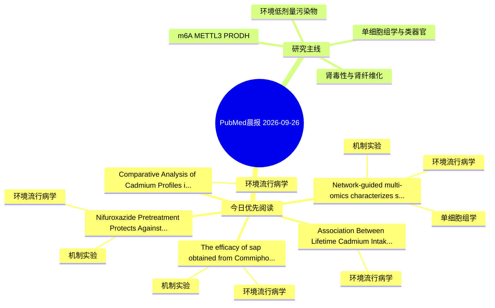

# PubMed 文献晨报｜2026-09-26

- 生成日期：2026-09-26 UTC
- 检索窗口：近 24 小时
- 高质量阈值：规则评分 ≥ 7
- 近 24 小时原始命中数：12

## 今日总体判断

今日筛选出 5 篇优先阅读文献，主要集中在：环境流行病学、机制实验、单细胞组学。

## 今日最值得读的 5 篇文章

### 1. Network-guided multi-omics characterizes stress-associated transcriptional and metabolic alterations in PFOA-exposed HK-2 proximal tubular cells.

- 题目：Network-guided multi-omics characterizes stress-associated transcriptional and metabolic alterations in PFOA-exposed HK-2 proximal tubular cells.
- 期刊：Ecotoxicology and environmental safety
- 年份：2026
- PMID：[42790108](https://pubmed.ncbi.nlm.nih.gov/42790108/)
- DOI：[10.1016/j.ecoenv.2026.120839](https://doi.org/10.1016/j.ecoenv.2026.120839)
- 分类：环境流行病学、机制实验、单细胞组学、肾毒性
- 规则评分：17
- 研究对象：HK-2 近端肾小管上皮细胞
- 核心方法：细胞与动物机制实验
- 主要发现：摘要提示研究重点涉及环境污染物暴露；结论线索为：These data define a PFOA-responsive proximal-tubule stress program accompanied by redox imbalance, exploratory metabolic shifts and proliferative restraint.
- 为什么值得读：同时连接环境暴露与机制线索；与肾毒性/肾损伤主线直接相关；可帮助寻找细胞类型特异性机制

### 2. Comparative Analysis of Cadmium Profiles in Liver, Kidney, and Muscle of Bovines, Equines, and Cervids.

- 题目：Comparative Analysis of Cadmium Profiles in Liver, Kidney, and Muscle of Bovines, Equines, and Cervids.
- 期刊：Toxics
- 年份：2026
- PMID：[42797725](https://pubmed.ncbi.nlm.nih.gov/42797725/)
- DOI：[10.3390/toxics14090806](https://doi.org/10.3390/toxics14090806)
- 分类：环境流行病学
- 规则评分：16
- 研究对象：题名和摘要未明确，建议阅读全文确认
- 核心方法：环境流行病学/队列或人群数据
- 主要发现：摘要提示研究重点涉及环境污染物暴露；结论线索为：These findings support the integration of comparative tissue metal profiling into comprehensive veterinary toxicology, veterinary public health, and wildlife health assessment frameworks.
- 为什么值得读：关键词匹配度较高

### 3. Nifuroxazide Pretreatment Protects Against Acute CdCl2 Exposure-Induced Toxicity via Modulating the USP21/AIM2 Inflammasome Axis.

- 题目：Nifuroxazide Pretreatment Protects Against Acute CdCl2 Exposure-Induced Toxicity via Modulating the USP21/AIM2 Inflammasome Axis.
- 期刊：Antioxidants (Basel, Switzerland)
- 年份：2026
- PMID：[42792250](https://pubmed.ncbi.nlm.nih.gov/42792250/)
- DOI：[10.3390/antiox15091211](https://doi.org/10.3390/antiox15091211)
- 分类：环境流行病学、机制实验
- 规则评分：12
- 研究对象：小鼠或大鼠肾损伤模型
- 核心方法：基于题名/摘要的常规实验或文献分析，需阅读全文确认
- 主要发现：摘要提示研究重点涉及环境污染物暴露；结论线索为：Collectively, these findings indicate that NFX pretreatment protects against acute CdCl2-induced hepatic injury with mild improvements in extrahepatic tissue histology, and support the involvement of the USP21-AIM2 axis in regulating AIM2 inflammasome prote...
- 为什么值得读：同时连接环境暴露与机制线索；关键词匹配度较高

### 4. Association Between Lifetime Cadmium Intake and Urinary Cadmium Concentration Among Residents of the Jinzu River Basin Following Soil Remediation.

- 题目：Association Between Lifetime Cadmium Intake and Urinary Cadmium Concentration Among Residents of the Jinzu River Basin Following Soil Remediation.
- 期刊：Toxics
- 年份：2026
- PMID：[42797681](https://pubmed.ncbi.nlm.nih.gov/42797681/)
- DOI：[10.3390/toxics14090762](https://doi.org/10.3390/toxics14090762)
- 分类：环境流行病学
- 规则评分：12
- 研究对象：肾小管/肾脏细胞与组织
- 核心方法：基于题名/摘要的常规实验或文献分析，需阅读全文确认
- 主要发现：摘要提示研究重点涉及环境污染物暴露；结论线索为：Despite possible exposure misclassification, these findings support the utility of lifetime cadmium intake as a useful surrogate indicator of cumulative cadmium exposure and provide further evidence for its application in risk assessment and the derivation...
- 为什么值得读：关键词匹配度较高

### 5. The efficacy of sap obtained from Commiphora gileadensis against cadmium-induced hepatorenal toxicity in male rats.

- 题目：The efficacy of sap obtained from Commiphora gileadensis against cadmium-induced hepatorenal toxicity in male rats.
- 期刊：Veterinarni medicina
- 年份：2026
- PMID：[42787939](https://pubmed.ncbi.nlm.nih.gov/42787939/)
- DOI：[10.17221/86/2025-VETMED](https://doi.org/10.17221/86/2025-VETMED)
- 分类：环境流行病学、机制实验
- 规则评分：12
- 研究对象：人群/队列或环境暴露人群
- 核心方法：细胞与动物机制实验
- 主要发现：摘要提示研究重点涉及环境污染物暴露；结论线索为：The in vitro investigation revealed the potential antioxidant (DPPH, ABTS) and reducing (CUPRAC, FRAP) activities of the sap obtained from Commiphora gileadensis.
- 为什么值得读：同时连接环境暴露与机制线索；关键词匹配度较高

## 分类归档

### 环境流行病学
- [Network-guided multi-omics characterizes stress-associated transcriptional and metabolic alterations in PFOA-exposed HK-2 proximal tubular cells.](https://pubmed.ncbi.nlm.nih.gov/42790108/)（PMID: 42790108）
- [Comparative Analysis of Cadmium Profiles in Liver, Kidney, and Muscle of Bovines, Equines, and Cervids.](https://pubmed.ncbi.nlm.nih.gov/42797725/)（PMID: 42797725）
- [Nifuroxazide Pretreatment Protects Against Acute CdCl2 Exposure-Induced Toxicity via Modulating the USP21/AIM2 Inflammasome Axis.](https://pubmed.ncbi.nlm.nih.gov/42792250/)（PMID: 42792250）
- [Association Between Lifetime Cadmium Intake and Urinary Cadmium Concentration Among Residents of the Jinzu River Basin Following Soil Remediation.](https://pubmed.ncbi.nlm.nih.gov/42797681/)（PMID: 42797681）
- [The efficacy of sap obtained from Commiphora gileadensis against cadmium-induced hepatorenal toxicity in male rats.](https://pubmed.ncbi.nlm.nih.gov/42787939/)（PMID: 42787939）

### 机制实验
- [Network-guided multi-omics characterizes stress-associated transcriptional and metabolic alterations in PFOA-exposed HK-2 proximal tubular cells.](https://pubmed.ncbi.nlm.nih.gov/42790108/)（PMID: 42790108）
- [Nifuroxazide Pretreatment Protects Against Acute CdCl2 Exposure-Induced Toxicity via Modulating the USP21/AIM2 Inflammasome Axis.](https://pubmed.ncbi.nlm.nih.gov/42792250/)（PMID: 42792250）
- [The efficacy of sap obtained from Commiphora gileadensis against cadmium-induced hepatorenal toxicity in male rats.](https://pubmed.ncbi.nlm.nih.gov/42787939/)（PMID: 42787939）

### 单细胞组学
- [Network-guided multi-omics characterizes stress-associated transcriptional and metabolic alterations in PFOA-exposed HK-2 proximal tubular cells.](https://pubmed.ncbi.nlm.nih.gov/42790108/)（PMID: 42790108）

### 类器官
- 今日暂无高质量新文献。

### 肾毒性
- [Network-guided multi-omics characterizes stress-associated transcriptional and metabolic alterations in PFOA-exposed HK-2 proximal tubular cells.](https://pubmed.ncbi.nlm.nih.gov/42790108/)（PMID: 42790108）

### m6A-METTL3-PRODH
- 今日暂无高质量新文献。

## 今日阅读优先级

1. Network-guided multi-omics characterizes stress-associated transcriptional and metabolic alterations in PFOA-exposed HK-2 proximal tubular cells.（优先理由：同时连接环境暴露与机制线索；与肾毒性/肾损伤主线直接相关；可帮助寻找细胞类型特异性机制）
2. Comparative Analysis of Cadmium Profiles in Liver, Kidney, and Muscle of Bovines, Equines, and Cervids.（优先理由：关键词匹配度较高）
3. Nifuroxazide Pretreatment Protects Against Acute CdCl2 Exposure-Induced Toxicity via Modulating the USP21/AIM2 Inflammasome Axis.（优先理由：同时连接环境暴露与机制线索；关键词匹配度较高）
4. Association Between Lifetime Cadmium Intake and Urinary Cadmium Concentration Among Residents of the Jinzu River Basin Following Soil Remediation.（优先理由：关键词匹配度较高）
5. The efficacy of sap obtained from Commiphora gileadensis against cadmium-induced hepatorenal toxicity in male rats.（优先理由：同时连接环境暴露与机制线索；关键词匹配度较高）

## Mermaid 思维导图

