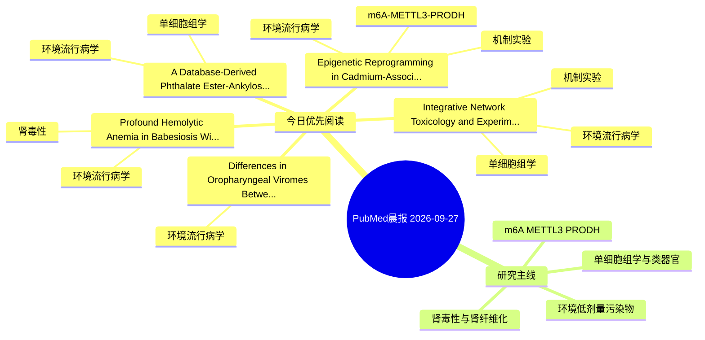

# PubMed 文献晨报｜2026-09-27

- 生成日期：2026-09-27 UTC
- 检索窗口：近 24 小时
- 高质量阈值：规则评分 ≥ 7
- 近 24 小时原始命中数：9

## 今日总体判断

今日筛选出 5 篇优先阅读文献，主要集中在：环境流行病学、机制实验、单细胞组学。

## 今日最值得读的 5 篇文章

### 1. Integrative Network Toxicology and Experimental Validation Define Mechanisms of Perfluorodecanoic Acid (PFDA) Induced Granulosa Cell Toxicity and Attenuation by Kaempferol in HGrC1 Cells.

- 题目：Integrative Network Toxicology and Experimental Validation Define Mechanisms of Perfluorodecanoic Acid (PFDA) Induced Granulosa Cell Toxicity and Attenuation by Kaempferol in HGrC1 Cells.
- 期刊：Reproductive toxicology (Elmsford, N.Y.)
- 年份：2026
- PMID：[42800621](https://pubmed.ncbi.nlm.nih.gov/42800621/)
- DOI：[10.1016/j.reprotox.2026.109368](https://doi.org/10.1016/j.reprotox.2026.109368)
- 分类：环境流行病学、机制实验、单细胞组学
- 规则评分：13
- 研究对象：人群/队列或环境暴露人群
- 核心方法：单细胞或空间组学；细胞与动物机制实验
- 主要发现：摘要提示研究重点涉及环境污染物暴露、单细胞或空间组学；结论线索为：Together, these findings indicate that PFDA disrupts granulosa cell homeostasis through redox imbalance and modulation of steroidogenesis-related gene expression, while kaempferol mitigates part of this response in the present in vitro model.
- 为什么值得读：同时连接环境暴露与机制线索；可帮助寻找细胞类型特异性机制；关键词匹配度较高

### 2. Epigenetic Reprogramming in Cadmium-Associated Liver Injury: Evidence, Mechanistic Insights, and Therapeutic Perspectives.

- 题目：Epigenetic Reprogramming in Cadmium-Associated Liver Injury: Evidence, Mechanistic Insights, and Therapeutic Perspectives.
- 期刊：Environmental toxicology and pharmacology
- 年份：2026
- PMID：[42800692](https://pubmed.ncbi.nlm.nih.gov/42800692/)
- DOI：[10.1016/j.etap.2026.105178](https://doi.org/10.1016/j.etap.2026.105178)
- 分类：环境流行病学、机制实验、m6A-METTL3-PRODH
- 规则评分：10
- 研究对象：人群/队列或环境暴露人群
- 核心方法：环境流行病学/队列或人群数据；m6A RNA修饰检测
- 主要发现：摘要提示研究重点涉及环境污染物暴露、肾纤维化、m6A-METTL3/PRODH 调控；结论线索为：We further discuss cross-layer interactions, cell-type heterogeneity, emerging preclinical intervention strategies, and translational barriers, highlighting the need for longitudinal human studies, cell-resolved multi-omics, and target-specific functional v...
- 为什么值得读：同时连接环境暴露与机制线索；贴近 m6A-METTL3-PRODH 调控假说

### 3. A Database-Derived Phthalate Ester-Ankylosing Spondylitis Signature Identifies an AP-1/CXCL8 Inflammatory Classical-Monocyte Program.

- 题目：A Database-Derived Phthalate Ester-Ankylosing Spondylitis Signature Identifies an AP-1/CXCL8 Inflammatory Classical-Monocyte Program.
- 期刊：Genes
- 年份：2026
- PMID：[42793007](https://pubmed.ncbi.nlm.nih.gov/42793007/)
- DOI：[10.3390/genes17091113](https://doi.org/10.3390/genes17091113)
- 分类：环境流行病学、单细胞组学
- 规则评分：10
- 研究对象：人群/队列或环境暴露人群
- 核心方法：环境流行病学/队列或人群数据；单细胞或空间组学
- 主要发现：摘要提示研究重点涉及单细胞或空间组学；结论线索为：Conclusions: The PAE-AS signature identifies an AP-1/CXCL8-associated classical-monocyte inflammatory program, with partial cross-cohort corroboration and secondary NK alterations, providing candidates for exposure-informed mechanistic studies.
- 为什么值得读：可帮助寻找细胞类型特异性机制

### 4. Differences in Oropharyngeal Viromes Between Surviving and Deceased Malayan Pangolins in a Rescue Context.

- 题目：Differences in Oropharyngeal Viromes Between Surviving and Deceased Malayan Pangolins in a Rescue Context.
- 期刊：Microorganisms
- 年份：2026
- PMID：[42795624](https://pubmed.ncbi.nlm.nih.gov/42795624/)
- DOI：[10.3390/microorganisms14092043](https://doi.org/10.3390/microorganisms14092043)
- 分类：环境流行病学
- 规则评分：10
- 研究对象：肾小管/肾脏细胞与组织
- 核心方法：基于题名/摘要的常规实验或文献分析，需阅读全文确认
- 主要发现：摘要提示研究重点涉及环境污染物暴露；结论线索为：These findings demonstrate heterogeneous oropharyngeal viral communities among rescued pangolins and reveal differences in viral community diversity and composition between surviving and deceased individuals.
- 为什么值得读：与检索主题有交集，可作为背景或线索文献扫读

### 5. Profound Hemolytic Anemia in Babesiosis With Lyme Disease Coinfection and Occult Strongyloidiasis.

- 题目：Profound Hemolytic Anemia in Babesiosis With Lyme Disease Coinfection and Occult Strongyloidiasis.
- 期刊：Cureus
- 年份：2026
- PMID：[42799294](https://pubmed.ncbi.nlm.nih.gov/42799294/)
- DOI：[10.7759/cureus.115255](https://doi.org/10.7759/cureus.115255)
- 分类：环境流行病学、肾毒性
- 规则评分：10
- 研究对象：患者样本或临床数据
- 核心方法：基于题名/摘要的常规实验或文献分析，需阅读全文确认
- 主要发现：摘要提示研究重点涉及环境污染物暴露、肾毒性/肾损伤；结论线索为：Laboratory evaluation revealed profound hemolytic anemia with a hemoglobin of 6.8 g/dL, elevated lactate dehydrogenase (LDH), undetectable haptoglobin, reticulocytosis, and stage 1 acute kidney injury.
- 为什么值得读：与肾毒性/肾损伤主线直接相关

## 分类归档

### 环境流行病学
- [Integrative Network Toxicology and Experimental Validation Define Mechanisms of Perfluorodecanoic Acid (PFDA) Induced Granulosa Cell Toxicity and Attenuation by Kaempferol in HGrC1 Cells.](https://pubmed.ncbi.nlm.nih.gov/42800621/)（PMID: 42800621）
- [Epigenetic Reprogramming in Cadmium-Associated Liver Injury: Evidence, Mechanistic Insights, and Therapeutic Perspectives.](https://pubmed.ncbi.nlm.nih.gov/42800692/)（PMID: 42800692）
- [A Database-Derived Phthalate Ester-Ankylosing Spondylitis Signature Identifies an AP-1/CXCL8 Inflammatory Classical-Monocyte Program.](https://pubmed.ncbi.nlm.nih.gov/42793007/)（PMID: 42793007）
- [Differences in Oropharyngeal Viromes Between Surviving and Deceased Malayan Pangolins in a Rescue Context.](https://pubmed.ncbi.nlm.nih.gov/42795624/)（PMID: 42795624）
- [Profound Hemolytic Anemia in Babesiosis With Lyme Disease Coinfection and Occult Strongyloidiasis.](https://pubmed.ncbi.nlm.nih.gov/42799294/)（PMID: 42799294）

### 机制实验
- [Integrative Network Toxicology and Experimental Validation Define Mechanisms of Perfluorodecanoic Acid (PFDA) Induced Granulosa Cell Toxicity and Attenuation by Kaempferol in HGrC1 Cells.](https://pubmed.ncbi.nlm.nih.gov/42800621/)（PMID: 42800621）
- [Epigenetic Reprogramming in Cadmium-Associated Liver Injury: Evidence, Mechanistic Insights, and Therapeutic Perspectives.](https://pubmed.ncbi.nlm.nih.gov/42800692/)（PMID: 42800692）

### 单细胞组学
- [Integrative Network Toxicology and Experimental Validation Define Mechanisms of Perfluorodecanoic Acid (PFDA) Induced Granulosa Cell Toxicity and Attenuation by Kaempferol in HGrC1 Cells.](https://pubmed.ncbi.nlm.nih.gov/42800621/)（PMID: 42800621）
- [A Database-Derived Phthalate Ester-Ankylosing Spondylitis Signature Identifies an AP-1/CXCL8 Inflammatory Classical-Monocyte Program.](https://pubmed.ncbi.nlm.nih.gov/42793007/)（PMID: 42793007）

### 类器官
- 今日暂无高质量新文献。

### 肾毒性
- [Profound Hemolytic Anemia in Babesiosis With Lyme Disease Coinfection and Occult Strongyloidiasis.](https://pubmed.ncbi.nlm.nih.gov/42799294/)（PMID: 42799294）

### m6A-METTL3-PRODH
- [Epigenetic Reprogramming in Cadmium-Associated Liver Injury: Evidence, Mechanistic Insights, and Therapeutic Perspectives.](https://pubmed.ncbi.nlm.nih.gov/42800692/)（PMID: 42800692）

## 今日阅读优先级

1. Integrative Network Toxicology and Experimental Validation Define Mechanisms of Perfluorodecanoic Acid (PFDA) Induced Granulosa Cell Toxicity and Attenuation by Kaempferol in HGrC1 Cells.（优先理由：同时连接环境暴露与机制线索；可帮助寻找细胞类型特异性机制；关键词匹配度较高）
2. Epigenetic Reprogramming in Cadmium-Associated Liver Injury: Evidence, Mechanistic Insights, and Therapeutic Perspectives.（优先理由：同时连接环境暴露与机制线索；贴近 m6A-METTL3-PRODH 调控假说）
3. A Database-Derived Phthalate Ester-Ankylosing Spondylitis Signature Identifies an AP-1/CXCL8 Inflammatory Classical-Monocyte Program.（优先理由：可帮助寻找细胞类型特异性机制）
4. Differences in Oropharyngeal Viromes Between Surviving and Deceased Malayan Pangolins in a Rescue Context.（优先理由：与检索主题有交集，可作为背景或线索文献扫读）
5. Profound Hemolytic Anemia in Babesiosis With Lyme Disease Coinfection and Occult Strongyloidiasis.（优先理由：与肾毒性/肾损伤主线直接相关）

## Mermaid 思维导图

