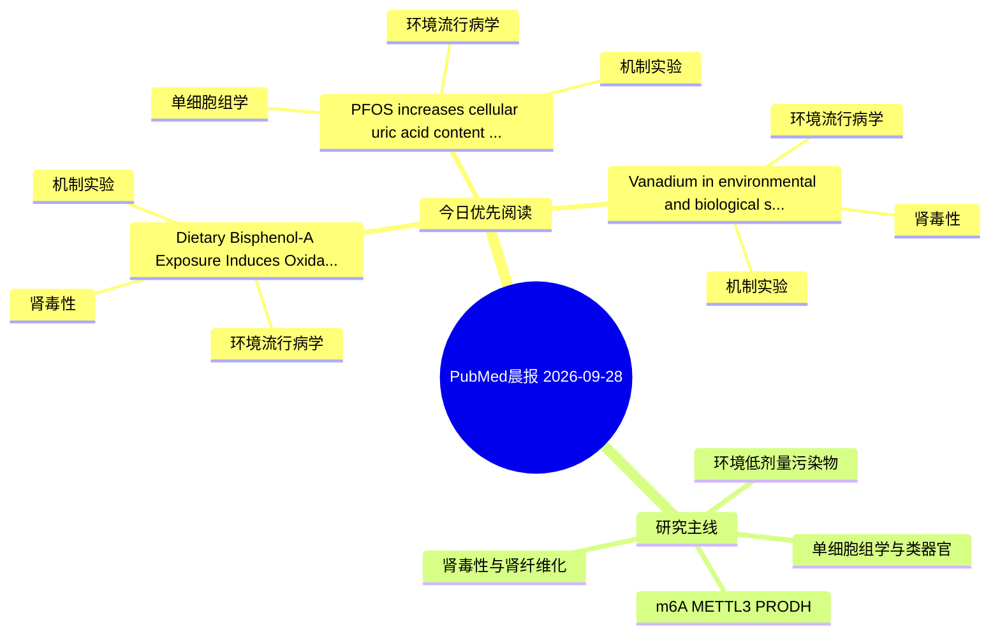

# PubMed 文献晨报｜2026-09-28

- 生成日期：2026-09-28 UTC
- 检索窗口：近 24 小时
- 高质量阈值：规则评分 ≥ 7
- 近 24 小时原始命中数：6

## 今日总体判断

今日筛选出 3 篇优先阅读文献，主要集中在：环境流行病学、机制实验、肾毒性。

## 今日最值得读的 5 篇文章

### 1. PFOS increases cellular uric acid content and the abundance of URAT1 and GLUT9 in HK-2 cells.

- 题目：PFOS increases cellular uric acid content and the abundance of URAT1 and GLUT9 in HK-2 cells.
- 期刊：Ecotoxicology and environmental safety
- 年份：2026
- PMID：[42801899](https://pubmed.ncbi.nlm.nih.gov/42801899/)
- DOI：[10.1016/j.ecoenv.2026.120851](https://doi.org/10.1016/j.ecoenv.2026.120851)
- 分类：环境流行病学、机制实验、单细胞组学、肾毒性
- 规则评分：21
- 研究对象：HK-2 近端肾小管上皮细胞
- 核心方法：单细胞或空间组学；细胞与动物机制实验
- 主要发现：摘要提示研究重点涉及环境污染物暴露、单细胞或空间组学；结论线索为：The respective contributions of URAT1 and GLUT9 to transport function, and the relevance of these responses in vivo, remain questions for direct functional studies.
- 为什么值得读：同时连接环境暴露与机制线索；与肾毒性/肾损伤主线直接相关；可帮助寻找细胞类型特异性机制

### 2. Dietary Bisphenol-A Exposure Induces Oxidative Stress-Mediated Developmental Renal Toxicity in Drosophila melanogaster.

- 题目：Dietary Bisphenol-A Exposure Induces Oxidative Stress-Mediated Developmental Renal Toxicity in Drosophila melanogaster.
- 期刊：Journal of applied toxicology : JAT
- 年份：2026
- PMID：[42802011](https://pubmed.ncbi.nlm.nih.gov/42802011/)
- DOI：[10.1002/jat.70411](https://doi.org/10.1002/jat.70411)
- 分类：环境流行病学、机制实验、肾毒性
- 规则评分：14
- 研究对象：题名和摘要未明确，建议阅读全文确认
- 核心方法：基于题名/摘要的常规实验或文献分析，需阅读全文确认
- 主要发现：摘要提示研究重点涉及肾毒性/肾损伤；结论线索为：Collectively, these results define oxidative stress-associated molecular, cellular and structural alterations underlying BPA-induced nephrotoxicity and demonstrate Drosophila as a mechanistically informative model for developmental toxicology research.
- 为什么值得读：同时连接环境暴露与机制线索；与肾毒性/肾损伤主线直接相关；关键词匹配度较高

### 3. Vanadium in environmental and biological systems: From industrial contaminant to insulin-mimetic agent.

- 题目：Vanadium in environmental and biological systems: From industrial contaminant to insulin-mimetic agent.
- 期刊：Journal of trace elements in medicine and biology : organ of the Society for Minerals and Trace Elements (GMS)
- 年份：2026
- PMID：[42800294](https://pubmed.ncbi.nlm.nih.gov/42800294/)
- DOI：[10.1016/j.jtemb.2026.127965](https://doi.org/10.1016/j.jtemb.2026.127965)
- 分类：环境流行病学、机制实验、肾毒性
- 规则评分：8
- 研究对象：人群/队列或环境暴露人群
- 核心方法：基于题名/摘要的常规实验或文献分析，需阅读全文确认
- 主要发现：摘要提示研究重点涉及环境污染物暴露、肾毒性/肾损伤；结论线索为：Given the projected increase in vanadium applications, particularly in vanadium redox flow batteries (VRFBs) for energy storage, comprehensive environmental monitoring and regulatory frameworks are urgently required to mitigate potential risks to ecosystem...
- 为什么值得读：同时连接环境暴露与机制线索；与肾毒性/肾损伤主线直接相关

## 分类归档

### 环境流行病学
- [PFOS increases cellular uric acid content and the abundance of URAT1 and GLUT9 in HK-2 cells.](https://pubmed.ncbi.nlm.nih.gov/42801899/)（PMID: 42801899）
- [Dietary Bisphenol-A Exposure Induces Oxidative Stress-Mediated Developmental Renal Toxicity in Drosophila melanogaster.](https://pubmed.ncbi.nlm.nih.gov/42802011/)（PMID: 42802011）
- [Vanadium in environmental and biological systems: From industrial contaminant to insulin-mimetic agent.](https://pubmed.ncbi.nlm.nih.gov/42800294/)（PMID: 42800294）

### 机制实验
- [PFOS increases cellular uric acid content and the abundance of URAT1 and GLUT9 in HK-2 cells.](https://pubmed.ncbi.nlm.nih.gov/42801899/)（PMID: 42801899）
- [Dietary Bisphenol-A Exposure Induces Oxidative Stress-Mediated Developmental Renal Toxicity in Drosophila melanogaster.](https://pubmed.ncbi.nlm.nih.gov/42802011/)（PMID: 42802011）
- [Vanadium in environmental and biological systems: From industrial contaminant to insulin-mimetic agent.](https://pubmed.ncbi.nlm.nih.gov/42800294/)（PMID: 42800294）

### 单细胞组学
- [PFOS increases cellular uric acid content and the abundance of URAT1 and GLUT9 in HK-2 cells.](https://pubmed.ncbi.nlm.nih.gov/42801899/)（PMID: 42801899）

### 类器官
- 今日暂无高质量新文献。

### 肾毒性
- [PFOS increases cellular uric acid content and the abundance of URAT1 and GLUT9 in HK-2 cells.](https://pubmed.ncbi.nlm.nih.gov/42801899/)（PMID: 42801899）
- [Dietary Bisphenol-A Exposure Induces Oxidative Stress-Mediated Developmental Renal Toxicity in Drosophila melanogaster.](https://pubmed.ncbi.nlm.nih.gov/42802011/)（PMID: 42802011）
- [Vanadium in environmental and biological systems: From industrial contaminant to insulin-mimetic agent.](https://pubmed.ncbi.nlm.nih.gov/42800294/)（PMID: 42800294）

### m6A-METTL3-PRODH
- 今日暂无高质量新文献。

## 今日阅读优先级

1. PFOS increases cellular uric acid content and the abundance of URAT1 and GLUT9 in HK-2 cells.（优先理由：同时连接环境暴露与机制线索；与肾毒性/肾损伤主线直接相关；可帮助寻找细胞类型特异性机制）
2. Dietary Bisphenol-A Exposure Induces Oxidative Stress-Mediated Developmental Renal Toxicity in Drosophila melanogaster.（优先理由：同时连接环境暴露与机制线索；与肾毒性/肾损伤主线直接相关；关键词匹配度较高）
3. Vanadium in environmental and biological systems: From industrial contaminant to insulin-mimetic agent.（优先理由：同时连接环境暴露与机制线索；与肾毒性/肾损伤主线直接相关）

## Mermaid 思维导图

