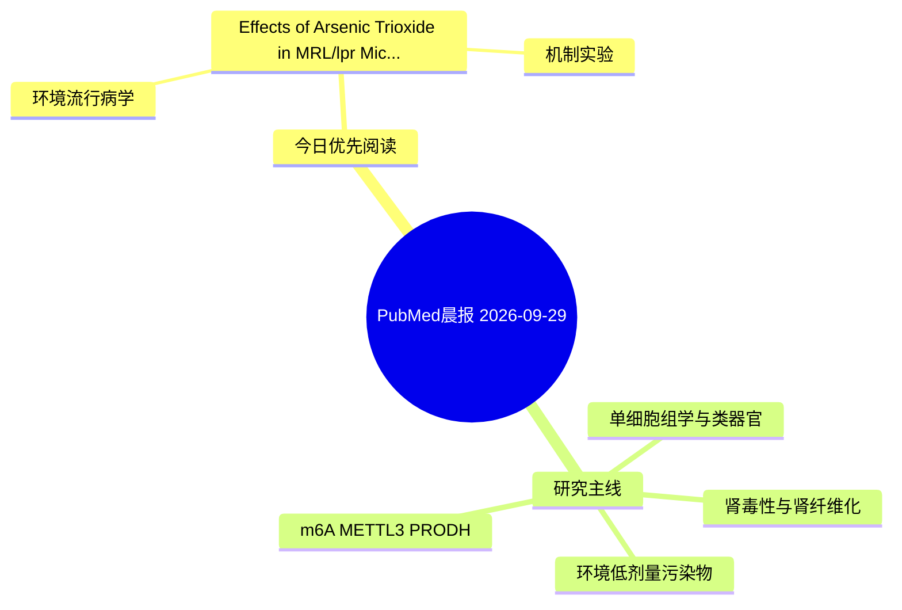

# PubMed 文献晨报｜2026-09-29

- 生成日期：2026-09-29 UTC
- 检索窗口：近 24 小时
- 高质量阈值：规则评分 ≥ 7
- 近 24 小时原始命中数：1

## 今日总体判断

今日筛选出 1 篇优先阅读文献，主要集中在：环境流行病学、机制实验。

## 今日最值得读的 5 篇文章

### 1. Effects of Arsenic Trioxide in MRL/lpr Mice: Disease-Context Support from Human Transcriptomic and DNA Methylation Datasets.

- 题目：Effects of Arsenic Trioxide in MRL/lpr Mice: Disease-Context Support from Human Transcriptomic and DNA Methylation Datasets.
- 期刊：Biological trace element research
- 年份：2026
- PMID：[42806268](https://pubmed.ncbi.nlm.nih.gov/42806268/)
- DOI：[10.1007/s12011-026-05260-w](https://doi.org/10.1007/s12011-026-05260-w)
- 分类：环境流行病学、机制实验
- 规则评分：9
- 研究对象：人群/队列或环境暴露人群
- 核心方法：环境流行病学/队列或人群数据；m6A RNA修饰检测；细胞与动物机制实验
- 主要发现：摘要提示研究重点涉及环境污染物暴露；结论线索为：Public human transcriptomic and DNA methylation data support the disease relevance of this regulatory context.
- 为什么值得读：同时连接环境暴露与机制线索

## 分类归档

### 环境流行病学
- [Effects of Arsenic Trioxide in MRL/lpr Mice: Disease-Context Support from Human Transcriptomic and DNA Methylation Datasets.](https://pubmed.ncbi.nlm.nih.gov/42806268/)（PMID: 42806268）

### 机制实验
- [Effects of Arsenic Trioxide in MRL/lpr Mice: Disease-Context Support from Human Transcriptomic and DNA Methylation Datasets.](https://pubmed.ncbi.nlm.nih.gov/42806268/)（PMID: 42806268）

### 单细胞组学
- 今日暂无高质量新文献。

### 类器官
- 今日暂无高质量新文献。

### 肾毒性
- 今日暂无高质量新文献。

### m6A-METTL3-PRODH
- 今日暂无高质量新文献。

## 今日阅读优先级

1. Effects of Arsenic Trioxide in MRL/lpr Mice: Disease-Context Support from Human Transcriptomic and DNA Methylation Datasets.（优先理由：同时连接环境暴露与机制线索）

## Mermaid 思维导图

