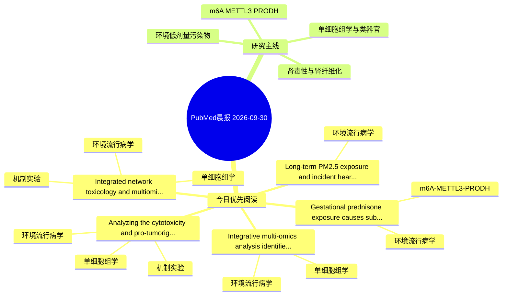

# PubMed 文献晨报｜2026-09-30

- 生成日期：2026-09-30 UTC
- 检索窗口：近 24 小时
- 高质量阈值：规则评分 ≥ 7
- 近 24 小时原始命中数：7

## 今日总体判断

今日筛选出 5 篇优先阅读文献，主要集中在：环境流行病学、单细胞组学、机制实验。

## 今日最值得读的 5 篇文章

### 1. Gestational prednisone exposure causes subfertility in male offspring mice: Role of testicular E2f1 N6-methyladenosine modification.

- 题目：Gestational prednisone exposure causes subfertility in male offspring mice: Role of testicular E2f1 N6-methyladenosine modification.
- 期刊：Journal of hazardous materials
- 年份：2026
- PMID：[42809972](https://pubmed.ncbi.nlm.nih.gov/42809972/)
- DOI：[10.1016/j.jhazmat.2026.143752](https://doi.org/10.1016/j.jhazmat.2026.143752)
- 分类：环境流行病学、m6A-METTL3-PRODH
- 规则评分：16
- 研究对象：小鼠或大鼠肾损伤模型
- 核心方法：m6A RNA修饰检测
- 主要发现：摘要提示研究重点涉及环境污染物暴露、m6A-METTL3/PRODH 调控；结论线索为：These results suggest that gestational PDN exposure causes spermatogonial proliferation inhibition and subfertility via elevating testicular E2f1 m6A in male offspring.
- 为什么值得读：贴近 m6A-METTL3-PRODH 调控假说；关键词匹配度较高

### 2. Analyzing the cytotoxicity and pro-tumorigenic role of acetyl tributyl citrate in prostate through network toxicology and the immune microenvironment.

- 题目：Analyzing the cytotoxicity and pro-tumorigenic role of acetyl tributyl citrate in prostate through network toxicology and the immune microenvironment.
- 期刊：Frontiers in immunology
- 年份：2026
- PMID：[42807872](https://pubmed.ncbi.nlm.nih.gov/42807872/)
- DOI：[10.3389/fimmu.2026.1758050](https://doi.org/10.3389/fimmu.2026.1758050)
- 分类：环境流行病学、机制实验、单细胞组学
- 规则评分：13
- 研究对象：题名和摘要未明确，建议阅读全文确认
- 核心方法：单细胞或空间组学；细胞与动物机制实验
- 主要发现：摘要提示研究重点涉及单细胞或空间组学；结论线索为：CONCLUSION: Overall, the findings provide new insights into linking the effects of ATBC to PCa, and they provide a preventive and therapeutic strategy for PCa that exposure to the environments with excessive ATBC levels.
- 为什么值得读：同时连接环境暴露与机制线索；可帮助寻找细胞类型特异性机制；关键词匹配度较高

### 3. Integrated network toxicology and multiomics analyses reveal the mechanisms underlying trimethyltin chloride-induced epilepsy and the ameliorative effects of astaxanthin via NFKB1 and IL6.

- 题目：Integrated network toxicology and multiomics analyses reveal the mechanisms underlying trimethyltin chloride-induced epilepsy and the ameliorative effects of astaxanthin via NFKB1 and IL6.
- 期刊：Ecotoxicology and environmental safety
- 年份：2026
- PMID：[42810259](https://pubmed.ncbi.nlm.nih.gov/42810259/)
- DOI：[10.1016/j.ecoenv.2026.120870](https://doi.org/10.1016/j.ecoenv.2026.120870)
- 分类：环境流行病学、机制实验、单细胞组学
- 规则评分：10
- 研究对象：人群/队列或环境暴露人群
- 核心方法：环境流行病学/队列或人群数据；单细胞或空间组学；细胞与动物机制实验
- 主要发现：摘要提示研究重点涉及环境污染物暴露、单细胞或空间组学；结论线索为：Protein-protein interaction (PPI) network analysis together with a systematic evaluation of 77 machine learning models further revealed ten core hub genes.
- 为什么值得读：同时连接环境暴露与机制线索；可帮助寻找细胞类型特异性机制

### 4. Long-term PM2.5 exposure and incident heart failure in the UK Biobank: relative and absolute risk estimates.

- 题目：Long-term PM2.5 exposure and incident heart failure in the UK Biobank: relative and absolute risk estimates.
- 期刊：Frontiers in public health
- 年份：2026
- PMID：[42807448](https://pubmed.ncbi.nlm.nih.gov/42807448/)
- DOI：[10.3389/fpubh.2026.1864868](https://doi.org/10.3389/fpubh.2026.1864868)
- 分类：环境流行病学
- 规则评分：10
- 研究对象：人群/队列或环境暴露人群
- 核心方法：环境流行病学/队列或人群数据
- 主要发现：摘要提示研究重点涉及环境污染物暴露；结论线索为：We found no strong evidence that this association differed across major cardiometabolic or inflammatory vulnerability groups.
- 为什么值得读：与检索主题有交集，可作为背景或线索文献扫读

### 5. Integrative multi-omics analysis identifies programmed cell death-related biomarkers and their environmentally relevant toxicological interactions in abdominal aortic aneurysm.

- 题目：Integrative multi-omics analysis identifies programmed cell death-related biomarkers and their environmentally relevant toxicological interactions in abdominal aortic aneurysm.
- 期刊：Ecotoxicology and environmental safety
- 年份：2026
- PMID：[42810262](https://pubmed.ncbi.nlm.nih.gov/42810262/)
- DOI：[10.1016/j.ecoenv.2026.120853](https://doi.org/10.1016/j.ecoenv.2026.120853)
- 分类：环境流行病学、单细胞组学
- 规则评分：7
- 研究对象：人群/队列或环境暴露人群
- 核心方法：环境流行病学/队列或人群数据；单细胞或空间组学
- 主要发现：摘要提示研究重点涉及单细胞或空间组学；结论线索为：Using machine learning approaches, we identified four core PCD genes (AGER, CX3CR1, LEP, and SATB1) and incorporated them into an artificial neural network-based AAA risk model, which demonstrated robust diagnostic performance across multiple cohorts and re...
- 为什么值得读：可帮助寻找细胞类型特异性机制

## 分类归档

### 环境流行病学
- [Gestational prednisone exposure causes subfertility in male offspring mice: Role of testicular E2f1 N6-methyladenosine modification.](https://pubmed.ncbi.nlm.nih.gov/42809972/)（PMID: 42809972）
- [Analyzing the cytotoxicity and pro-tumorigenic role of acetyl tributyl citrate in prostate through network toxicology and the immune microenvironment.](https://pubmed.ncbi.nlm.nih.gov/42807872/)（PMID: 42807872）
- [Integrated network toxicology and multiomics analyses reveal the mechanisms underlying trimethyltin chloride-induced epilepsy and the ameliorative effects of astaxanthin via NFKB1 and IL6.](https://pubmed.ncbi.nlm.nih.gov/42810259/)（PMID: 42810259）
- [Long-term PM2.5 exposure and incident heart failure in the UK Biobank: relative and absolute risk estimates.](https://pubmed.ncbi.nlm.nih.gov/42807448/)（PMID: 42807448）
- [Integrative multi-omics analysis identifies programmed cell death-related biomarkers and their environmentally relevant toxicological interactions in abdominal aortic aneurysm.](https://pubmed.ncbi.nlm.nih.gov/42810262/)（PMID: 42810262）

### 机制实验
- [Analyzing the cytotoxicity and pro-tumorigenic role of acetyl tributyl citrate in prostate through network toxicology and the immune microenvironment.](https://pubmed.ncbi.nlm.nih.gov/42807872/)（PMID: 42807872）
- [Integrated network toxicology and multiomics analyses reveal the mechanisms underlying trimethyltin chloride-induced epilepsy and the ameliorative effects of astaxanthin via NFKB1 and IL6.](https://pubmed.ncbi.nlm.nih.gov/42810259/)（PMID: 42810259）

### 单细胞组学
- [Analyzing the cytotoxicity and pro-tumorigenic role of acetyl tributyl citrate in prostate through network toxicology and the immune microenvironment.](https://pubmed.ncbi.nlm.nih.gov/42807872/)（PMID: 42807872）
- [Integrated network toxicology and multiomics analyses reveal the mechanisms underlying trimethyltin chloride-induced epilepsy and the ameliorative effects of astaxanthin via NFKB1 and IL6.](https://pubmed.ncbi.nlm.nih.gov/42810259/)（PMID: 42810259）
- [Integrative multi-omics analysis identifies programmed cell death-related biomarkers and their environmentally relevant toxicological interactions in abdominal aortic aneurysm.](https://pubmed.ncbi.nlm.nih.gov/42810262/)（PMID: 42810262）

### 类器官
- 今日暂无高质量新文献。

### 肾毒性
- 今日暂无高质量新文献。

### m6A-METTL3-PRODH
- [Gestational prednisone exposure causes subfertility in male offspring mice: Role of testicular E2f1 N6-methyladenosine modification.](https://pubmed.ncbi.nlm.nih.gov/42809972/)（PMID: 42809972）

## 今日阅读优先级

1. Gestational prednisone exposure causes subfertility in male offspring mice: Role of testicular E2f1 N6-methyladenosine modification.（优先理由：贴近 m6A-METTL3-PRODH 调控假说；关键词匹配度较高）
2. Analyzing the cytotoxicity and pro-tumorigenic role of acetyl tributyl citrate in prostate through network toxicology and the immune microenvironment.（优先理由：同时连接环境暴露与机制线索；可帮助寻找细胞类型特异性机制；关键词匹配度较高）
3. Integrated network toxicology and multiomics analyses reveal the mechanisms underlying trimethyltin chloride-induced epilepsy and the ameliorative effects of astaxanthin via NFKB1 and IL6.（优先理由：同时连接环境暴露与机制线索；可帮助寻找细胞类型特异性机制）
4. Long-term PM2.5 exposure and incident heart failure in the UK Biobank: relative and absolute risk estimates.（优先理由：与检索主题有交集，可作为背景或线索文献扫读）
5. Integrative multi-omics analysis identifies programmed cell death-related biomarkers and their environmentally relevant toxicological interactions in abdominal aortic aneurysm.（优先理由：可帮助寻找细胞类型特异性机制）

## Mermaid 思维导图

