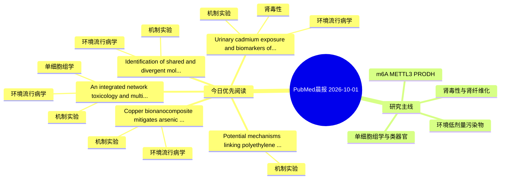

# PubMed 文献晨报｜2026-10-01

- 生成日期：2026-10-01 UTC
- 检索窗口：近 24 小时
- 高质量阈值：规则评分 ≥ 7
- 近 24 小时原始命中数：6

## 今日总体判断

今日筛选出 5 篇优先阅读文献，主要集中在：机制实验、环境流行病学、肾毒性。

## 今日最值得读的 5 篇文章

### 1. Urinary cadmium exposure and biomarkers of inflammation, lipid peroxidation, and kidney injury in apparently healthy adults from the Central Region of Mexico.

- 题目：Urinary cadmium exposure and biomarkers of inflammation, lipid peroxidation, and kidney injury in apparently healthy adults from the Central Region of Mexico.
- 期刊：Environmental toxicology and pharmacology
- 年份：2026
- PMID：[42815658](https://pubmed.ncbi.nlm.nih.gov/42815658/)
- DOI：[10.1016/j.etap.2026.105182](https://doi.org/10.1016/j.etap.2026.105182)
- 分类：环境流行病学、机制实验、肾毒性
- 规则评分：12
- 研究对象：人群/队列或环境暴露人群
- 核心方法：环境流行病学/队列或人群数据
- 主要发现：摘要提示研究重点涉及环境污染物暴露、肾毒性/肾损伤；结论线索为：These findings indicate that cadmium exposure is associated with biological alterations linked to an elevated risk of renal impairment, cardiovascular events, and metabolic syndrome, potentially mediated by oxidative stress and a sustained pro-inflammatory...
- 为什么值得读：同时连接环境暴露与机制线索；与肾毒性/肾损伤主线直接相关；关键词匹配度较高

### 2. An integrated network toxicology and multi-omics framework prioritizes BRCA1 as a testable candidate in benzo[a]pyrene-associated oral cancer.

- 题目：An integrated network toxicology and multi-omics framework prioritizes BRCA1 as a testable candidate in benzo[a]pyrene-associated oral cancer.
- 期刊：Frontiers in pharmacology
- 年份：2026
- PMID：[42812597](https://pubmed.ncbi.nlm.nih.gov/42812597/)
- DOI：[10.3389/fphar.2026.1940046](https://doi.org/10.3389/fphar.2026.1940046)
- 分类：环境流行病学、机制实验、单细胞组学
- 规则评分：11
- 研究对象：人群/队列或环境暴露人群
- 核心方法：单细胞或空间组学；细胞与动物机制实验
- 主要发现：摘要提示研究重点涉及环境污染物暴露、单细胞或空间组学；结论线索为：All mechanistic and clinical interpretations require further validation through direct biochemical assays, additional experimental models, and exposure-annotated human cohorts.
- 为什么值得读：同时连接环境暴露与机制线索；可帮助寻找细胞类型特异性机制

### 3. Copper bionanocomposite mitigates arsenic toxicity in Oreochromis niloticus.

- 题目：Copper bionanocomposite mitigates arsenic toxicity in Oreochromis niloticus.
- 期刊：Discover nano
- 年份：2026
- PMID：[42814260](https://pubmed.ncbi.nlm.nih.gov/42814260/)
- DOI：[10.1186/s11671-026-04944-5](https://doi.org/10.1186/s11671-026-04944-5)
- 分类：环境流行病学、机制实验
- 规则评分：9
- 研究对象：题名和摘要未明确，建议阅读全文确认
- 核心方法：基于题名/摘要的常规实验或文献分析，需阅读全文确认
- 主要发现：摘要提示研究重点涉及环境污染物暴露；结论线索为：These findings suggest that Cu-BDC@AC can mitigate As-induced toxicity in Nile tilapia and warrant further study as a candidate bio-adsorptive material for aquaculture water treatment.
- 为什么值得读：同时连接环境暴露与机制线索

### 4. Potential mechanisms linking polyethylene terephthalate microplastic-associated exposure factors to abnormal biomineralization.

- 题目：Potential mechanisms linking polyethylene terephthalate microplastic-associated exposure factors to abnormal biomineralization.
- 期刊：Computational biology and chemistry
- 年份：2026
- PMID：[42815322](https://pubmed.ncbi.nlm.nih.gov/42815322/)
- DOI：[10.1016/j.compbiolchem.2026.109449](https://doi.org/10.1016/j.compbiolchem.2026.109449)
- 分类：机制实验
- 规则评分：9
- 研究对象：题名和摘要未明确，建议阅读全文确认
- 核心方法：基于题名/摘要的常规实验或文献分析，需阅读全文确认
- 主要发现：摘要提示研究重点涉及本方向相关问题；结论线索为：These findings suggest that PAEFs may contribute to abnormal biomineralization through multi-target and multi-pathway mechanisms, providing a basis for exposure risk assessment and mechanistic validation.
- 为什么值得读：与检索主题有交集，可作为背景或线索文献扫读

### 5. Identification of shared and divergent molecular pathways linking ambient air pollutants to mortality and major chronic diseases through proteomic profiling.

- 题目：Identification of shared and divergent molecular pathways linking ambient air pollutants to mortality and major chronic diseases through proteomic profiling.
- 期刊：Redox biology
- 年份：2026
- PMID：[42815190](https://pubmed.ncbi.nlm.nih.gov/42815190/)
- DOI：[10.1016/j.redox.2026.104411](https://doi.org/10.1016/j.redox.2026.104411)
- 分类：环境流行病学、机制实验
- 规则评分：9
- 研究对象：人群/队列或环境暴露人群
- 核心方法：环境流行病学/队列或人群数据
- 主要发现：摘要提示研究重点涉及环境污染物暴露；结论线索为：Specifically, cell-type and tissue enrichment annotation revealed outcome-relevant specificity of advanced glycosylation end product-specific receptor (AGER) for chronic respiratory disease and lung cancer.
- 为什么值得读：同时连接环境暴露与机制线索

## 分类归档

### 环境流行病学
- [Urinary cadmium exposure and biomarkers of inflammation, lipid peroxidation, and kidney injury in apparently healthy adults from the Central Region of Mexico.](https://pubmed.ncbi.nlm.nih.gov/42815658/)（PMID: 42815658）
- [An integrated network toxicology and multi-omics framework prioritizes BRCA1 as a testable candidate in benzo\[a\]pyrene-associated oral cancer.](https://pubmed.ncbi.nlm.nih.gov/42812597/)（PMID: 42812597）
- [Copper bionanocomposite mitigates arsenic toxicity in Oreochromis niloticus.](https://pubmed.ncbi.nlm.nih.gov/42814260/)（PMID: 42814260）
- [Identification of shared and divergent molecular pathways linking ambient air pollutants to mortality and major chronic diseases through proteomic profiling.](https://pubmed.ncbi.nlm.nih.gov/42815190/)（PMID: 42815190）

### 机制实验
- [Urinary cadmium exposure and biomarkers of inflammation, lipid peroxidation, and kidney injury in apparently healthy adults from the Central Region of Mexico.](https://pubmed.ncbi.nlm.nih.gov/42815658/)（PMID: 42815658）
- [An integrated network toxicology and multi-omics framework prioritizes BRCA1 as a testable candidate in benzo\[a\]pyrene-associated oral cancer.](https://pubmed.ncbi.nlm.nih.gov/42812597/)（PMID: 42812597）
- [Copper bionanocomposite mitigates arsenic toxicity in Oreochromis niloticus.](https://pubmed.ncbi.nlm.nih.gov/42814260/)（PMID: 42814260）
- [Potential mechanisms linking polyethylene terephthalate microplastic-associated exposure factors to abnormal biomineralization.](https://pubmed.ncbi.nlm.nih.gov/42815322/)（PMID: 42815322）
- [Identification of shared and divergent molecular pathways linking ambient air pollutants to mortality and major chronic diseases through proteomic profiling.](https://pubmed.ncbi.nlm.nih.gov/42815190/)（PMID: 42815190）

### 单细胞组学
- [An integrated network toxicology and multi-omics framework prioritizes BRCA1 as a testable candidate in benzo\[a\]pyrene-associated oral cancer.](https://pubmed.ncbi.nlm.nih.gov/42812597/)（PMID: 42812597）

### 类器官
- 今日暂无高质量新文献。

### 肾毒性
- [Urinary cadmium exposure and biomarkers of inflammation, lipid peroxidation, and kidney injury in apparently healthy adults from the Central Region of Mexico.](https://pubmed.ncbi.nlm.nih.gov/42815658/)（PMID: 42815658）

### m6A-METTL3-PRODH
- 今日暂无高质量新文献。

## 今日阅读优先级

1. Urinary cadmium exposure and biomarkers of inflammation, lipid peroxidation, and kidney injury in apparently healthy adults from the Central Region of Mexico.（优先理由：同时连接环境暴露与机制线索；与肾毒性/肾损伤主线直接相关；关键词匹配度较高）
2. An integrated network toxicology and multi-omics framework prioritizes BRCA1 as a testable candidate in benzo[a]pyrene-associated oral cancer.（优先理由：同时连接环境暴露与机制线索；可帮助寻找细胞类型特异性机制）
3. Copper bionanocomposite mitigates arsenic toxicity in Oreochromis niloticus.（优先理由：同时连接环境暴露与机制线索）
4. Potential mechanisms linking polyethylene terephthalate microplastic-associated exposure factors to abnormal biomineralization.（优先理由：与检索主题有交集，可作为背景或线索文献扫读）
5. Identification of shared and divergent molecular pathways linking ambient air pollutants to mortality and major chronic diseases through proteomic profiling.（优先理由：同时连接环境暴露与机制线索）

## Mermaid 思维导图

