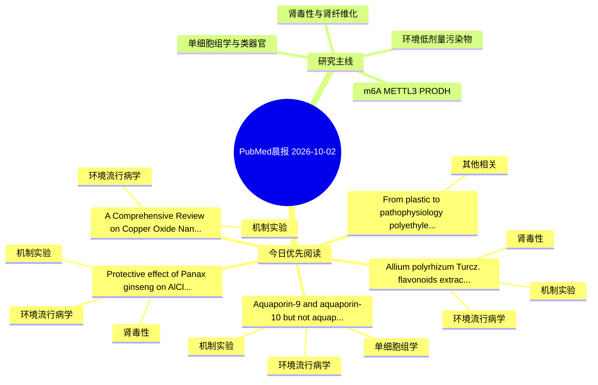

# PubMed 文献晨报｜2026-10-02

- 生成日期：2026-10-02 UTC
- 检索窗口：近 24 小时
- 高质量阈值：规则评分 ≥ 7
- 近 24 小时原始命中数：8

## 今日总体判断

今日筛选出 5 篇优先阅读文献，主要集中在：环境流行病学、机制实验、肾毒性。

## 今日最值得读的 5 篇文章

### 1. Allium polyrhizum Turcz. flavonoids extract alleviates cadmium-induced renal injury through differential regulation of autophagy mediated by mTORC1 and mTORC2.

- 题目：Allium polyrhizum Turcz. flavonoids extract alleviates cadmium-induced renal injury through differential regulation of autophagy mediated by mTORC1 and mTORC2.
- 期刊：Journal of environmental sciences (China)
- 年份：2026
- PMID：[42822936](https://pubmed.ncbi.nlm.nih.gov/42822936/)
- DOI：[10.1016/j.jes.2026.05.046](https://doi.org/10.1016/j.jes.2026.05.046)
- 分类：环境流行病学、机制实验、肾毒性
- 规则评分：17
- 研究对象：题名和摘要未明确，建议阅读全文确认
- 核心方法：细胞与动物机制实验
- 主要发现：摘要提示研究重点涉及环境污染物暴露、肾毒性/肾损伤；结论线索为：APTF orchestrates a dual-pathway protective mechanism by differentially targeting mTORC1 and mTORC2 to restore coordinated autophagy, highlighting its potential as a novel multi-targeted phytotherapeutic agent against Cd-induced nephrotoxicity.
- 为什么值得读：同时连接环境暴露与机制线索；与肾毒性/肾损伤主线直接相关；关键词匹配度较高

### 2. Protective effect of Panax ginseng on AlCl₃-induced liver, kidney, and testis toxicity in male albino rats: biochemical, histopathological, and molecular study.

- 题目：Protective effect of Panax ginseng on AlCl₃-induced liver, kidney, and testis toxicity in male albino rats: biochemical, histopathological, and molecular study.
- 期刊：Frontiers in veterinary science
- 年份：2026
- PMID：[42819301](https://pubmed.ncbi.nlm.nih.gov/42819301/)
- DOI：[10.3389/fvets.2026.1925382](https://doi.org/10.3389/fvets.2026.1925382)
- 分类：环境流行病学、机制实验、肾毒性
- 规则评分：17
- 研究对象：小鼠或大鼠肾损伤模型
- 核心方法：细胞与动物机制实验
- 主要发现：摘要提示研究重点涉及环境污染物暴露、肾毒性/肾损伤；结论线索为：In conclusion, Panax ginseng may have protective effect on AlCl₃-induced liver, kidney, and testicular toxicity.
- 为什么值得读：同时连接环境暴露与机制线索；与肾毒性/肾损伤主线直接相关；关键词匹配度较高

### 3. Aquaporin-9 and aquaporin-10 but not aquaporin-3 confer susceptibility to dimethylarsinic acid genotoxicity in human cells.

- 题目：Aquaporin-9 and aquaporin-10 but not aquaporin-3 confer susceptibility to dimethylarsinic acid genotoxicity in human cells.
- 期刊：bioRxiv : the preprint server for biology
- 年份：2026
- PMID：[42818007](https://pubmed.ncbi.nlm.nih.gov/42818007/)
- DOI：[10.64898/2026.09.20.752519](https://doi.org/10.64898/2026.09.20.752519)
- 分类：环境流行病学、机制实验、单细胞组学
- 规则评分：10
- 研究对象：人群/队列或环境暴露人群
- 核心方法：单细胞或空间组学
- 主要发现：摘要提示研究重点涉及环境污染物暴露、单细胞或空间组学；结论线索为：We show that this weakness is conditional on the transporter complement of the exposed cell.
- 为什么值得读：同时连接环境暴露与机制线索；可帮助寻找细胞类型特异性机制

### 4. From plastic to pathophysiology: polyethylene (PE) and polyvinyl chloride (PVC) microplastics disrupt fish blood, metabolism, and growth.

- 题目：From plastic to pathophysiology: polyethylene (PE) and polyvinyl chloride (PVC) microplastics disrupt fish blood, metabolism, and growth.
- 期刊：Ecotoxicology (London, England)
- 年份：2026
- PMID：[42821027](https://pubmed.ncbi.nlm.nih.gov/42821027/)
- DOI：[10.1007/s10646-026-03175-9](https://doi.org/10.1007/s10646-026-03175-9)
- 分类：其他相关
- 规则评分：9
- 研究对象：题名和摘要未明确，建议阅读全文确认
- 核心方法：基于题名/摘要的常规实验或文献分析，需阅读全文确认
- 主要发现：摘要提示研究重点涉及本方向相关问题；结论线索为：Biochemical analyses revealed significant (p < 0.05) physiological stress, as reflected by elevated SGOT, SGPT, ALP, LDH, creatinine, blood urea nitrogen, glucose, cholesterol, triglycerides, and disturbances in protein profiles, including albumin, globulin...
- 为什么值得读：与检索主题有交集，可作为背景或线索文献扫读

### 5. A Comprehensive Review on Copper Oxide Nanoparticles: Physicochemical Parameters, Pharmacological Potential and Pathophysiological Effects.

- 题目：A Comprehensive Review on Copper Oxide Nanoparticles: Physicochemical Parameters, Pharmacological Potential and Pathophysiological Effects.
- 期刊：International journal of nanomedicine
- 年份：2026
- PMID：[42820077](https://pubmed.ncbi.nlm.nih.gov/42820077/)
- DOI：[10.2147/IJN.S592672](https://doi.org/10.2147/IJN.S592672)
- 分类：环境流行病学、机制实验
- 规则评分：9
- 研究对象：患者样本或临床数据
- 核心方法：细胞与动物机制实验
- 主要发现：摘要提示研究重点涉及环境污染物暴露；结论线索为：Overall, this review highlights the dual role of CuONPs as both promising nanotherapeutic agents and potential toxicological hazards, emphasizing the need for standardized biological evaluation, safer nanoparticle design strategies, and improved understandi...
- 为什么值得读：同时连接环境暴露与机制线索

## 分类归档

### 环境流行病学
- [Allium polyrhizum Turcz. flavonoids extract alleviates cadmium-induced renal injury through differential regulation of autophagy mediated by mTORC1 and mTORC2.](https://pubmed.ncbi.nlm.nih.gov/42822936/)（PMID: 42822936）
- [Protective effect of Panax ginseng on AlCl₃-induced liver, kidney, and testis toxicity in male albino rats: biochemical, histopathological, and molecular study.](https://pubmed.ncbi.nlm.nih.gov/42819301/)（PMID: 42819301）
- [Aquaporin-9 and aquaporin-10 but not aquaporin-3 confer susceptibility to dimethylarsinic acid genotoxicity in human cells.](https://pubmed.ncbi.nlm.nih.gov/42818007/)（PMID: 42818007）
- [A Comprehensive Review on Copper Oxide Nanoparticles: Physicochemical Parameters, Pharmacological Potential and Pathophysiological Effects.](https://pubmed.ncbi.nlm.nih.gov/42820077/)（PMID: 42820077）

### 机制实验
- [Allium polyrhizum Turcz. flavonoids extract alleviates cadmium-induced renal injury through differential regulation of autophagy mediated by mTORC1 and mTORC2.](https://pubmed.ncbi.nlm.nih.gov/42822936/)（PMID: 42822936）
- [Protective effect of Panax ginseng on AlCl₃-induced liver, kidney, and testis toxicity in male albino rats: biochemical, histopathological, and molecular study.](https://pubmed.ncbi.nlm.nih.gov/42819301/)（PMID: 42819301）
- [Aquaporin-9 and aquaporin-10 but not aquaporin-3 confer susceptibility to dimethylarsinic acid genotoxicity in human cells.](https://pubmed.ncbi.nlm.nih.gov/42818007/)（PMID: 42818007）
- [A Comprehensive Review on Copper Oxide Nanoparticles: Physicochemical Parameters, Pharmacological Potential and Pathophysiological Effects.](https://pubmed.ncbi.nlm.nih.gov/42820077/)（PMID: 42820077）

### 单细胞组学
- [Aquaporin-9 and aquaporin-10 but not aquaporin-3 confer susceptibility to dimethylarsinic acid genotoxicity in human cells.](https://pubmed.ncbi.nlm.nih.gov/42818007/)（PMID: 42818007）

### 类器官
- 今日暂无高质量新文献。

### 肾毒性
- [Allium polyrhizum Turcz. flavonoids extract alleviates cadmium-induced renal injury through differential regulation of autophagy mediated by mTORC1 and mTORC2.](https://pubmed.ncbi.nlm.nih.gov/42822936/)（PMID: 42822936）
- [Protective effect of Panax ginseng on AlCl₃-induced liver, kidney, and testis toxicity in male albino rats: biochemical, histopathological, and molecular study.](https://pubmed.ncbi.nlm.nih.gov/42819301/)（PMID: 42819301）

### m6A-METTL3-PRODH
- 今日暂无高质量新文献。

## 今日阅读优先级

1. Allium polyrhizum Turcz. flavonoids extract alleviates cadmium-induced renal injury through differential regulation of autophagy mediated by mTORC1 and mTORC2.（优先理由：同时连接环境暴露与机制线索；与肾毒性/肾损伤主线直接相关；关键词匹配度较高）
2. Protective effect of Panax ginseng on AlCl₃-induced liver, kidney, and testis toxicity in male albino rats: biochemical, histopathological, and molecular study.（优先理由：同时连接环境暴露与机制线索；与肾毒性/肾损伤主线直接相关；关键词匹配度较高）
3. Aquaporin-9 and aquaporin-10 but not aquaporin-3 confer susceptibility to dimethylarsinic acid genotoxicity in human cells.（优先理由：同时连接环境暴露与机制线索；可帮助寻找细胞类型特异性机制）
4. From plastic to pathophysiology: polyethylene (PE) and polyvinyl chloride (PVC) microplastics disrupt fish blood, metabolism, and growth.（优先理由：与检索主题有交集，可作为背景或线索文献扫读）
5. A Comprehensive Review on Copper Oxide Nanoparticles: Physicochemical Parameters, Pharmacological Potential and Pathophysiological Effects.（优先理由：同时连接环境暴露与机制线索）

## Mermaid 思维导图

