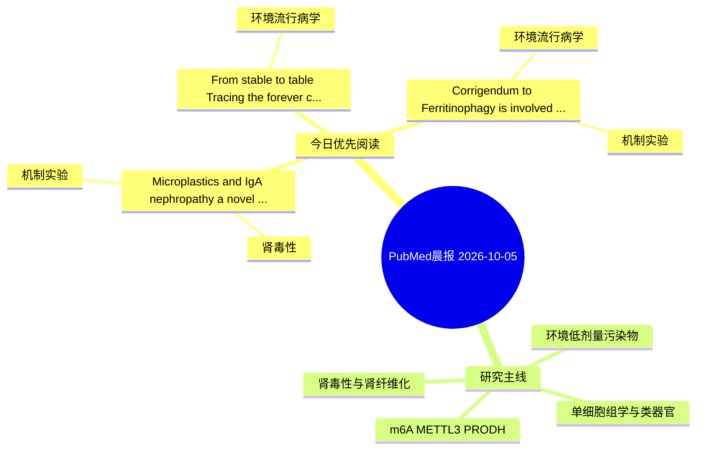

# PubMed 文献晨报｜2026-10-05

- 生成日期：2026-10-05 UTC
- 检索窗口：近 7 天
- 高质量阈值：规则评分 ≥ 7
- 近 24 小时原始命中数：1

## 今日总体判断

今日筛选出 3 篇优先阅读文献，主要集中在：机制实验、环境流行病学、肾毒性。
由于近 24 小时内没有达到高质量阈值的未推荐文献，本次已自动扩大检索范围。

## 今日最值得读的 5 篇文章

### 1. Microplastics and IgA nephropathy: a novel environmental hypothesis of immune dysregulation.

- 题目：Microplastics and IgA nephropathy: a novel environmental hypothesis of immune dysregulation.
- 期刊：Renal failure
- 年份：2026
- PMID：[42817229](https://pubmed.ncbi.nlm.nih.gov/42817229/)
- DOI：[10.1080/0886022X.2026.2735540](https://doi.org/10.1080/0886022X.2026.2735540)
- 分类：机制实验、肾毒性
- 规则评分：8
- 研究对象：题名和摘要未明确，建议阅读全文确认
- 核心方法：细胞与动物机制实验
- 主要发现：摘要提示研究重点涉及肾毒性/肾损伤；结论线索为：Finally, we delineate future in vivo, observational, and epidemiological investigations required to establish this pathophysiological link.
- 为什么值得读：与肾毒性/肾损伤主线直接相关

### 2. From stable to table: Tracing the "forever chemical" vector through the food animal supply chain.

- 题目：From stable to table: Tracing the "forever chemical" vector through the food animal supply chain.
- 期刊：Food and chemical toxicology : an international journal published for the British Industrial Biological Research Association
- 年份：2026
- PMID：[42822638](https://pubmed.ncbi.nlm.nih.gov/42822638/)
- DOI：[10.1016/j.fct.2026.116419](https://doi.org/10.1016/j.fct.2026.116419)
- 分类：环境流行病学
- 规则评分：8
- 研究对象：人群/队列或环境暴露人群
- 核心方法：环境流行病学/队列或人群数据
- 主要发现：摘要提示研究重点涉及环境污染物暴露；结论线索为：Addressing PFAS contamination in food animals is therefore not merely an environmental issue but an urgent imperative for safeguarding food security and public health.
- 为什么值得读：与检索主题有交集，可作为背景或线索文献扫读

### 3. Corrigendum to "Ferritinophagy is involved in Bisphenol A-induced ferroptosis of renal tubular epithelial cells through the activation of the AMPK-mTOR-ULK1 pathway" [Food Chem. Toxicol. 163, (2022), 112909].

- 题目：Corrigendum to "Ferritinophagy is involved in Bisphenol A-induced ferroptosis of renal tubular epithelial cells through the activation of the AMPK-mTOR-ULK1 pathway" [Food Chem. Toxicol. 163, (2022), 112909].
- 期刊：Food and chemical toxicology : an international journal published for the British Industrial Biological Research Association
- 年份：2026
- PMID：[42810055](https://pubmed.ncbi.nlm.nih.gov/42810055/)
- DOI：[10.1016/j.fct.2026.116404](https://doi.org/10.1016/j.fct.2026.116404)
- 分类：环境流行病学、机制实验
- 规则评分：7
- 研究对象：肾小管/肾脏细胞与组织
- 核心方法：基于题名/摘要的常规实验或文献分析，需阅读全文确认
- 主要发现：题名和关键词提示该文关注本方向相关问题，需要阅读全文确认具体结果。
- 为什么值得读：同时连接环境暴露与机制线索

## 分类归档

### 环境流行病学
- [From stable to table: Tracing the "forever chemical" vector through the food animal supply chain.](https://pubmed.ncbi.nlm.nih.gov/42822638/)（PMID: 42822638）
- [Corrigendum to "Ferritinophagy is involved in Bisphenol A-induced ferroptosis of renal tubular epithelial cells through the activation of the AMPK-mTOR-ULK1 pathway" \[Food Chem. Toxicol. 163, (2022), 112909\].](https://pubmed.ncbi.nlm.nih.gov/42810055/)（PMID: 42810055）

### 机制实验
- [Microplastics and IgA nephropathy: a novel environmental hypothesis of immune dysregulation.](https://pubmed.ncbi.nlm.nih.gov/42817229/)（PMID: 42817229）
- [Corrigendum to "Ferritinophagy is involved in Bisphenol A-induced ferroptosis of renal tubular epithelial cells through the activation of the AMPK-mTOR-ULK1 pathway" \[Food Chem. Toxicol. 163, (2022), 112909\].](https://pubmed.ncbi.nlm.nih.gov/42810055/)（PMID: 42810055）

### 单细胞组学
- 今日暂无高质量新文献。

### 类器官
- 今日暂无高质量新文献。

### 肾毒性
- [Microplastics and IgA nephropathy: a novel environmental hypothesis of immune dysregulation.](https://pubmed.ncbi.nlm.nih.gov/42817229/)（PMID: 42817229）

### m6A-METTL3-PRODH
- 今日暂无高质量新文献。

## 今日阅读优先级

1. Microplastics and IgA nephropathy: a novel environmental hypothesis of immune dysregulation.（优先理由：与肾毒性/肾损伤主线直接相关）
2. From stable to table: Tracing the "forever chemical" vector through the food animal supply chain.（优先理由：与检索主题有交集，可作为背景或线索文献扫读）
3. Corrigendum to "Ferritinophagy is involved in Bisphenol A-induced ferroptosis of renal tubular epithelial cells through the activation of the AMPK-mTOR-ULK1 pathway" [Food Chem. Toxicol. 163, (2022), 112909].（优先理由：同时连接环境暴露与机制线索）

## Mermaid 思维导图

