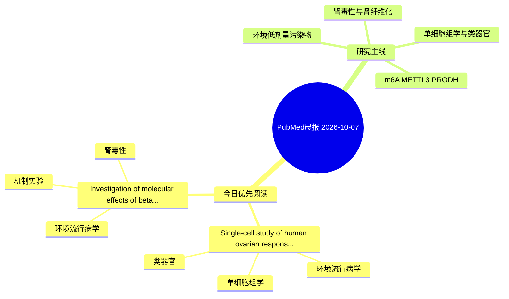

# PubMed 文献晨报｜2026-10-07

- 生成日期：2026-10-07 UTC
- 检索窗口：近 24 小时
- 高质量阈值：规则评分 ≥ 7
- 近 24 小时原始命中数：2

## 今日总体判断

今日筛选出 2 篇优先阅读文献，主要集中在：环境流行病学、单细胞组学、类器官。

## 今日最值得读的 5 篇文章

### 1. Single-cell study of human ovarian response to phthalate exposure reveals glial cell susceptibility and disruption of adhesion and mitochondrial pathways.

- 题目：Single-cell study of human ovarian response to phthalate exposure reveals glial cell susceptibility and disruption of adhesion and mitochondrial pathways.
- 期刊：EBioMedicine
- 年份：2026
- PMID：[42838884](https://pubmed.ncbi.nlm.nih.gov/42838884/)
- DOI：[10.1016/j.ebiom.2026.106487](https://doi.org/10.1016/j.ebiom.2026.106487)
- 分类：环境流行病学、单细胞组学、类器官
- 规则评分：18
- 研究对象：人群/队列或环境暴露人群
- 核心方法：单细胞或空间组学；类器官/干细胞模型
- 主要发现：摘要提示研究重点涉及单细胞或空间组学；结论线索为：FUNDING: Swedish Research Council for Sustainable Development and the European Union.
- 为什么值得读：可帮助寻找细胞类型特异性机制；对建立更接近人体的模型有参考价值；关键词匹配度较高

### 2. Investigation of molecular effects of beta caryophyllene in cadmium-induced nephrotoxicity model in rats: in silico and in vivo studies.

- 题目：Investigation of molecular effects of beta caryophyllene in cadmium-induced nephrotoxicity model in rats: in silico and in vivo studies.
- 期刊：Journal of trace elements in medicine and biology : organ of the Society for Minerals and Trace Elements (GMS)
- 年份：2026
- PMID：[42837932](https://pubmed.ncbi.nlm.nih.gov/42837932/)
- DOI：[10.1016/j.jtemb.2026.127969](https://doi.org/10.1016/j.jtemb.2026.127969)
- 分类：环境流行病学、机制实验、肾毒性
- 规则评分：14
- 研究对象：小鼠或大鼠肾损伤模型
- 核心方法：细胞与动物机制实验
- 主要发现：摘要提示研究重点涉及环境污染物暴露、肾毒性/肾损伤；结论线索为：CONCLUSION: Thus, BCP may protect kidney tissues from Cd-induced nephrotoxicity by regulating oxidant/antioxidant status, reducing inflammation, ER stress, cell death, and activating the Nrf2/HO-1 signaling pathway.
- 为什么值得读：同时连接环境暴露与机制线索；与肾毒性/肾损伤主线直接相关；关键词匹配度较高

## 分类归档

### 环境流行病学
- [Single-cell study of human ovarian response to phthalate exposure reveals glial cell susceptibility and disruption of adhesion and mitochondrial pathways.](https://pubmed.ncbi.nlm.nih.gov/42838884/)（PMID: 42838884）
- [Investigation of molecular effects of beta caryophyllene in cadmium-induced nephrotoxicity model in rats: in silico and in vivo studies.](https://pubmed.ncbi.nlm.nih.gov/42837932/)（PMID: 42837932）

### 机制实验
- [Investigation of molecular effects of beta caryophyllene in cadmium-induced nephrotoxicity model in rats: in silico and in vivo studies.](https://pubmed.ncbi.nlm.nih.gov/42837932/)（PMID: 42837932）

### 单细胞组学
- [Single-cell study of human ovarian response to phthalate exposure reveals glial cell susceptibility and disruption of adhesion and mitochondrial pathways.](https://pubmed.ncbi.nlm.nih.gov/42838884/)（PMID: 42838884）

### 类器官
- [Single-cell study of human ovarian response to phthalate exposure reveals glial cell susceptibility and disruption of adhesion and mitochondrial pathways.](https://pubmed.ncbi.nlm.nih.gov/42838884/)（PMID: 42838884）

### 肾毒性
- [Investigation of molecular effects of beta caryophyllene in cadmium-induced nephrotoxicity model in rats: in silico and in vivo studies.](https://pubmed.ncbi.nlm.nih.gov/42837932/)（PMID: 42837932）

### m6A-METTL3-PRODH
- 今日暂无高质量新文献。

## 今日阅读优先级

1. Single-cell study of human ovarian response to phthalate exposure reveals glial cell susceptibility and disruption of adhesion and mitochondrial pathways.（优先理由：可帮助寻找细胞类型特异性机制；对建立更接近人体的模型有参考价值；关键词匹配度较高）
2. Investigation of molecular effects of beta caryophyllene in cadmium-induced nephrotoxicity model in rats: in silico and in vivo studies.（优先理由：同时连接环境暴露与机制线索；与肾毒性/肾损伤主线直接相关；关键词匹配度较高）

## Mermaid 思维导图

