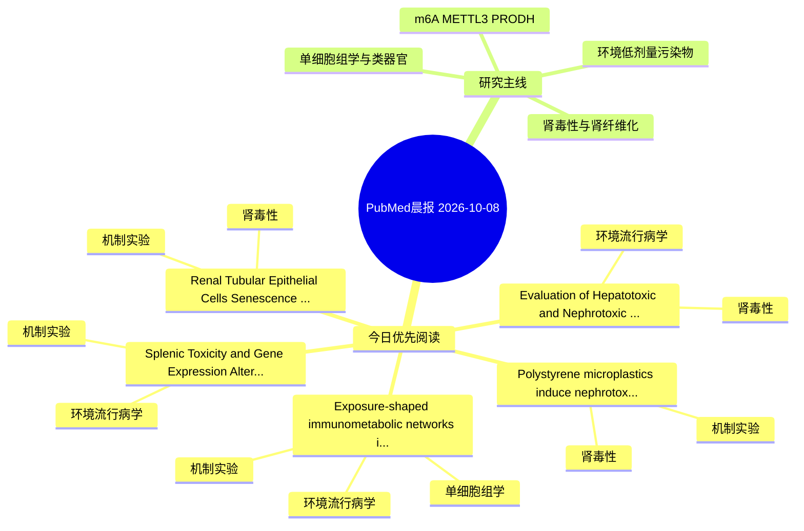

# PubMed 文献晨报｜2026-10-08

- 生成日期：2026-10-08 UTC
- 检索窗口：近 24 小时
- 高质量阈值：规则评分 ≥ 7
- 近 24 小时原始命中数：6

## 今日总体判断

今日筛选出 5 篇优先阅读文献，主要集中在：机制实验、环境流行病学、肾毒性。

## 今日最值得读的 5 篇文章

### 1. Evaluation of Hepatotoxic and Nephrotoxic Effects of Hexachlorobenzene, DDT, and p,p'-DDE in Rats.

- 题目：Evaluation of Hepatotoxic and Nephrotoxic Effects of Hexachlorobenzene, DDT, and p,p'-DDE in Rats.
- 期刊：Environmental toxicology
- 年份：2026
- PMID：[42842346](https://pubmed.ncbi.nlm.nih.gov/42842346/)
- DOI：[10.1002/tox.70200](https://doi.org/10.1002/tox.70200)
- 分类：环境流行病学、肾毒性
- 规则评分：18
- 研究对象：小鼠或大鼠肾损伤模型
- 核心方法：基于题名/摘要的常规实验或文献分析，需阅读全文确认
- 主要发现：摘要提示研究重点涉及肾毒性/肾损伤；结论线索为：These findings suggest that more sensitive endpoints than serum biomarkers may be required to detect organ injury associated with organochlorine pesticide exposure.
- 为什么值得读：与肾毒性/肾损伤主线直接相关；关键词匹配度较高

### 2. Polystyrene microplastics induce nephrotoxicity through impaired mitochondrial homeostasis: An integrated experimental study.

- 题目：Polystyrene microplastics induce nephrotoxicity through impaired mitochondrial homeostasis: An integrated experimental study.
- 期刊：Tissue & cell
- 年份：2026
- PMID：[42843001](https://pubmed.ncbi.nlm.nih.gov/42843001/)
- DOI：[10.1016/j.tice.2026.104026](https://doi.org/10.1016/j.tice.2026.104026)
- 分类：机制实验、肾毒性
- 规则评分：17
- 研究对象：肾小管/肾脏细胞与组织
- 核心方法：基于题名/摘要的常规实验或文献分析，需阅读全文确认
- 主要发现：摘要提示研究重点涉及肾毒性/肾损伤、肾纤维化；结论线索为：CONCLUSION: PS-MPs induce marked nephrotoxicity, accompanied by oxidative stress, coordinated transcriptional dysregulation of mitochondrial homeostasis-related genes, inflammatory activation, and apoptosis.
- 为什么值得读：与肾毒性/肾损伤主线直接相关；关键词匹配度较高

### 3. Renal Tubular Epithelial Cells Senescence Induced by 1-Aminopyrene Activates Fibroblast via BRD4 Driven Senescence-Associated Secretory Phenotype Signaling.

- 题目：Renal Tubular Epithelial Cells Senescence Induced by 1-Aminopyrene Activates Fibroblast via BRD4 Driven Senescence-Associated Secretory Phenotype Signaling.
- 期刊：Journal of biochemical and molecular toxicology
- 年份：2026
- PMID：[42841671](https://pubmed.ncbi.nlm.nih.gov/42841671/)
- DOI：[10.1002/jbt.71124](https://doi.org/10.1002/jbt.71124)
- 分类：机制实验、肾毒性
- 规则评分：14
- 研究对象：肾小管/肾脏细胞与组织
- 核心方法：基于题名/摘要的常规实验或文献分析，需阅读全文确认
- 主要发现：摘要提示研究重点涉及肾毒性/肾损伤、肾纤维化；结论线索为：In this study, we show that 1-aminopyrene (1-AP), a metabolite of diesel exhaust, leads to genomic instability and renal tubular epithelial cell (RTEC) senescence.
- 为什么值得读：与肾毒性/肾损伤主线直接相关；关键词匹配度较高

### 4. Exposure-shaped immunometabolic networks in chronic liver disease: translating multi-omics and artificial intelligence into preventive biomarkers.

- 题目：Exposure-shaped immunometabolic networks in chronic liver disease: translating multi-omics and artificial intelligence into preventive biomarkers.
- 期刊：Frontiers in immunology
- 年份：2026
- PMID：[42840869](https://pubmed.ncbi.nlm.nih.gov/42840869/)
- DOI：[10.3389/fimmu.2026.1866951](https://doi.org/10.3389/fimmu.2026.1866951)
- 分类：环境流行病学、机制实验、单细胞组学
- 规则评分：10
- 研究对象：人群/队列或环境暴露人群
- 核心方法：环境流行病学/队列或人群数据；单细胞或空间组学
- 主要发现：摘要提示研究重点涉及环境污染物暴露、肾纤维化、单细胞或空间组学；结论线索为：Such translation will require better exposure assessment, longitudinal sampling, assay standardization, and transportable models tested across real-world populations.
- 为什么值得读：同时连接环境暴露与机制线索；可帮助寻找细胞类型特异性机制

### 5. Splenic Toxicity and Gene Expression Alterations Induced by Perfluorobutanesulfonic Acid (PFBS) Ingestion in Sprague Dawley Rats.

- 题目：Splenic Toxicity and Gene Expression Alterations Induced by Perfluorobutanesulfonic Acid (PFBS) Ingestion in Sprague Dawley Rats.
- 期刊：Toxicology mechanisms and methods
- 年份：2026
- PMID：[42845118](https://pubmed.ncbi.nlm.nih.gov/42845118/)
- DOI：[10.1080/15376516.2026.2745930](https://doi.org/10.1080/15376516.2026.2745930)
- 分类：环境流行病学、机制实验
- 规则评分：9
- 研究对象：小鼠或大鼠肾损伤模型
- 核心方法：细胞与动物机制实验
- 主要发现：摘要提示研究重点涉及环境污染物暴露；结论线索为：These findings suggest that dietary ingestion of PFBS induces subtle but measurable toxicological effects on splenic function and immune regulation, probably indicating further research into its long-term health implications.
- 为什么值得读：同时连接环境暴露与机制线索

## 分类归档

### 环境流行病学
- [Evaluation of Hepatotoxic and Nephrotoxic Effects of Hexachlorobenzene, DDT, and p,p'-DDE in Rats.](https://pubmed.ncbi.nlm.nih.gov/42842346/)（PMID: 42842346）
- [Exposure-shaped immunometabolic networks in chronic liver disease: translating multi-omics and artificial intelligence into preventive biomarkers.](https://pubmed.ncbi.nlm.nih.gov/42840869/)（PMID: 42840869）
- [Splenic Toxicity and Gene Expression Alterations Induced by Perfluorobutanesulfonic Acid (PFBS) Ingestion in Sprague Dawley Rats.](https://pubmed.ncbi.nlm.nih.gov/42845118/)（PMID: 42845118）

### 机制实验
- [Polystyrene microplastics induce nephrotoxicity through impaired mitochondrial homeostasis: An integrated experimental study.](https://pubmed.ncbi.nlm.nih.gov/42843001/)（PMID: 42843001）
- [Renal Tubular Epithelial Cells Senescence Induced by 1-Aminopyrene Activates Fibroblast via BRD4 Driven Senescence-Associated Secretory Phenotype Signaling.](https://pubmed.ncbi.nlm.nih.gov/42841671/)（PMID: 42841671）
- [Exposure-shaped immunometabolic networks in chronic liver disease: translating multi-omics and artificial intelligence into preventive biomarkers.](https://pubmed.ncbi.nlm.nih.gov/42840869/)（PMID: 42840869）
- [Splenic Toxicity and Gene Expression Alterations Induced by Perfluorobutanesulfonic Acid (PFBS) Ingestion in Sprague Dawley Rats.](https://pubmed.ncbi.nlm.nih.gov/42845118/)（PMID: 42845118）

### 单细胞组学
- [Exposure-shaped immunometabolic networks in chronic liver disease: translating multi-omics and artificial intelligence into preventive biomarkers.](https://pubmed.ncbi.nlm.nih.gov/42840869/)（PMID: 42840869）

### 类器官
- 今日暂无高质量新文献。

### 肾毒性
- [Evaluation of Hepatotoxic and Nephrotoxic Effects of Hexachlorobenzene, DDT, and p,p'-DDE in Rats.](https://pubmed.ncbi.nlm.nih.gov/42842346/)（PMID: 42842346）
- [Polystyrene microplastics induce nephrotoxicity through impaired mitochondrial homeostasis: An integrated experimental study.](https://pubmed.ncbi.nlm.nih.gov/42843001/)（PMID: 42843001）
- [Renal Tubular Epithelial Cells Senescence Induced by 1-Aminopyrene Activates Fibroblast via BRD4 Driven Senescence-Associated Secretory Phenotype Signaling.](https://pubmed.ncbi.nlm.nih.gov/42841671/)（PMID: 42841671）

### m6A-METTL3-PRODH
- 今日暂无高质量新文献。

## 今日阅读优先级

1. Evaluation of Hepatotoxic and Nephrotoxic Effects of Hexachlorobenzene, DDT, and p,p'-DDE in Rats.（优先理由：与肾毒性/肾损伤主线直接相关；关键词匹配度较高）
2. Polystyrene microplastics induce nephrotoxicity through impaired mitochondrial homeostasis: An integrated experimental study.（优先理由：与肾毒性/肾损伤主线直接相关；关键词匹配度较高）
3. Renal Tubular Epithelial Cells Senescence Induced by 1-Aminopyrene Activates Fibroblast via BRD4 Driven Senescence-Associated Secretory Phenotype Signaling.（优先理由：与肾毒性/肾损伤主线直接相关；关键词匹配度较高）
4. Exposure-shaped immunometabolic networks in chronic liver disease: translating multi-omics and artificial intelligence into preventive biomarkers.（优先理由：同时连接环境暴露与机制线索；可帮助寻找细胞类型特异性机制）
5. Splenic Toxicity and Gene Expression Alterations Induced by Perfluorobutanesulfonic Acid (PFBS) Ingestion in Sprague Dawley Rats.（优先理由：同时连接环境暴露与机制线索）

## Mermaid 思维导图

