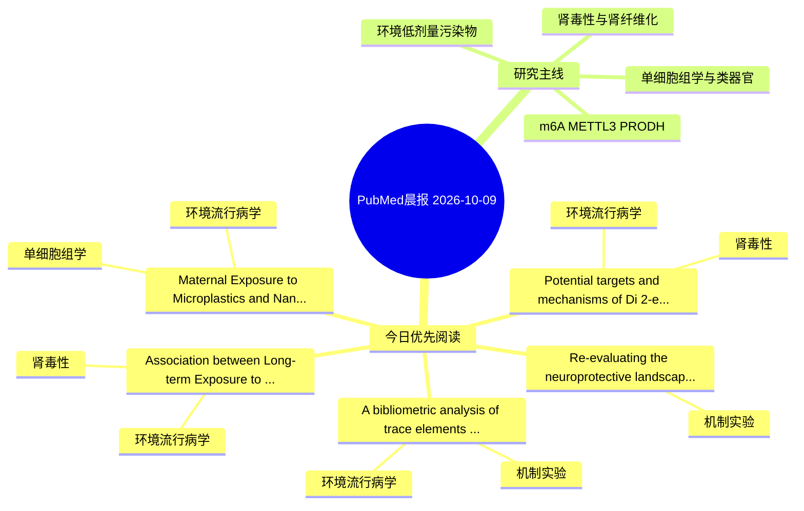

# PubMed 文献晨报｜2026-10-09

- 生成日期：2026-10-09 UTC
- 检索窗口：近 24 小时
- 高质量阈值：规则评分 ≥ 7
- 近 24 小时原始命中数：7

## 今日总体判断

今日筛选出 5 篇优先阅读文献，主要集中在：环境流行病学、肾毒性、机制实验。

## 今日最值得读的 5 篇文章

### 1. Potential targets and mechanisms of Di(2-ethylhexyl) phthalate exposure in inducing chronic kidney disease: a multimodal study integrating epidemiology, network toxicology, and Mendelian randomization.

- 题目：Potential targets and mechanisms of Di(2-ethylhexyl) phthalate exposure in inducing chronic kidney disease: a multimodal study integrating epidemiology, network toxicology, and Mendelian randomization.
- 期刊：Naunyn-Schmiedeberg's archives of pharmacology
- 年份：2026
- PMID：[42848225](https://pubmed.ncbi.nlm.nih.gov/42848225/)
- DOI：[10.1007/s00210-026-05972-9](https://doi.org/10.1007/s00210-026-05972-9)
- 分类：环境流行病学、肾毒性
- 规则评分：12
- 研究对象：人群/队列或环境暴露人群
- 核心方法：环境流行病学/队列或人群数据
- 主要发现：摘要提示研究重点涉及肾毒性/肾损伤；结论线索为：These findings provide convergent epidemiological, genetic, and computational evidence supporting CTSK as a candidate molecular target for further investigation in the context of DEHP-associated renal injury.
- 为什么值得读：与肾毒性/肾损伤主线直接相关；关键词匹配度较高

### 2. A bibliometric analysis of trace elements and diabetic kidney disease: scientific hotspots and research evolution.

- 题目：A bibliometric analysis of trace elements and diabetic kidney disease: scientific hotspots and research evolution.
- 期刊：Renal failure
- 年份：2026
- PMID：[42850723](https://pubmed.ncbi.nlm.nih.gov/42850723/)
- DOI：[10.1080/0886022X.2026.2736897](https://doi.org/10.1080/0886022X.2026.2736897)
- 分类：环境流行病学、机制实验
- 规则评分：11
- 研究对象：题名和摘要未明确，建议阅读全文确认
- 核心方法：基于题名/摘要的常规实验或文献分析，需阅读全文确认
- 主要发现：摘要提示研究重点涉及环境污染物暴露；结论线索为：This study provides a data-driven analysis of the evolving research landscape, offering insights into the future directions of trace element-related DKD studies, particularly in understanding the transition from environmental toxicology to molecular interve...
- 为什么值得读：同时连接环境暴露与机制线索

### 3. Maternal Exposure to Microplastics and Nanoplastics: Placental Lipid Metabolic Dysregulation as a Potential Link to Fetal Growth Restriction.

- 题目：Maternal Exposure to Microplastics and Nanoplastics: Placental Lipid Metabolic Dysregulation as a Potential Link to Fetal Growth Restriction.
- 期刊：Reproductive toxicology (Elmsford, N.Y.)
- 年份：2026
- PMID：[42849766](https://pubmed.ncbi.nlm.nih.gov/42849766/)
- DOI：[10.1016/j.reprotox.2026.109375](https://doi.org/10.1016/j.reprotox.2026.109375)
- 分类：环境流行病学、单细胞组学
- 规则评分：10
- 研究对象：人群/队列或环境暴露人群
- 核心方法：环境流行病学/队列或人群数据；单细胞或空间组学
- 主要发现：摘要提示研究重点涉及单细胞或空间组学；结论线索为：Prospective pregnancy cohorts and human-relevant placental models integrating validated particle detection, fetal growth trajectories, spatial and single-cell omics, metabolic-flux analysis, and rescue experiments are required to determine whether placental...
- 为什么值得读：可帮助寻找细胞类型特异性机制

### 4. Association between Long-term Exposure to Air Pollution and Incident Chronic Kidney Disease among Adults in Beijing, China.

- 题目：Association between Long-term Exposure to Air Pollution and Incident Chronic Kidney Disease among Adults in Beijing, China.
- 期刊：Environmental pollution (Barking, Essex : 1987)
- 年份：2026
- PMID：[42849692](https://pubmed.ncbi.nlm.nih.gov/42849692/)
- DOI：[10.1016/j.envpol.2026.129302](https://doi.org/10.1016/j.envpol.2026.129302)
- 分类：环境流行病学、肾毒性
- 规则评分：9
- 研究对象：人群/队列或环境暴露人群
- 核心方法：环境流行病学/队列或人群数据
- 主要发现：摘要提示研究重点涉及肾毒性/肾损伤；结论线索为：CONCLUSION: Sustained PM10 and CO exposure was linked to elevated CKD risk, with O3 showing a potentially inverse pattern.
- 为什么值得读：与肾毒性/肾损伤主线直接相关

### 5. Re-evaluating the neuroprotective landscape of Nigella sativa: Molecular mechanisms, nanomedicine, and clinical translation.

- 题目：Re-evaluating the neuroprotective landscape of Nigella sativa: Molecular mechanisms, nanomedicine, and clinical translation.
- 期刊：Current opinion in pharmacology
- 年份：2026
- PMID：[42849086](https://pubmed.ncbi.nlm.nih.gov/42849086/)
- DOI：[10.1016/j.coph.2026.102676](https://doi.org/10.1016/j.coph.2026.102676)
- 分类：机制实验
- 规则评分：8
- 研究对象：人群/队列或环境暴露人群
- 核心方法：基于题名/摘要的常规实验或文献分析，需阅读全文确认
- 主要发现：摘要提示研究重点涉及环境污染物暴露；结论线索为：Their potential applications in Alzheimer's disease, Parkinson's disease, ischemic stroke, and epilepsy remain hypothesis-generating and will require validation through pharmacokinetically optimized formulations and adequately powered clinical trials.
- 为什么值得读：与检索主题有交集，可作为背景或线索文献扫读

## 分类归档

### 环境流行病学
- [Potential targets and mechanisms of Di(2-ethylhexyl) phthalate exposure in inducing chronic kidney disease: a multimodal study integrating epidemiology, network toxicology, and Mendelian randomization.](https://pubmed.ncbi.nlm.nih.gov/42848225/)（PMID: 42848225）
- [A bibliometric analysis of trace elements and diabetic kidney disease: scientific hotspots and research evolution.](https://pubmed.ncbi.nlm.nih.gov/42850723/)（PMID: 42850723）
- [Maternal Exposure to Microplastics and Nanoplastics: Placental Lipid Metabolic Dysregulation as a Potential Link to Fetal Growth Restriction.](https://pubmed.ncbi.nlm.nih.gov/42849766/)（PMID: 42849766）
- [Association between Long-term Exposure to Air Pollution and Incident Chronic Kidney Disease among Adults in Beijing, China.](https://pubmed.ncbi.nlm.nih.gov/42849692/)（PMID: 42849692）

### 机制实验
- [A bibliometric analysis of trace elements and diabetic kidney disease: scientific hotspots and research evolution.](https://pubmed.ncbi.nlm.nih.gov/42850723/)（PMID: 42850723）
- [Re-evaluating the neuroprotective landscape of Nigella sativa: Molecular mechanisms, nanomedicine, and clinical translation.](https://pubmed.ncbi.nlm.nih.gov/42849086/)（PMID: 42849086）

### 单细胞组学
- [Maternal Exposure to Microplastics and Nanoplastics: Placental Lipid Metabolic Dysregulation as a Potential Link to Fetal Growth Restriction.](https://pubmed.ncbi.nlm.nih.gov/42849766/)（PMID: 42849766）

### 类器官
- 今日暂无高质量新文献。

### 肾毒性
- [Potential targets and mechanisms of Di(2-ethylhexyl) phthalate exposure in inducing chronic kidney disease: a multimodal study integrating epidemiology, network toxicology, and Mendelian randomization.](https://pubmed.ncbi.nlm.nih.gov/42848225/)（PMID: 42848225）
- [Association between Long-term Exposure to Air Pollution and Incident Chronic Kidney Disease among Adults in Beijing, China.](https://pubmed.ncbi.nlm.nih.gov/42849692/)（PMID: 42849692）

### m6A-METTL3-PRODH
- 今日暂无高质量新文献。

## 今日阅读优先级

1. Potential targets and mechanisms of Di(2-ethylhexyl) phthalate exposure in inducing chronic kidney disease: a multimodal study integrating epidemiology, network toxicology, and Mendelian randomization.（优先理由：与肾毒性/肾损伤主线直接相关；关键词匹配度较高）
2. A bibliometric analysis of trace elements and diabetic kidney disease: scientific hotspots and research evolution.（优先理由：同时连接环境暴露与机制线索）
3. Maternal Exposure to Microplastics and Nanoplastics: Placental Lipid Metabolic Dysregulation as a Potential Link to Fetal Growth Restriction.（优先理由：可帮助寻找细胞类型特异性机制）
4. Association between Long-term Exposure to Air Pollution and Incident Chronic Kidney Disease among Adults in Beijing, China.（优先理由：与肾毒性/肾损伤主线直接相关）
5. Re-evaluating the neuroprotective landscape of Nigella sativa: Molecular mechanisms, nanomedicine, and clinical translation.（优先理由：与检索主题有交集，可作为背景或线索文献扫读）

## Mermaid 思维导图

