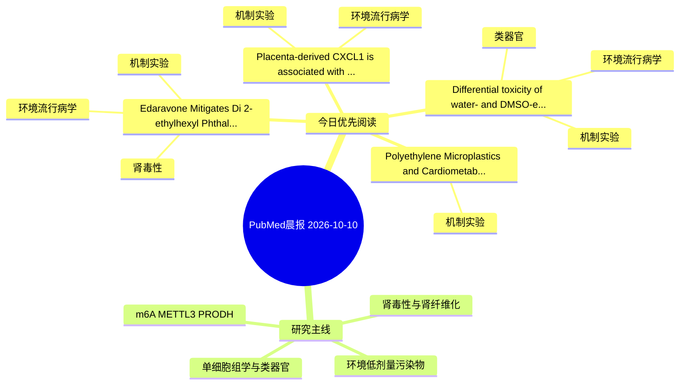

# PubMed 文献晨报｜2026-10-10

- 生成日期：2026-10-10 UTC
- 检索窗口：近 24 小时
- 高质量阈值：规则评分 ≥ 7
- 近 24 小时原始命中数：5

## 今日总体判断

今日筛选出 4 篇优先阅读文献，主要集中在：机制实验、环境流行病学、肾毒性。

## 今日最值得读的 5 篇文章

### 1. Edaravone Mitigates Di(2-ethylhexyl) Phthalate-Induced Nephrotoxicity Through Attenuation of Oxidative Stress and Endoplasmic Reticulum Stress.

- 题目：Edaravone Mitigates Di(2-ethylhexyl) Phthalate-Induced Nephrotoxicity Through Attenuation of Oxidative Stress and Endoplasmic Reticulum Stress.
- 期刊：Journal of biochemical and molecular toxicology
- 年份：2026
- PMID：[42852524](https://pubmed.ncbi.nlm.nih.gov/42852524/)
- DOI：[10.1002/jbt.71125](https://doi.org/10.1002/jbt.71125)
- 分类：环境流行病学、机制实验、肾毒性
- 规则评分：17
- 研究对象：小鼠或大鼠肾损伤模型
- 核心方法：基于题名/摘要的常规实验或文献分析，需阅读全文确认
- 主要发现：摘要提示研究重点涉及肾毒性/肾损伤；结论线索为：Findings revealed that DEHP significantly increased levels of BUN, creatinine, and urea along with a substantial reduction in GSH levels and an increase in MDA and nitrite levels.
- 为什么值得读：同时连接环境暴露与机制线索；与肾毒性/肾损伤主线直接相关；关键词匹配度较高

### 2. Placenta-derived CXCL1 is associated with fetal renal dysplasia upon gestational cadmium treatment.

- 题目：Placenta-derived CXCL1 is associated with fetal renal dysplasia upon gestational cadmium treatment.
- 期刊：Ecotoxicology and environmental safety
- 年份：2026
- PMID：[42854375](https://pubmed.ncbi.nlm.nih.gov/42854375/)
- DOI：[10.1016/j.ecoenv.2026.120898](https://doi.org/10.1016/j.ecoenv.2026.120898)
- 分类：环境流行病学、机制实验
- 规则评分：15
- 研究对象：人群/队列或环境暴露人群
- 核心方法：细胞与动物机制实验
- 主要发现：摘要提示研究重点涉及环境污染物暴露；结论线索为：Overall, these findings suggest that placenta-derived CXCL1 is associated with fetal renal dysplasia upon gestational Cd treatment, which provides a central mechanism for fetal-derived diseases.
- 为什么值得读：同时连接环境暴露与机制线索；关键词匹配度较高

### 3. Polyethylene Microplastics and Cardiometabolic Mitochondrial-Redox Dysfunction in Preclinical Rodent Models: A Systematic Review and Meta-Analysis of Bioenergetic and Oxidative Stress Outcomes Across Target Organs.

- 题目：Polyethylene Microplastics and Cardiometabolic Mitochondrial-Redox Dysfunction in Preclinical Rodent Models: A Systematic Review and Meta-Analysis of Bioenergetic and Oxidative Stress Outcomes Across Target Organs.
- 期刊：Cardiovascular toxicology
- 年份：2026
- PMID：[42853351](https://pubmed.ncbi.nlm.nih.gov/42853351/)
- DOI：[10.1007/s12012-026-10203-x](https://doi.org/10.1007/s12012-026-10203-x)
- 分类：机制实验
- 规则评分：11
- 研究对象：题名和摘要未明确，建议阅读全文确认
- 核心方法：基于题名/摘要的常规实验或文献分析，需阅读全文确认
- 主要发现：摘要提示研究重点涉及环境污染物暴露；结论线索为：These findings establish the mitochondrial-redox axis as a defining biochemical fingerprint of PE-MP multi-organ toxicity and provide mechanistic grounding for microplastic-associated cardiovascular risk.
- 为什么值得读：与检索主题有交集，可作为背景或线索文献扫读

### 4. Differential toxicity of water- and DMSO-extractable PM2.5 fractions in human alveolar organoids.

- 题目：Differential toxicity of water- and DMSO-extractable PM2.5 fractions in human alveolar organoids.
- 期刊：Frontiers in toxicology
- 年份：2026
- PMID：[42852147](https://pubmed.ncbi.nlm.nih.gov/42852147/)
- DOI：[10.3389/ftox.2026.1943932](https://doi.org/10.3389/ftox.2026.1943932)
- 分类：环境流行病学、机制实验、类器官
- 规则评分：10
- 研究对象：人群/队列或环境暴露人群
- 核心方法：类器官/干细胞模型；细胞与动物机制实验
- 主要发现：摘要提示研究重点涉及环境污染物暴露、类器官模型；结论线索为：The results revealed that PM2.5 induced morphological damage in hALOs in a dose- and time-dependent manner, with the DMSO-extractable fraction eliciting more severe damage than the water-extractable fraction.
- 为什么值得读：同时连接环境暴露与机制线索；对建立更接近人体的模型有参考价值

## 分类归档

### 环境流行病学
- [Edaravone Mitigates Di(2-ethylhexyl) Phthalate-Induced Nephrotoxicity Through Attenuation of Oxidative Stress and Endoplasmic Reticulum Stress.](https://pubmed.ncbi.nlm.nih.gov/42852524/)（PMID: 42852524）
- [Placenta-derived CXCL1 is associated with fetal renal dysplasia upon gestational cadmium treatment.](https://pubmed.ncbi.nlm.nih.gov/42854375/)（PMID: 42854375）
- [Differential toxicity of water- and DMSO-extractable PM2.5 fractions in human alveolar organoids.](https://pubmed.ncbi.nlm.nih.gov/42852147/)（PMID: 42852147）

### 机制实验
- [Edaravone Mitigates Di(2-ethylhexyl) Phthalate-Induced Nephrotoxicity Through Attenuation of Oxidative Stress and Endoplasmic Reticulum Stress.](https://pubmed.ncbi.nlm.nih.gov/42852524/)（PMID: 42852524）
- [Placenta-derived CXCL1 is associated with fetal renal dysplasia upon gestational cadmium treatment.](https://pubmed.ncbi.nlm.nih.gov/42854375/)（PMID: 42854375）
- [Polyethylene Microplastics and Cardiometabolic Mitochondrial-Redox Dysfunction in Preclinical Rodent Models: A Systematic Review and Meta-Analysis of Bioenergetic and Oxidative Stress Outcomes Across Target Organs.](https://pubmed.ncbi.nlm.nih.gov/42853351/)（PMID: 42853351）
- [Differential toxicity of water- and DMSO-extractable PM2.5 fractions in human alveolar organoids.](https://pubmed.ncbi.nlm.nih.gov/42852147/)（PMID: 42852147）

### 单细胞组学
- 今日暂无高质量新文献。

### 类器官
- [Differential toxicity of water- and DMSO-extractable PM2.5 fractions in human alveolar organoids.](https://pubmed.ncbi.nlm.nih.gov/42852147/)（PMID: 42852147）

### 肾毒性
- [Edaravone Mitigates Di(2-ethylhexyl) Phthalate-Induced Nephrotoxicity Through Attenuation of Oxidative Stress and Endoplasmic Reticulum Stress.](https://pubmed.ncbi.nlm.nih.gov/42852524/)（PMID: 42852524）

### m6A-METTL3-PRODH
- 今日暂无高质量新文献。

## 今日阅读优先级

1. Edaravone Mitigates Di(2-ethylhexyl) Phthalate-Induced Nephrotoxicity Through Attenuation of Oxidative Stress and Endoplasmic Reticulum Stress.（优先理由：同时连接环境暴露与机制线索；与肾毒性/肾损伤主线直接相关；关键词匹配度较高）
2. Placenta-derived CXCL1 is associated with fetal renal dysplasia upon gestational cadmium treatment.（优先理由：同时连接环境暴露与机制线索；关键词匹配度较高）
3. Polyethylene Microplastics and Cardiometabolic Mitochondrial-Redox Dysfunction in Preclinical Rodent Models: A Systematic Review and Meta-Analysis of Bioenergetic and Oxidative Stress Outcomes Across Target Organs.（优先理由：与检索主题有交集，可作为背景或线索文献扫读）
4. Differential toxicity of water- and DMSO-extractable PM2.5 fractions in human alveolar organoids.（优先理由：同时连接环境暴露与机制线索；对建立更接近人体的模型有参考价值）

## Mermaid 思维导图

